# Introduction To Cybersecurity 

---
## Foundational cybersecurity principles 
revolve around the core tenets of confidentiality, integrity, and availability, which dictate how data remains private, accurate, 
and accessible to authorized parties. Understanding the landscape requires a granular analysis of modern threat vectors, including 
the mechanics of malware, the psychology behind social engineering, and the technical execution of network-based exploits. 
Defensive posture begins with the individual, where the focus lies on hardening personal hardware, encrypting sensitive communications, 
and managing the digital footprint left across public and private networks.

At the enterprise level, security shifts toward protecting the broader organization through the implementation of the defense-in-depth 
strategy. This necessitates the deployment of firewalls, intrusion prevention systems, and rigorous access control lists to mitigate 
risk across complex infrastructures. Beyond technical controls, organizational security is heavily dependent on incident response 
frameworks and disaster recovery planning. As the industry scales, the professional landscape requires a workforce capable of navigating 
evolving legal regulations and ethical dilemmas. Career progression in this field is predicated on mastering these diverse domains, 
from technical penetration testing to high-level security governance and risk management.

---

  <table>
    <tr>
      <td>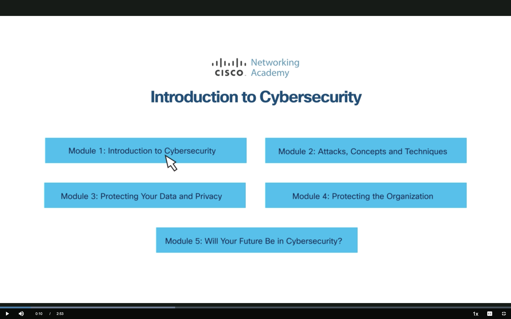
      <td>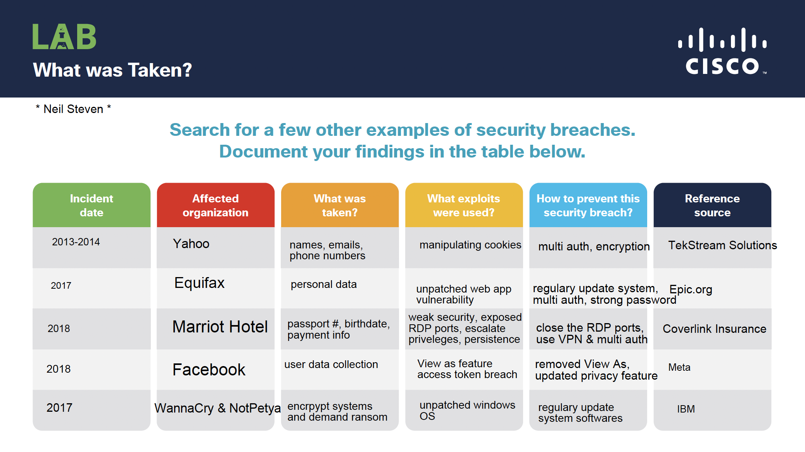</td>
    </tr>
    <tr>
      <td align="center"><strong>Figure 1a:</strong> Introduction to Cybersecurity</td>
      <td align="center"><strong>Figure 1b:</strong> Activity M1 Lab - What Was Taken</td>
    </tr>
    <tr>
      <td>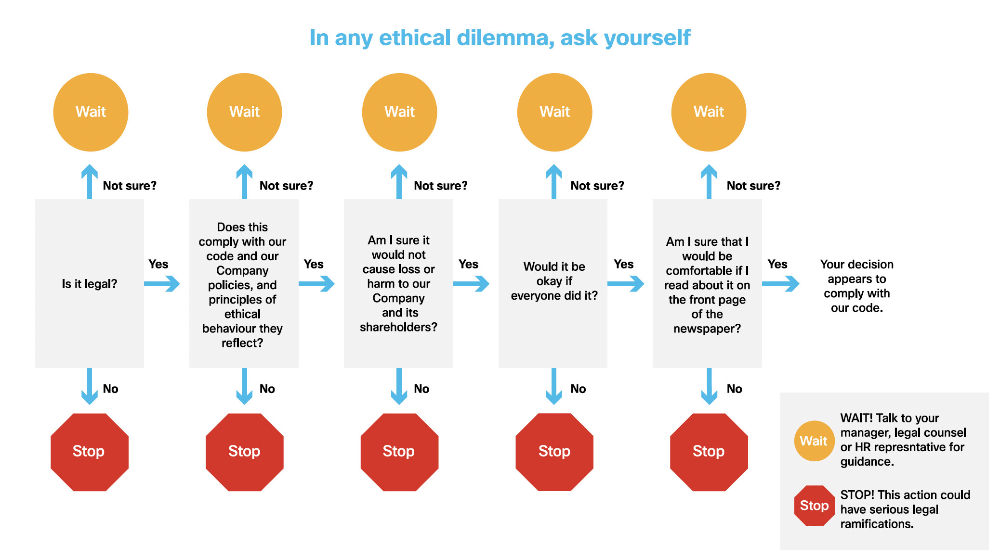
    </tr>
     <tr>
      <td align="center"><strong>Figure 2a:</strong> In Any Ethical Dilema - Ask Yourself</td>
    </tr>
  </table>

---
### Key Takeaways - Security frameworks must prioritize the protection of the CIA triad to ensure data reliability and privacy.
* Recognizing the specific concepts and techniques behind cyberattacks is the first step in developing effective countermeasures.
* Personal data protection requires proactive management of privacy settings and device security.
* Organizational defense relies on a multi-layered approach involving both technical systems and administrative policies.
* Professional growth in cybersecurity involves understanding the intersection of technical skill, legal compliance, and ethical
  responsibility.
  
---

  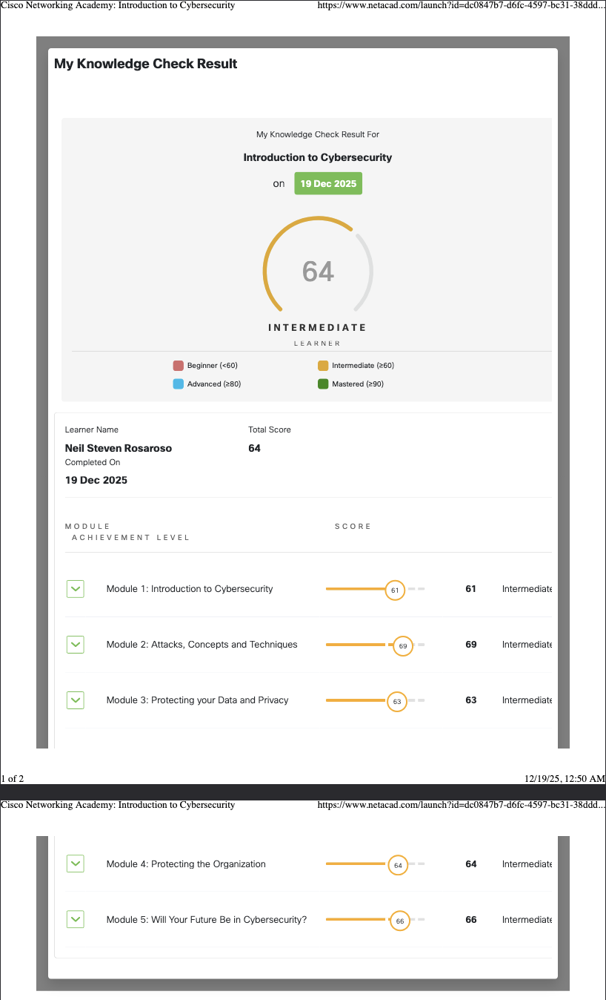

	
- [https://vimeo.com/25118844](https://vimeo.com/25118844): Stuxnet Malware - Used in Iran Nuclear Facilities
- [https://youtu.be/Oh4WURZoR98](https://youtu.be/Oh4WURZoR98) & [https://www.krackattacks.com/](https://www.krackattacks.com/): The definitive research by
  Mathy Vanhoef on KRACK (Key Reinstallation Attacks), which demonstrated how to bypass WPA2 encryption by exploiting the 4-way handshake.
- [https://pages.nist.gov/800-63-3/](https://pages.nist.gov/800-63-3/): NIST SP 800-63-3, the industry standard for Digital Identity 
Guidelines, providing technical requirements for identity proofing and authentication (IAL, AAL, FAL).
- [https://www.fcc.gov/consumers/guides/how-protect-yourself-online](https://www.fcc.gov/consumers/guides/how-protect-yourself-online): 
Official FCC Consumer Guides providing federal recommendations for general online protection and personal data privacy.
- [https://www.shodan.io/dashboard](https://www.shodan.io/dashboard): The "search engine for Internet-connected devices," used for OSINT, 
vulnerability research, and identifying exposed network assets.
- [https://project-zero.issues.chromium.org/issues?q=](https://project-zero.issues.chromium.org/issues?q=): Google Project Zero's 
public issue tracker, documenting elite zero-day research and enforcing the industry-standard 90-day disclosure policy.
- [https://brainstation.io/cybersecurity/two-factor-auth](https://brainstation.io/cybersecurity/two-factor-auth): An educational 
guide on Two-Factor Authentication (2FA), explaining its role as a critical defense-in-depth layer for identity management.
- [https://nmap.org/zenmap/](https://nmap.org/zenmap/): The official graphical user interface (GUI) for the Nmap Security Scanner, 
used for visual network mapping and port auditing.
- [https://issa.org/code-of-ethics/](https://issa.org/code-of-ethics/): The Information Systems Security Association (ISSA) Code of 
Ethics, outlining the professional and moral conduct required for cybersecurity practitioners.
- [https://www.cisco.com/c/m/en_us/about/csr/esg-hub.html](https://www.cisco.com/c/m/en_us/about/csr/esg-hub.html): Cisco’s ESG 
(Environmental, Social, and Governance) Hub, showing how cybersecurity and privacy are integrated into corporate social responsibility.
- [https://investor.cisco.com/corporate-governance/code-of-business-conduct/default.aspx](https://investor.cisco.com/corporate-governance/code-of-business-conduct/default.aspx): Cisco’s Code of Business Conduct, detailing the internal ethical frameworks and policy standards for global corporate governance.
					
---

  <table>
    <tr>
      <td>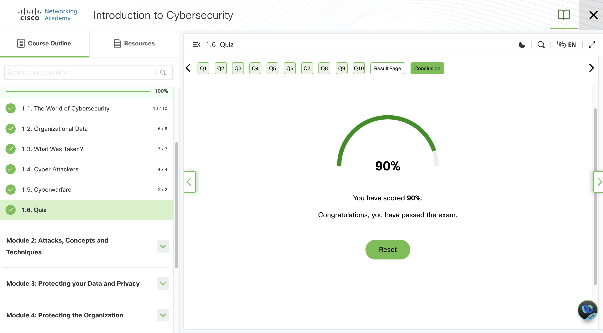
      <td>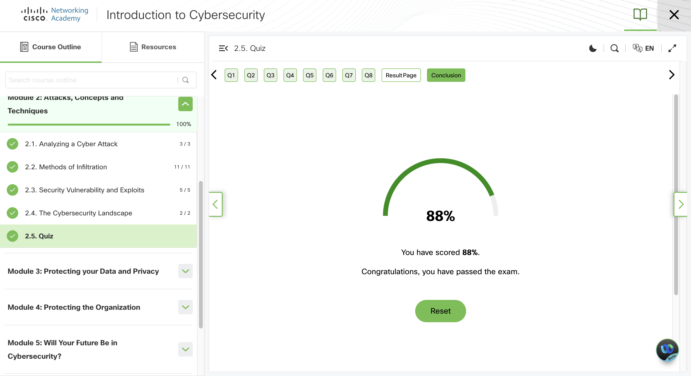</td>
    </tr>
    <tr>
      <td align="center"><strong>Figure 1a:</strong> Cisco Quiz 1.6 Introduction to Cybersecurity</td>
      <td align="center"><strong>Figure 1b:</strong> Cisco Quiz 2.5 Introduction to Cybersecurity</td>
    </tr>
    <tr>
      <td>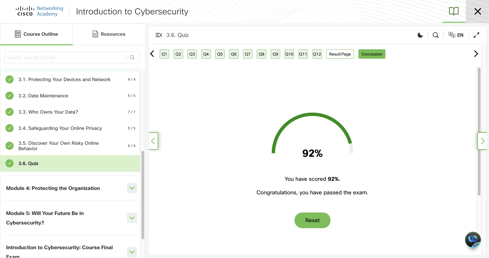
      <td>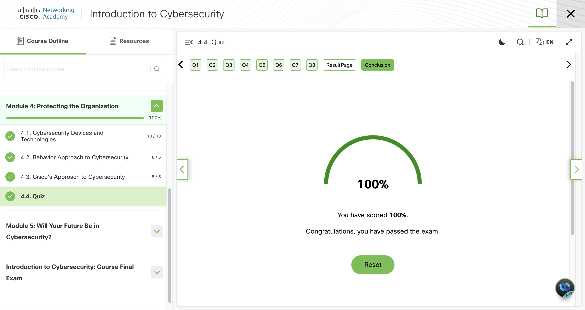</td>
    </tr>
     <tr>
      <td align="center"><strong>Figure 2a:</strong> Cisco Quiz 3.6 Introduction to Cybersecurity</td>
      <td align="center"><strong>Figure 2b:</strong> Cisco Quiz 4.4 Introduction to Cybersecurity</td>
    </tr>
	      <tr>
      <td>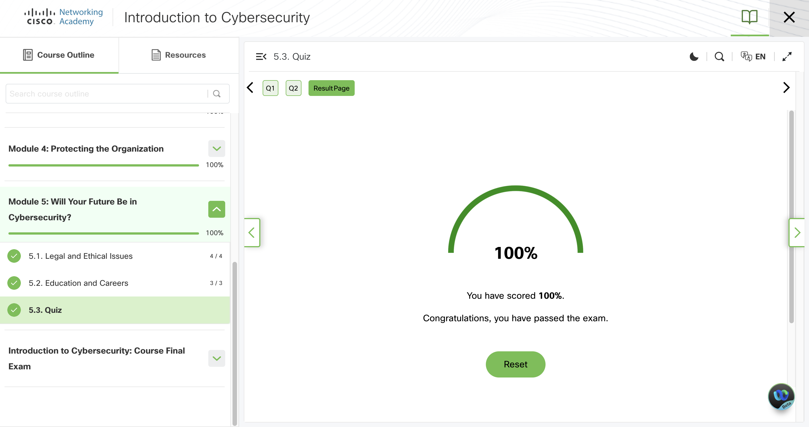
      <td>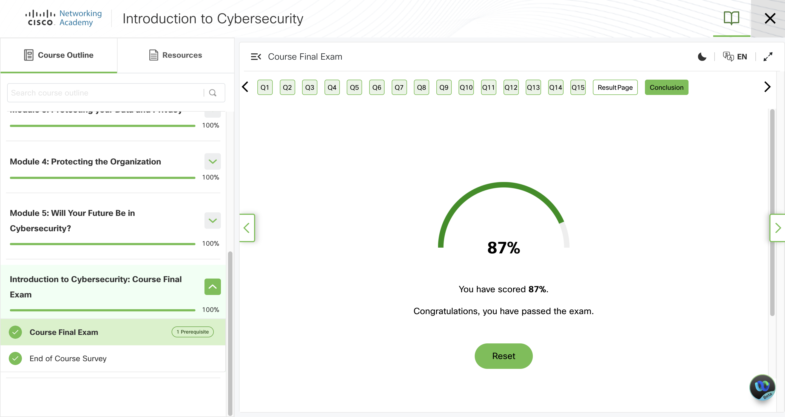</td>
    </tr>
     <tr>
      <td align="center"><strong>Figure 3a:</strong> Cisco Quiz 5.3 Introduction to Cybersecurity</td>
      <td align="center"><strong>Figure 3b:</strong> Cisco Final Exam - Introduction to Cybersecurity</td>
    </tr>
	      <tr>
      <td>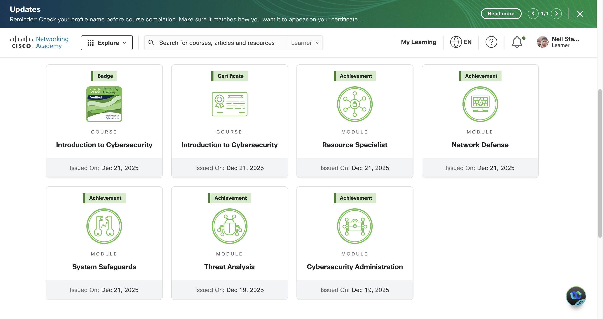
     <tr>
      <td align="center"><strong>Figure 4a:</strong> Cisco Achievements - Introduction to Cybersecurity</td>
    </tr>
  </table>

