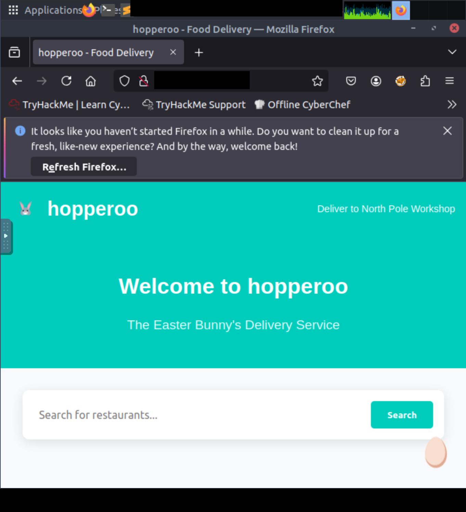

# Containers - DoorDasher's Demise

---
Containerization functions as a technical solution for modern application complexity by encapsulating software and its dependencies 
within isolated environments. Unlike virtual machines, which require a hypervisor and a complete guest operating system to function, 
containers share the host system’s kernel. This architectural difference allows containers to remain lightweight and achieve faster 
startup times compared to traditional virtualization. By utilizing kernel features such as namespaces and control groups (cgroups), 
a container engine—such as Docker—manages these isolated units. This efficiency supports microservices architectures, where 
monolithic applications are decomposed into functional components that can be scaled independently to handle varying traffic loads.

The security of a containerized environment relies heavily on the isolation between the container and the host kernel. A container 
escape occurs when a process bypasses these boundaries to execute code on the host or interact with other containers. Docker 
specifically utilizes a client-server architecture where the Command Line Interface (CLI) communicates with a background daemon 
via an API. This interaction often occurs through a Unix domain socket, commonly located at `/var/run/docker.sock`. If this runtime 
socket is mounted inside a container, a user within that container can issue commands directly to the Docker engine, effectively 
gaining the ability to manage the host's container infrastructure.

In scenarios where "Enhanced Container Isolation" is disabled or misconfigured, the presence of the Docker socket inside a container 
allows for significant privilege escalation. By interacting with this socket, an attacker can execute commands to inspect other 
running services or spawn new, privileged containers. For example, accessing a management container through the socket may 
provide the necessary permissions to execute administrative scripts or access sensitive directories on the host. Managing these 
environments requires careful oversight of socket mounts and the principle of least privilege to prevent lateral movement between 
isolated service units.

| Description | Code/Command |
| --- | --- |
| List all currently running Docker containers | `docker ps` |
| Access a running container with an interactive shell | `docker exec -it uptime-checker sh` |
| Check for the existence and permissions of the Docker socket | `ls -la /var/run/docker.sock` |
| Access the privileged deployer container | `docker exec -it deployer bash` |
| Identify the current user within the container | `whoami` |
| Execute the system restoration script with root privileges | `sudo /recovery_script.sh` |
| Read the contents of the flag file | `cat /flag.txt` |

---

## Key Takeaways - Containers isolate applications and dependencies while sharing the host OS kernel, making them more 
resource-efficient than Virtual Machines.
* Microservices allow for granular scaling of specific application functions rather than scaling a full monolith.
* Docker leverages namespaces and cgroups to maintain process isolation and resource management.
* Mounting `/var/run/docker.sock` inside a container allows that container to control the Docker daemon, potentially leading
  to a container escape.
* Enhanced Container Isolation should be utilized to prevent unauthorized mounting of sensitive runtime sockets.
* Security audits should prioritize identifying privileged containers or containers with direct API access to the host.

---
### Successful Exploitation

After mounting the host filesystem from the compromised container, the target DoorDash website was defaced:

**Figure 1:** Defaced DoorDash website displaying the "Hopperoo" message, proof of full system compromise.

---
What exact command lists running Docker containers?
- `docker ps`

What file is used to define the instructions for building a Docker image?
- `Dockerfile`

What's the flag?
- `THM{DOCKER_ESCAPE_SUCCESS}`

Bonus Question: There is a secret code contained within the news site running on port 5002; this code also happens to be the 
password for the deployer user! They should definitely change their password. Can you find it?  
- `DeployMaster2025!`

---
>[!Note]
>### You did it! Wareville is one step safer.
>The townsfolk are counting on you to keep Christmas secure.
>Head back to Wareville to continue your mission!

