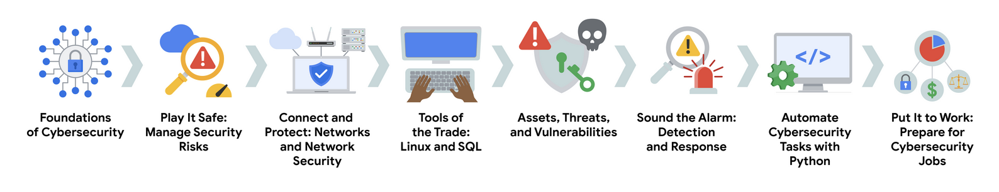
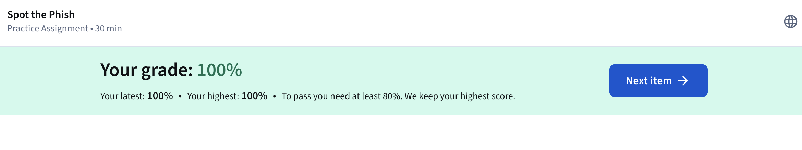
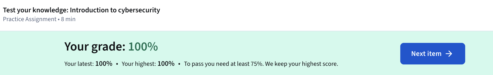
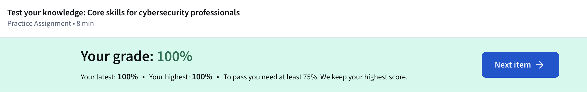

# Module 1: Welcome To The Exciting World Of Cybersecurity 

---

As a cybersecurity researcher logging my initial explorations into foundational concepts, I reflect on the Google Cybersecurity Certificate program, which serves as an entry point 
for building skills in this field. The program, led by instructors like Toni, a Security Engineering Manager at Google, emphasizes the rapid growth in demand for security roles, 
projected by the U.S. Bureau of Labor Statistics to exceed 30 percent by 2030, far outpacing average occupational expansion. This surge stems from expanding global internet access 
and digital technology adoption, necessitating diverse professionals to safeguard varied markets. Toni's background in intelligence analysis before transitioning to security 
resonates with me, highlighting how skills like critical thinking and communication form a base for success here. The certificate aims to equip learners for entry-level positions, 
covering essentials such as monitoring systems, investigating breaches, and implementing protective measures, without requiring prior experience.

The program's structure includes multiple courses guided by Google experts: Ashley covers security domains, frameworks, controls, threats, risks, vulnerabilities, and common tools;
Chris discusses network structures, protocols, attacks, and securing networks; Kim introduces computing basics, operating systems, Linux command line, and SQL; Da'Queshia explores
asset protection via controls and deeper risk insights; Dave focuses on incident detection, response, and network analysis with tools; Angel teaches Python for automating security 
tasks; Dion handles incident escalation and stakeholder communication; and Emily guides community engagement and job search strategies. This progression builds from core concepts to
practical applications, including hands-on activities like detecting attacks, network protection, incident investigation, and automation. Completing it in three to six months 
part-time prepares one for roles, with connections to over 200 employers hiring certificate graduates. I appreciate the flexibility for self-paced online learning, and the 
inclusion of AI-powered job search tools for resumes, interviews, and skill identification, plus U.S.-specific resources like CareerCircle for coaching and job postings.

Delving into cybersecurity's core, it revolves around protecting organizational information much like fortifying a home against storms, ensuring confidentiality through measures 
like strong passwords and encryption, integrity to prevent unauthorized alterations, and availability for constant access by authorized users. This triad underpins the practice of
defending networks, devices, people, and data from exploitation. In entry-level roles, analysts monitor internal networks as first responders, conduct penetration testing to 
uncover vulnerabilities, collaborate on prevention software installation, integrate security in development, and perform audits to review records and restrict access to sensitive
data like passwords. Security engineers, as exemplified by Nikki's path from an aquarium internship spotting phishing to building detection systems, handle operational 
investigations, playbook creation for incident response, and improvements in defenses, blending blue team protection with red team vulnerability identification. Playbooks, as 
procedural guides for consistent incident handling, stand out to me as practical tools that streamline team efforts.

Key terminology forms the backbone: cybersecurity ensures confidentiality, integrity, and availability against unauthorized access; compliance adheres to standards to avoid 
breaches; frameworks guide risk mitigation plans; controls reduce specific risks for a strong posture, an organization's defense management and adaptability. Threat actors pose
risks, including internal ones from employees or partners, sometimes accidental like clicking malicious links. Network security protects infrastructure; cloud security configures 
remote data center assets properly; programming automates tasks like domain searches or traffic reviews. Transferable skills like clear communication across audiences, team 
collaboration, analytical problem-solving, time management under urgency, a growth mindset for evolving tech, and valuing diverse perspectives enhance effectiveness. Technical 
proficiencies include programming languages like Python and SQL for automation and errors, SIEM tools for log analysis and threat identification, computer forensics for evidence 
preservation, IDS for monitoring intrusions, threat landscape awareness for emerging patterns, and incident response following procedures.

The program's value lies in supporting business continuity, ethical operations, reputation, and trust, while protecting personally identifiable information (PII) such as names,
birth dates, addresses, or IP addresses, and sensitive PII (SPII) like social security numbers, medical data, or biometrics, to prevent identity theft driven by financial motives.
Veronica's transition from IT support at Google, leveraging troubleshooting and seeking mentorship, reinforces that degrees aren't mandatory; imperfect readiness shouldn't deter
pursuit. The CompTIA Security+ certification, with a 30 percent discount upon completion, validates skills further. For ongoing reference, the National Institute of Standards and 
Technology glossary at https://csrc.nist.gov/glossary provides comprehensive term updates. I find this foundational overview particularly useful for framing my own skill 
development, reminding me that curiosity and proactive questioning drive threat minimization in this dynamic field.

---

### Key Takeaways
- Industry-Recognized Credential: Earn a Google certificate to enhance your resume and professional profiles like LinkedIn.
- CompTIA Security+ Discount: Receive a discount for the CompTIA Security+ certification, further validating your cybersecurity skills.
- AI-Powered Job Search: Utilize AI tools within the program to streamline your job search, including identifying transferable skills, updating resumes, and practicing interviews.
- Exclusive Resources (U.S. Learners): Access one-on-one career coaching and thousands of job postings through CareerCircle at no cost.
- Stay on Top of Deadlines: Learners who meet deadlines are nearly twice as likely to complete the certificate.
- Engage with the Learner Community: Connect with other learners for advice and support, which significantly increases your chances of success.
- Keep information private (Confidentiality): This means using strong passwords and encryption to prevent unauthorized access to sensitive data.
- Ensure information is accurate and untampered (Integrity): This ensures data remains correct and unchanged without permission.
- Make sure information is always available when needed (Availability): This keeps systems and data accessible to authorized users.
- Phishing Tactics (Social Engineering): Psychological tricks like urgency, fear, or authority impersonation.
- Technical Indicators: Definitive flags like incorrect sender domains or malicious links.
- Content Indicators: Suspicious elements like poor grammar, misspellings, generic greetings, or unusual requests.
- Read the Email Scenario.
- Evaluate the options, focusing on the technical element (domain, link).
- Submit your answer for an instant grade and feedback.
- Monitoring and Protecting Systems: Security analysts monitor networks and respond to threats, participating in penetration testing.
- Proactive Threat Prevention: Collaborate on prevention software and integrate security in development.
- Conducting Security Audits: Review security records and restrict access to confidential information.
- Journey into Cybersecurity: Exposure through internships handling phishing and network security.
- The Flexibility of Cybersecurity Careers: Paths in blue team protection or red team vulnerability identification, with varying daily tasks.
- Roles and Impact in Cybersecurity: Focus on operations, investigations, building detections, and creating playbooks.
- Communication: Explain threats to technical and non-technical audiences and report findings.
- Collaboration: Work with engineers, investigators, and managers.
- Analysis and Problem-Solving: Analyze scenarios, recommend tools, diagnose issues, and provide solutions.
- Programming Languages: Basic understanding of Python and SQL for automation and error identification.
- SIEM Tools: For identifying and analyzing threats.
- Computer Forensics: Identifying, analyzing, and preserving digital evidence.
- Communication: Mitigate issues quickly by understanding concerns and conveying information clearly.
- Problem-solving: Identify attack patterns and find efficient solutions, accepting compromises.
- Time management: Prioritize tasks with urgency to minimize damage.
- Growth mindset: Embrace continuous learning in a fast-evolving industry.
- Diverse perspectives: Encourage respect for better solutions.
- Programming languages: Automate time-consuming tasks like threat searches or pattern analysis.
- SIEM tools: Analyze log data for monitoring activities and identifying threats.
- Intrusion detection systems (IDSs): Monitor for intrusions like unauthorized access.
- Threat landscape knowledge: Stay aware of trends in actors, malware, and methodologies.
- Incident response: Follow procedures to investigate and remediate issues.
- Business Continuity and Ethics: Ensure operations and avoid legal or moral issues.
- Reputation and Trust: Protect standing, build trust, and foster growth.
- Personally Identifiable Information (PII): Data like names, birth dates, addresses, IP addresses.
- Sensitive Personally Identifiable Information (SPII): Stricter data like social security numbers, medical/financial info, biometrics.
- Primary Concern: Identity theft for fraudulent activities.
- Financial Gain: Main goal of identity theft.
- Cybersecurity (or security): The practice of ensuring confidentiality, integrity, and availability of information by protecting networks, devices, people, and data from unauthorized access or criminal exploitation.
- Cloud security: The process of ensuring that assets stored in the cloud are properly configured and access to those assets is limited to authorized users.
- Internal threat: A current or former employee, external vendor, or trusted partner who poses a security risk.
- Network security: The practice of keeping an organization's network infrastructure secure from unauthorized access.
- Personally identifiable information (PII): Any information used to infer an individual’s identity.
- Security posture: An organization’s ability to manage its defense of critical assets and data and react to change.
- Sensitive personally identifiable information (SPII): A specific type of PII that falls under stricter handling guidelines.
- Technical skills: Skills that require knowledge of specific tools, procedures, and policies.
- Threat: Any circumstance or event that can negatively impact assets.
- Threat actor: Any person or group who presents a security risk.
- Transferable skills: Skills from other areas that can apply to different careers.

---

### Gallery 

  <table>
    <tr>
      <td>
      <td></td>
    </tr>
    <tr>
      <td align="center"><strong>Figure 1a:</strong> Module 1 Security Domains</td>
      <td align="center"><strong>Figure 1b:</strong> Spot The Phish Assignment</td>
    </tr>
    <tr>
      <td>
      <td></td>
    </tr>
     <tr>
      <td align="center"><strong>Figure 2a:</strong> Test Your Knowledge: Intro to Cybersec</td>
      <td align="center"><strong>Figure 2b:</strong> Test Your Knowledge: Core Skills For Cybersecurity Professionals</td>
    </tr>
  </table>

---

