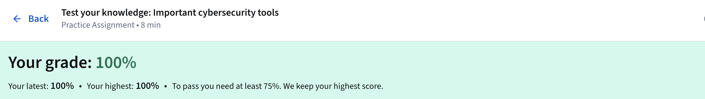
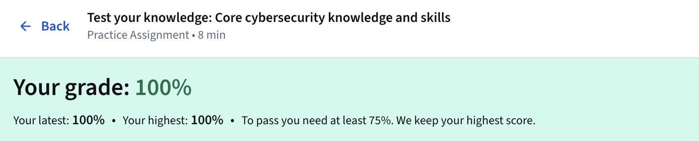
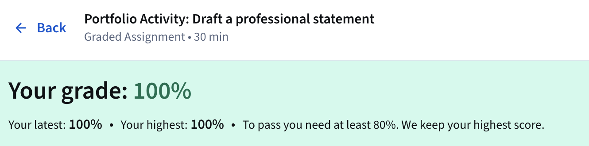
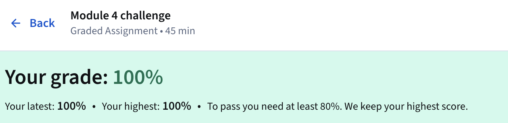

# Module 4: Cybersecurity Tools And Programming Languages 

---

Security Information and Event Management (SIEM) tools gather and examine log data in real time, delivering alerts on threats 
and vulnerabilities while reducing manual review through organized dashboards. Examples include Splunk Enterprise, which runs 
on-premise, and Google's Chronicle, a cloud-native solution. Organizations select hosting models based on team experience, often 
favoring cloud options for simpler setup and maintenance. Logs capture system events such as employee sign-ins or web service 
access, forming the foundation for identifying breaches and weaknesses.

Playbooks function as operational manuals that outline responses to security incidents, ensuring consistent procedures. In a 
forensic investigation scenario involving a breached medical practice, analysts consult the chain of custody playbook to document
evidence possession, tracking who handled it, when, where, and why, with every transfer recorded. The protecting and preserving 
evidence playbook addresses fragile digital data by following the order of volatility, collecting the most transient information 
first—such as data lost upon power-off—before working with copies to prevent alteration or compromise during analysis. This 
structured approach preserves evidence integrity for insurance or legal purposes.

Network protocol analyzers, commonly called packet sniffers, record and inspect data traffic to uncover risks, with common 
examples being tcpdump and Wireshark. Programming supports efficiency by generating precise instructions that automate repetitive
tasks and limit human error. Python handles time-intensive processes requiring accuracy, while SQL enables creation, interaction,
and retrieval of targeted data from large databases containing millions of data points. Linux serves as the primary open-source 
operating system for analysts, relying on its command-line interface to examine logs and probe unusual network activity.

Additional protective tools include antivirus software to scan for and remove malware, intrusion detection systems that monitor 
network packets and system activity for intrusions or unauthorized access, and encryption to convert readable plaintext into 
secure ciphertext for confidentiality. Penetration testing simulates attacks to reveal weaknesses in systems, networks, and 
applications. For web applications, staying informed on critical risks involves reviewing the Open Web Application Security 
Project (OWASP) Top 10.

Portfolio development received significant attention as a means to demonstrate skills beyond a basic resume. Practical options 
encompass a local documents folder on the hard drive, structured with subfolders for resume, education, portfolio documents, 
cybersecurity tools, and programming; cloud platforms like Google Drive or Dropbox for seamless sharing and automatic updates; 
Google Sites for building responsive websites with custom layouts and a shareable URL; and Git repositories such as GitLab, 
Bitbucket, or GitHub, managed through Markdown. Recommended projects to incorporate include drafting a professional statement, 
conducting a security audit, analyzing network structure, using Linux commands for file permissions, applying SQL query filters, 
identifying vulnerabilities for a small business, documenting incidents in a handler’s journal, importing and parsing 
security-related text files, and creating or revising a resume. Sites should remain private until complete, and private or 
proprietary materials must be excluded. Setup guidance is available directly from the Google Drive, Dropbox, Google Sites, and 
Get started with GitHub resources.

The module stressed that organizations vary in their tool selections, making broad familiarity valuable for adaptability. 
Supplementary references include the Google Cybersecurity Action Team's Threat Horizon Report for cloud threat intelligence and 
the Cybersecurity & Infrastructure Security Agency (CISA) list of free cybersecurity services and tools. Engagement in the 
Google Cybersecurity Community offers opportunities to discuss content, expand networks, and explore career leads. The section
ended with a recap of Course 1 foundations, covering the CIA triad, NIST Cybersecurity Framework, entry-level analyst roles, 
and preparation for subsequent courses on risk management, networks, Linux and SQL, threats and vulnerabilities, detection and 
response, Python automation, and job readiness.

---

### Key Takeaways
- SIEM tools collect and analyze logs to monitor activities, issue targeted alerts, and present data through customizable dashboards, supporting both on-premise and cloud deployments.
- Playbooks provide step-by-step guidance for incidents, including chain of custody to track evidence handling and protecting/preserving evidence via the order of volatility to prioritize transient data and work from copies.
- Network protocol analyzers such as tcpdump and Wireshark capture and examine traffic to detect risks.
- Python automates repetitive tasks with precision to reduce errors, while SQL queries large databases to extract specific data points.
- Linux functions as an open-source command-line operating system for log review and system investigation.
- Antivirus software prevents, detects, and removes malware; intrusion detection systems alert on suspicious packet activity and access attempts; encryption secures data confidentiality; penetration testing evaluates vulnerabilities through simulated attacks.
- Web application risks should be tracked via the OWASP Top 10.
- Portfolio hosting choices include a local documents folder with organized subfolders (Resume, Education, Portfolio documents, Cybersecurity tools, Programming), Google Drive or Dropbox for cloud sharing, Google Sites for responsive websites, and Git repositories (GitLab, Bitbucket, GitHub) using Markdown.
- Portfolio projects to build: draft professional statement, security audit, network analysis, Linux file permissions management, SQL query filters, small business vulnerability identification, incident handler’s journal, security text file parsing, and resume creation/revision.
- Additional resources: Google Cybersecurity Action Team's Threat Horizon Report and CISA free tools list.
- Join the Google Cybersecurity Community for peer discussions, networking, and career support.

---

### Gallery 

  <table>
    <tr>
      <td>
      <td></td>
    </tr>
    <tr>
      <td align="center"><strong>Figure 1a:</strong> Test Your Knowledge - Important Cybersecurity Tools</td>
      <td align="center"><strong>Figure 1b:</strong> Test Your Knowledge - Core Cybersecurity Knowledge And Skills</td>
    </tr>
    <tr>
      <td>
      <td></td>
    </tr>
     <tr>
      <td align="center"><strong>Figure 2a:</strong> Portfolio Activity - Draft A Professional Statement</td>
      <td align="center"><strong>Figure 2b:</strong> Module 4 Challenge - Graded Assignment</td>
    </tr>
  </table>

---

