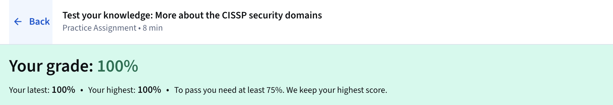
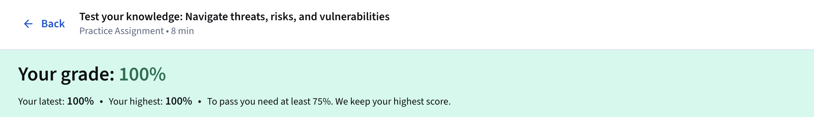

# Module 1: Security Domains 

---

In the second course of the Google Cybersecurity Certificate, Play It Safe: Manage Security Risks, the opening module lays out 
the core structure of the Certified Information Systems Security Professional (CISSP) certification's eight security domains. 
These domains serve as the organizing framework for how security teams assess posture, close gaps, and align protections with 
business needs. The material also maps threats, risks, and vulnerabilities to real organizational impacts and walks through the 
National Institute of Standards and Technology's (NIST) Risk Management Framework (RMF) 
(https://csrc.nist.gov/projects/risk-management) as the practical process for handling them.

The first domain, Security and Risk Management, centers on setting security goals, applying risk mitigation, maintaining 
compliance, ensuring business continuity, and meeting legal and ethical standards. It ties directly into information security 
processes such as incident response, vulnerability management, application security, cloud security, and infrastructure security. 
An organization might adjust handling of personally identifiable information (PII) to satisfy regulations like the European 
Union's General Data Protection Regulation (GDPR), for instance.

Asset Security, the second domain, deals with the full lifecycle of both physical and digital assets—storage, maintenance, 
retention, and secure destruction. Analysts often perform impact analyses and create recovery plans scaled to each asset's risk 
level, routinely taking backups so restoration remains possible after an incident.

Security Architecture and Engineering, the third domain, emphasizes building resilient systems through effective tools, 
processes, and design principles. Shared responsibility stands out here: every person involved in a system must actively reduce 
risk. Core principles include threat modeling, least privilege, defense in depth, fail securely, separation of duties, keep it 
simple, zero trust, and trust but verify. In practice, this shows up when security information and event management (SIEM) tools
flag anomalous login attempts that could signal an intruder targeting private data.

Communication and Network Security, the fourth domain, covers protection of physical networks, wireless links, on-premises, 
cloud, and remote-access environments. The challenge of securing hybrid workforces is addressed through controls like restricted 
access policies that keep traveling or remote employees from exposing the internal network.

Identity and Access Management (IAM), the fifth domain, enforces trusted identities, proper authentication, role-based 
authorization, and accountability. The principle of least privilege is central: grant only the access needed for a task and 
revoke it once the task ends. A typical analyst task might involve verifying that customer service staff can view only necessary 
contact details during a support call.

Security Assessment and Testing, the sixth domain, drives ongoing evaluation through control testing, data collection, audits, 
and penetration testing. Regular audits of user permissions and implementation of measures such as multi-factor authentication
help close gaps before threat actors can exploit them.

Security Operations, the seventh domain, handles active incident investigation, containment, forensics, and post-breach 
improvements. It draws on training, reporting, intrusion detection and prevention, SIEM tools, log management, playbooks, and 
lessons-learned reviews. Teams here manage everything from insider threats to advanced persistent threats (APTs) that linger 
undetected.

Software Development Security, the final domain, embeds security into every phase of the development lifecycle. Secure design 
reviews, code analysis, penetration testing, and quality assurance checks ensure vulnerabilities are caught before release 
rather than bolted on afterward.

The module then shifts to threats, risks, and vulnerabilities themselves. Assets include anything of value—physical items like 
servers and offices, or digital ones like employee PII, bank details, and intellectual property. A threat is any circumstance 
that can harm those assets, such as phishing that tricks users into revealing credentials. Risk is the combination of likelihood 
and potential impact on confidentiality, integrity, or availability, often rated low, medium, or high. Vulnerability is a 
weakness a threat can exploit, whether outdated software, weak passwords, or misconfigured access.

Common risk management strategies include acceptance when disruption outweighs the cost, avoidance through policy changes, 
transference to third parties like insurers, and mitigation by reducing exposure. The NIST RMF 
(https://csrc.nist.gov/projects/risk-management) provides the structured steps: Prepare by establishing risk processes; 
Categorize systems by impact; Select and tailor controls; Implement those controls; Assess effectiveness; Authorize operation; 
and Monitor continuously. Organizations also draw on frameworks like the Health Information Trust Alliance (HITRUST) 
(https://hitrustalliance.net/).

Specific threats highlighted include insider threats, where trusted insiders misuse access, and APTs that maintain long-term 
footholds. Risks arise from external actors, internal personnel, legacy systems still connected to production, multiparty 
arrangements with vendors, and non-compliant software. Vulnerabilities cited range from ProxyLogon and ZeroLogon in Microsoft 
environments to Log4Shell and PetitPotam, plus broader issues like poor logging and server-side request forgery. The reading 
stresses that timely patching and constant monitoring are non-negotiable; the NIST National Vulnerability Database 
(https://nvd.nist.gov/) and CISA Known Exploited Vulnerabilities Catalog 
(https://www.cisa.gov/known-exploited-vulnerabilities-catalog) are referenced as primary resources for staying current. The
Open Web Application Security Project (OWASP) Top 10 (https://owasp.org/www-project-top-ten/) also features as a key reference 
for web application risks.

Ransomware receives focused attention as a high-impact threat that encrypts data and demands payment, with negotiations and 
leaks often occurring on the dark web. Broader consequences include financial losses from downtime and recovery, identity theft
from exposed PII, and reputational damage that can drive customers away and trigger regulatory fines.

The NIST RMF steps are presented as the operational backbone for entry-level analysts, even if they do not execute every phase.
The Prepare step builds organizational readiness; Categorize evaluates impact on the CIA triad; Select documents chosen 
controls; Implement turns plans into action; Assess validates execution; Authorize assigns accountability; and Monitor maintains
ongoing visibility.

---

### Key Takeaways
- Security posture is the organization's overall ability to defend assets and adapt; it is shaped by goals, risk processes,
  compliance, continuity plans, regulations, and ethics.
- Risk management strategies: acceptance (live with it), avoidance (eliminate exposure), transference (shift to third party),
  mitigation (reduce impact).
- Common threats: insider threats, advanced persistent threats (APTs).
- Common risks: external actors, internal personnel, legacy systems, multiparty/vendor access, software compliance failures.
- Common vulnerabilities: ProxyLogon, ZeroLogon, Log4Shell, PetitPotam, insufficient logging/monitoring, server-side request
  forgery.
- NIST RMF steps: Prepare, Categorize, Select, Implement, Assess, Authorize, Monitor.
- Principle of least privilege: grant minimal access required for a task and revoke when complete.
- Shared responsibility: everyone in the organization actively lowers risk.
- InfoSec processes: incident response, vulnerability management, application security, cloud security, infrastructure
  security.

---

### Gallery 

  <table>
    <tr>
      <td>
      <td></td>
    </tr>
    <tr>
      <td align="center"><strong>Figure 1a:</strong> Test Your Knowledge More About CISSP Security Domains</td>
      <td align="center"><strong>Figure 1b:</strong> Test Your Knowledge - Navigate Threats, Risks, And Vulnerabilities</td>
    </tr>
    <tr>
      <td>
 </tr>
     <tr>
      <td align="center"><strong>Figure 2a:</strong> Module 1 Challenge - Graded Assignment</td>
    </tr>
  </table>

---

