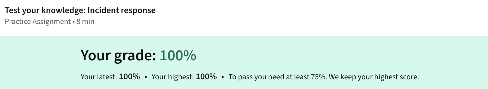
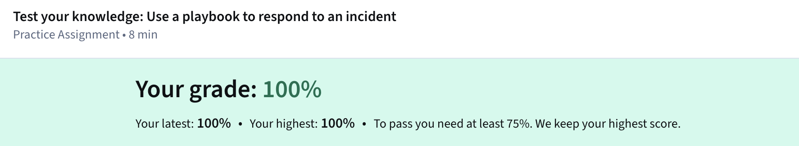

# Module 4: Use Playbooks To Respond To Incidents 

---

In my ongoing notes on cybersecurity practices, I've been reflecting on the structured role that security playbooks play in handling 
threats and vulnerabilities. These documents serve as detailed guides outlining operational steps and necessary tools for responding to 
incidents, ensuring that teams maintain consistency and precision regardless of the personnel involved. From what I've gathered, 
playbooks are paired with strategies that define team expectations and sometimes assign specific responsibilities, alongside plans that 
dictate exact completion methods for tasks. They're designed as evolving resources, collaboratively updated by team members with varying 
expertise to adapt to shifting industry dynamics and emerging adversary methods.

Playbooks prove especially vital in incident response, providing a framework to minimize damage and adhere to legal and organizational 
protocols. They often address specific scenarios like ransomware, voice phishing, or business email compromise, but organizations tailor
them based on local regulations, which influence notification requirements and compliance. For instance, incident and vulnerability 
response playbooks align with an organization's business continuity plan, which charts a recovery path to resume normal operations after
disruptions such as breaches. The level of risk in these situations hinges on the potential harm to assets, calculated roughly as the 
probability of a threat materializing, underscoring the need for swift action to preserve forensic evidence without mishandling it.

I've found it particularly insightful how playbooks integrate with tools like Security Information and Event Management (SIEM) systems,
which flag anomalies such as unusual user behavior, prompting analysts to follow prescribed steps for investigation and resolution. 
Similarly, they're used alongside Security Orchestration, Automation, and Response (SOAR) software, which automates routine tasks like 
account lockdowns after repeated failed logins, allowing teams to focus on deeper analysis. In practice, this combination reduces 
incident impact by enforcing timely, coordinated efforts, including flowcharts or tables for clarity on sequences and roles.

The emphasis on post-incident refinement resonates with me, as each event offers lessons to enhance future handling, bolstering overall 
preparedness. For professionals outside the U.S., resources like the United Kingdom's National Cyber Security Centre guidance on 
incident management at https://www.ncsc.gov.uk/collection/incident-management, the Australian Government's cyber security incident 
response materials at https://www.cyber.gov.au/business-government/detecting-responding-to-threats/cyber-security-incident-response, 
Japan's JPCERT/CC vulnerability handling guidelines at https://www.jpcert.or.jp/english/vh/guidelines.html, Canada's ransomware 
playbook at https://www.cyber.gc.ca/en/guidance/ransomware-playbook-itsm00099, and Scotland's cyber resilience playbook templates at 
https://www.gov.scot/publications/cyber-resilience-incident-management provide tailored insights that I've cross-noted for potential 
international contexts.

Diversity in team perspectives, including soft skills for collaboration, enhances playbook application, especially in roles like 
privacy engineering where user trust and data protection are prioritized from the design phase. Drawing from varied backgrounds, such
as journalism, can inform more inclusive incident handling. Ultimately, understanding these elements elevates daily tasks for analysts,
aligning with broader frameworks like the Certified Information Systems Security Professional domains and National Institute of 
Standards and Technology risk management approaches.

---

### Key Takeaways
- Playbooks update triggers: Identified failures in policies, procedures, or the playbook itself; shifts in industry standards like
  legal or compliance changes; evolutions in threat actor tactics and techniques.
- Types of playbooks: Specific to incidents like ransomware, vishing, or business email compromise; incident and vulnerability response
   varieties based on business continuity goals; organization-specific sets influenced by country-specific laws and data types.
- Common steps in incident and vulnerability playbooks: Preparation through documenting procedures, staffing, and user education;
  detection to identify security events; analysis to assess breach occurrence and scope; containment to halt further damage; eradication
   to remove incident remnants; recovery to restore systems securely; post-incident activities for documentation and lessons learned;
   coordination for reporting and information sharing per standards.

---

### Gallery 

  <table>
    <tr>
      <td>
      <td></td>
    </tr>
    <tr>
      <td align="center"><strong>Figure 1a:</strong> Test Your Knowledge - Incident Response</td>
      <td align="center"><strong>Figure 1b:</strong> Test Your Knowledge - Use A Playbook To Respond To An Incident</td>
    </tr>
    <tr>
      <td>
    </tr>
     <tr>
      <td align="center"><strong>Figure 2a:</strong> Module 4 Challenge - Graded Assignment</td>
    </tr>
  </table>

---

