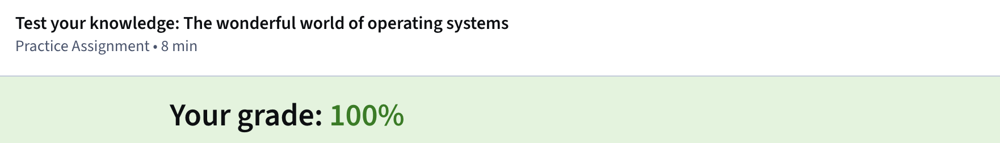
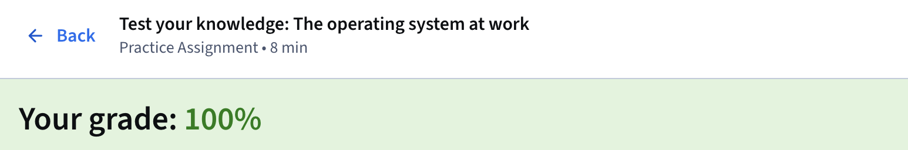
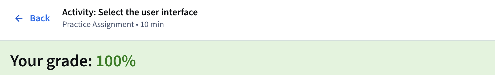
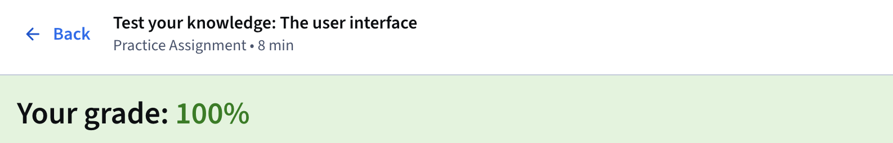
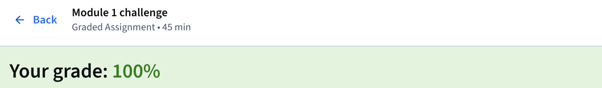

# Module 1: Introduction To Operating Systems

---

Operating systems serve as the essential bridge between computer hardware and users, managing resources and enabling applications to 
function efficiently in security environments. The Tools of the Trade: Linux and SQL course, the fourth in the Google Cybersecurity 
Certificate program, builds foundational skills for analysts by focusing on how systems operate, with strong emphasis on Linux and 
command-line usage alongside database querying through SQL. Module 1 introduces operating systems in detail, covering their 
interactions with hardware and software, common variants, and the value of understanding both graphical user interfaces and 
command-line interfaces for incident response and threat analysis.

Early computing in the 1950s limited machines to running one program at a time, often requiring manual resets between tasks, but modern
operating systems support multitasking and translate human instructions into machine code. The boot process begins when power activates
either the Basic Input/Output System (BIOS) on older hardware or the Unified Extensible Firmware Interface (UEFI) on newer systems; 
these microchips run initial checks, load the bootloader, and start the operating system. Once running, the OS handles requests by 
interpreting application demands, routing them to appropriate hardware components like processors or storage, then returning results 
through the same path back to the user. This layered flow proves critical for analysts tracing breaches, as vulnerabilities can appear
in firmware areas that standard antivirus tools might overlook.

Common operating systems include Windows, which remains closed-source, and macOS with its mix of open and closed elements, alongside 
fully open-source Linux that sees heavy adoption in security work. Mobile platforms such as Android (open-source base) and iOS 
(partially open) also play roles, while ChromeOS serves education-focused environments. All systems carry inherent vulnerabilities, 
making timely updates vital; legacy systems that no longer receive patches create persistent risks due to compatibility constraints 
in enterprise settings. Resource management forms another core function, with the operating system allocating memory, storage, and 
processing power among competing tasks, much like monitoring CPU and memory usage in tools such as task managers during malware 
investigations.

Virtualization adds another layer through virtual machines that emulate physical computers on shared hardware, providing isolated 
sandboxes ideal for safely analyzing malware or testing configurations via hypervisors like Kernel-based Virtual Machine (KVM). 
Command-line interfaces deliver text-based control superior for batch operations and logging history, contrasting with the icon-driven
graphical user interfaces most users encounter daily. Security professionals benefit particularly from command-line proficiency in 
Linux environments for file system navigation, user authentication, and reviewing command histories during forensic work.

Experienced practitioners like Technical Program Manager Kim and Security Engineering Manager Ellen highlighted how diverse career 
paths—from non-technical roles to self-taught experimentation—lead successfully into cybersecurity when paired with curiosity, 
networking, and openness to learning. The module stresses building this foundation for effective system protection, access management,
firewall configuration, and anomaly detection.

---

### Key Takeaways
- Establish a regular study schedule using a calendar for daily goals while progressing at your own pace through the certificate
  program.
- Stay curious by exploring concepts deeply, asking questions, searching for additional details online, and maintaining personal notes.
- Review completed assignment exemplars for validation and inspiration while developing a personal career identity aligned with
  individual strengths and values.
- Engage with the private Google Cybersecurity Community to network, share experiences, and update your Coursera profile for better
  connections.
- Utilize provided glossaries for modules, courses, and the full certificate to reinforce terminology ahead of quizzes.
- Prioritize regular operating system updates to mitigate vulnerabilities, especially on legacy systems that lack ongoing support.
- Understand the four-part task flow—user request, application, operating system interpretation, hardware execution—for effective
  security event analysis.
- Leverage virtual machines for isolated testing and malware handling to enhance safety and efficiency in security operations.
- Master command-line interfaces for their power in simultaneous task handling and command history review during incident response.

---

### Gallery 

  <table>
    <tr>
      <td align="center">
      <td align="center"></td>
    </tr>
    <tr>
      <td align="center"><strong>Figure 1a:</strong> Test your knowledge: The Wonderful World of OS</td>
      <td align="center"><strong>Figure 1b:</strong> Test your knowledge: The OS at work</td>
    </tr>
    <tr>
      <td align="center">
      <td align="center"></td>
    </tr>
     <tr>
      <td align="center"><strong>Figure 2a:</strong> Activity: Select The UI</td>
      <td align="center"><strong>Figure 2b:</strong> Test your knowledge: The UI</td>
    </tr>
  </table>

  <table>
    <tr>
      <td align="center">
    </tr>
    <tr>
      <td align="center"><strong>Figure 3a:</strong> Module 1 Challenge: Graded Assignment</td>
    </tr>
  </table>

---

