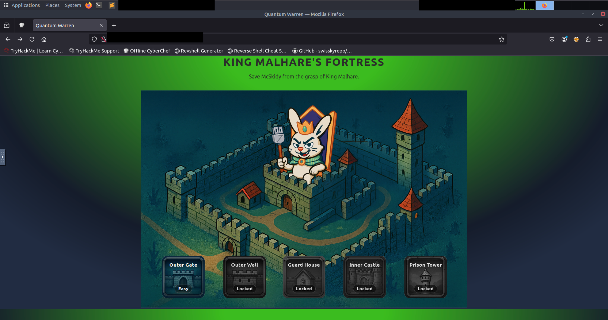
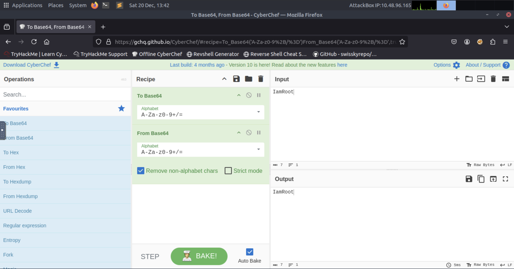
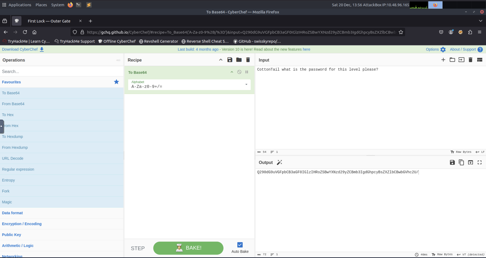
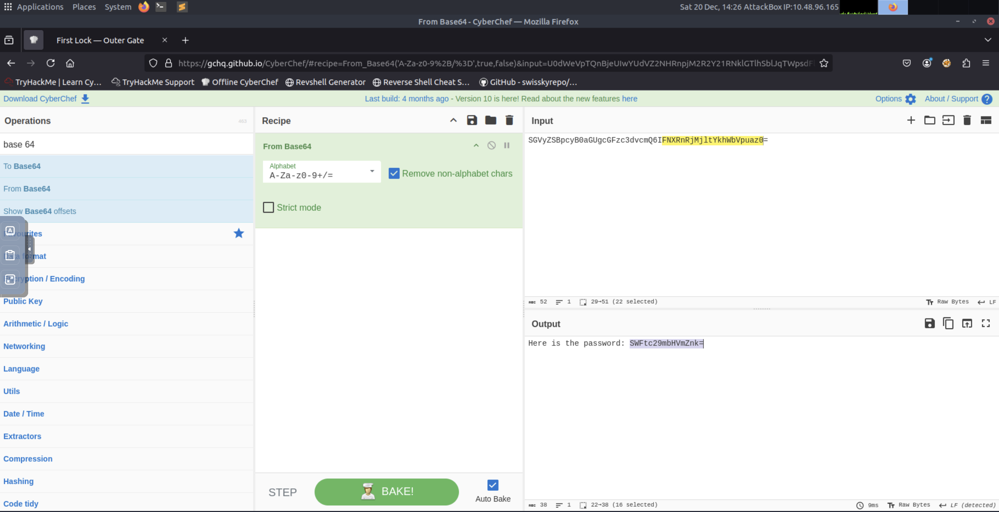
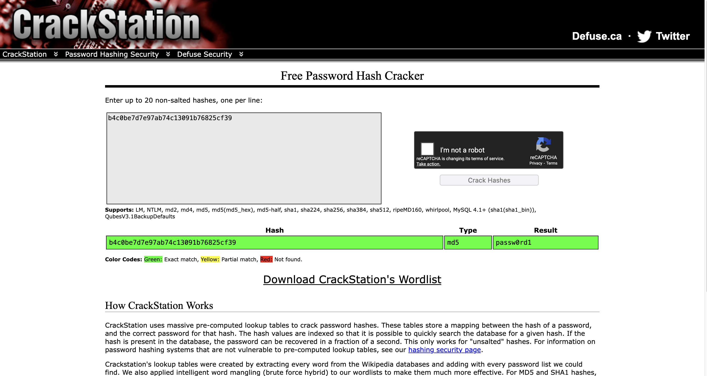
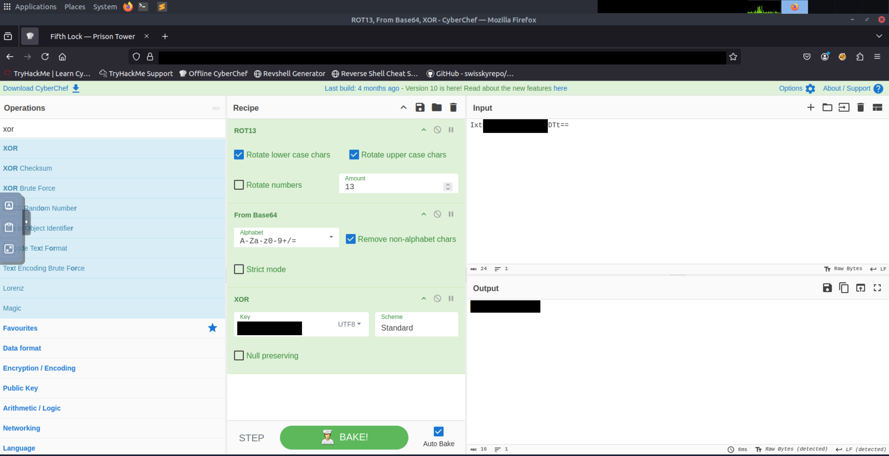
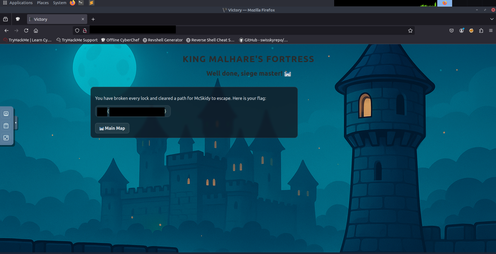
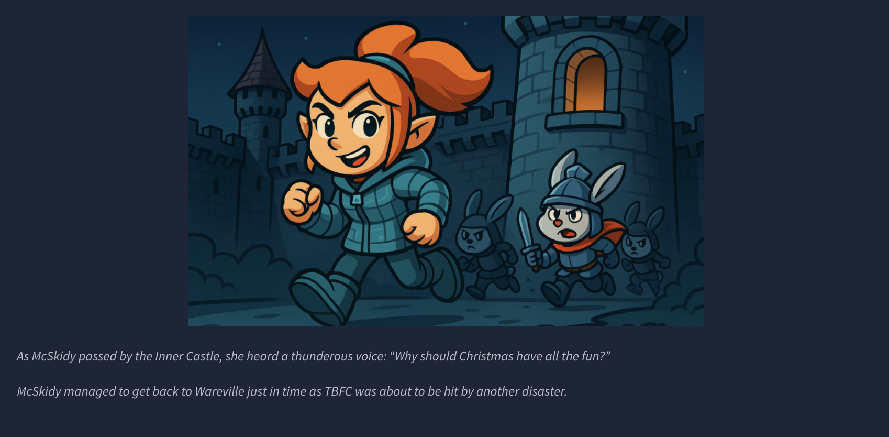

# CyberChef - Hoperation Save McSkidy

---

  <table>
    <tr>
      <td>
      <td></td>
    </tr>
    <tr>
      <td align="center"><strong>Figure 1a:</strong> King Malhare's Fortress</td>
      <td align="center"><strong>Figure 1b:</strong> Cyberchef tool</td>
    </tr>
  </table>

## Data transformation within security operations frequently requires a clear distinction between encoding and encryption. 
Encoding serves to ensure data compatibility across disparate systems and protocols, whereas encryption is intended strictly for 
confidentiality through the application of an algorithm and a secret key. In forensic and offensive analysis, CyberChef serves 
as a modular framework for these transformations, allowing for the construction of recipes where individual operations are chained 
to process input data sequentially. The ability to toggle specific operations within a recipe facilitates the debugging of complex 
transformation strings, which is particularly useful when encountering nested obfuscation layers.

---
## Advanced analysis often involves reversing bitwise operations like XOR. The exclusive OR operation is fundamentally symmetrical; 
applying the same key to the resulting data returns the original plaintext. This property is frequently leveraged in simple malware 
obfuscation and basic authentication challenges. When dealing with one-way functions like the MD5 message-digest algorithm, 
traditional reversal is not possible because the algorithm produces a fixed-size hash value from an input of any size. However, 
for weak or common inputs, precomputed hash tables can be utilized to identify the original string, effectively bypassing the 
one-way constraint through large-scale lookups.

---
## Complex authentication logic frequently incorporates multiple layers of obfuscation, requiring an analyst to work backward from 
the final output. Techniques often include a combination of Base64, Hexadecimal representation, and substitution ciphers like 
ROT13 or ROT47. ROT13 shifts alphabetical characters by thirteen positions, making it its own inverse within a standard 
26-character alphabet. ROT47 expands this concept by shifting across a wider range of ASCII characters. Effective dissection 
of these mechanisms necessitates inspecting the underlying application logic, often accessible via browser developer tools, 
to identify the specific sequence of operations and any embedded keys or salts required for the transformation chain.

| Description | Code/Command |
| --- | --- |
| Sample input for Base64 testing | `IamRoot` |
| Text string for guard interaction | `Password please.` |
| Transformation to standard Base64 encoding | `To Base64` |
| Transformation from standard Base64 encoding | `From Base64` |
| Bitwise Exclusive OR operation | `XOR` |
| Message-Digest Algorithm 5 hashing | `MD5` |
| Caesar cipher variant for alphabetical characters | `ROT13` |
| Caesar cipher variant for ASCII range 33-126 | `ROT47` |
| Reversal of the input string order | `Reverse` |
| Conversion from Hexadecimal string to plaintext | `From Hex` |

---

  <table>
    <tr>
      <td>
      <td></td>
    </tr>
    <tr>
      <td align="center"><strong>Figure 2a:</strong> First Lock Image 1</td>
      <td align="center"><strong>Figure 2b:</strong> First Lock Image 2</td>
    </tr>
    <tr>
      <td>
      <td></td>
    </tr>
     <tr>
      <td align="center"><strong>Figure 3a:</strong> Second Lock</td>
      <td align="center"><strong>Figure 3b:</strong> Third Lock</td>
    </tr>
        <tr>
      <td>
      <td></td>
    </tr>
     <tr>
      <td align="center"><strong>Figure 4a:</strong> Fourth Lock</td>
      <td align="center"><strong>Figure 4b:</strong> Fifth Lock</td>
    </tr>
          <tr>
      <td>
      <td></td>
    </tr>
     <tr>
      <td align="center"><strong>Figure 5a:</strong> Well Done Siege Master!</td>
      <td align="center"><strong>Figure 5b:</strong> McSkiddy Rescued</td>
    </tr>
  
  </table>

---
### Key Takeaways - Encoding is utilized for system compatibility and speed, while encryption is designed for security and data confidentiality.
* [CyberChef](https://gchq.github.io/CyberChef/) allows for the creation of chained "recipes," enabling complex multi-stage data
  processing and reversal.
* The XOR operation is its own inverse; XORing the output with the original key yields the initial input.
* MD5 is a one-way cryptographic hash; while it cannot be mathematically reversed, precomputed tables can be used for hash
  identification. [CrackStation](https://crackstation.net/) utilizes precomputed rainbow tables to perform near-instantaneous
  lookups of cryptographic hashes.
* Browser developer tools are essential for identifying hidden login logic, transformation sequences, and header-based metadata.
* Substitution ciphers like ROT13 and ROT47 are common obfuscation techniques that require specific rotational shifts to decode.
* Multi-layered decoding strategies often involve reversing the order of operations used during the initial encoding or obfuscation
  phase.

---

>[!Note]
>### You did it! Wareville is one step safer.
>The townsfolk are counting on you to keep Christmas secure.
>Head back to Wareville to continue your mission!

