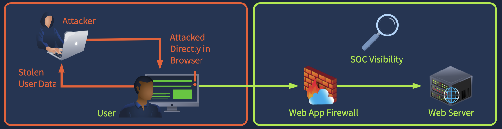
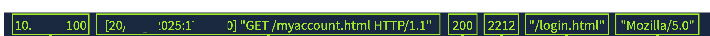
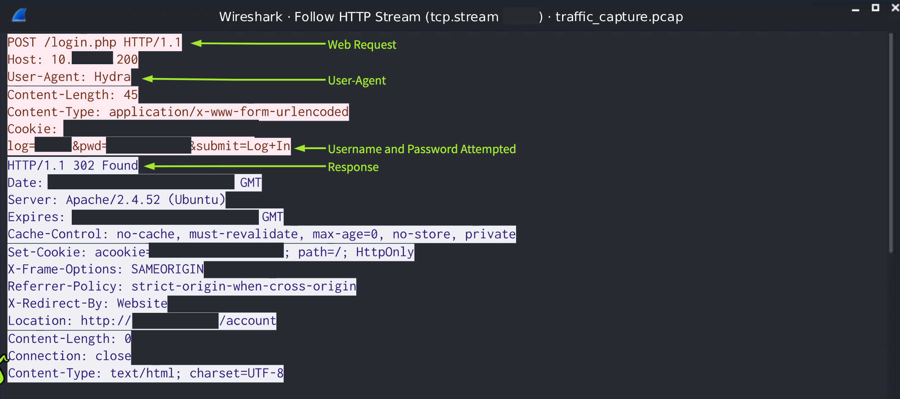
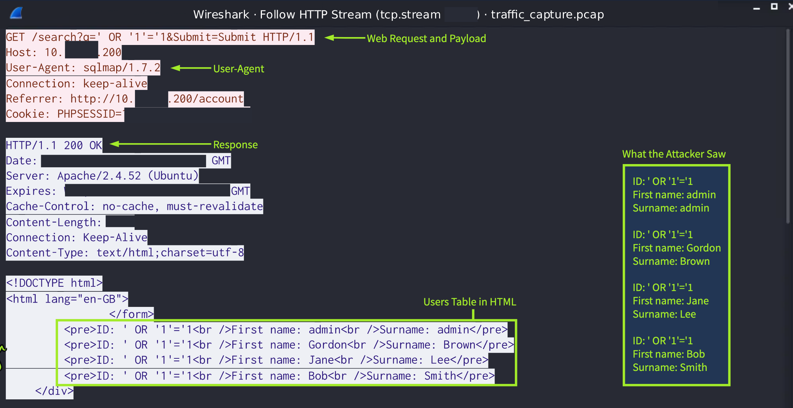
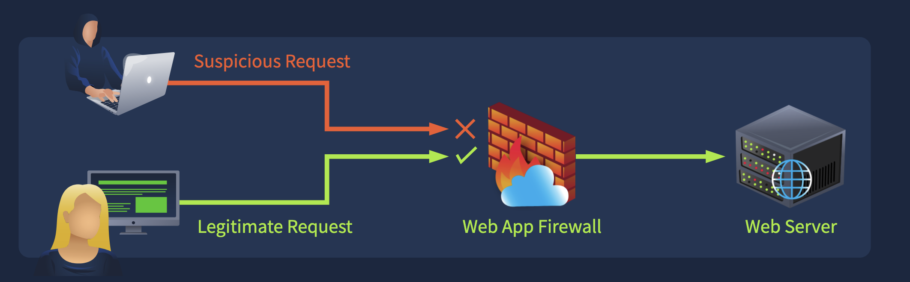
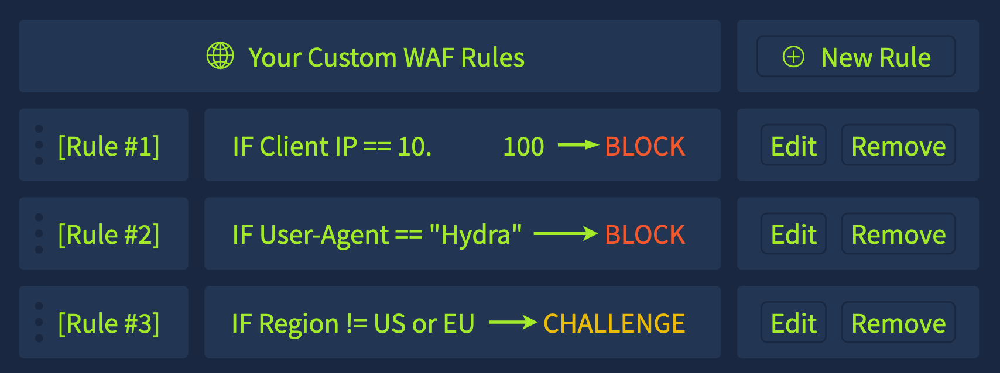
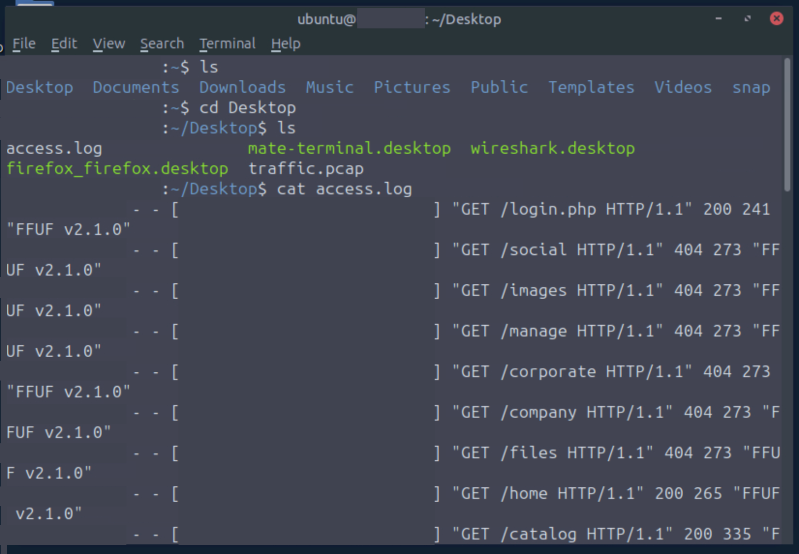
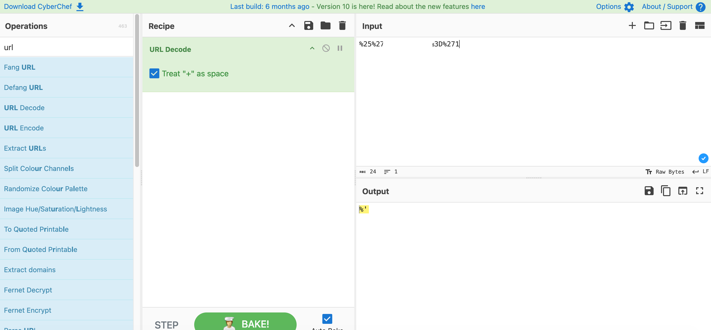
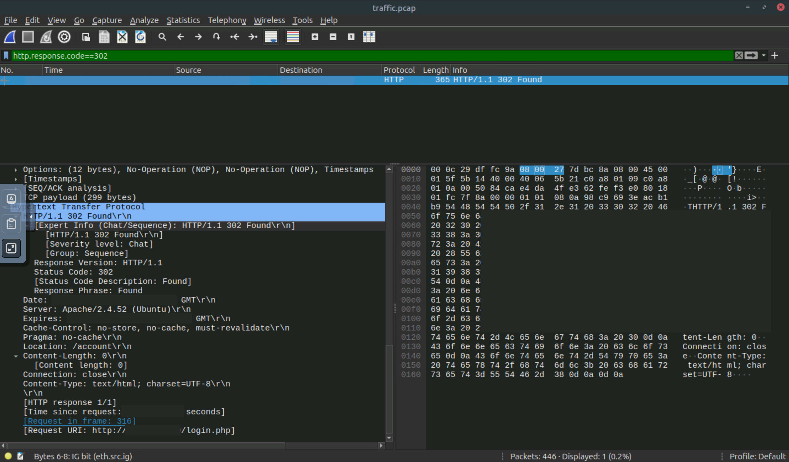
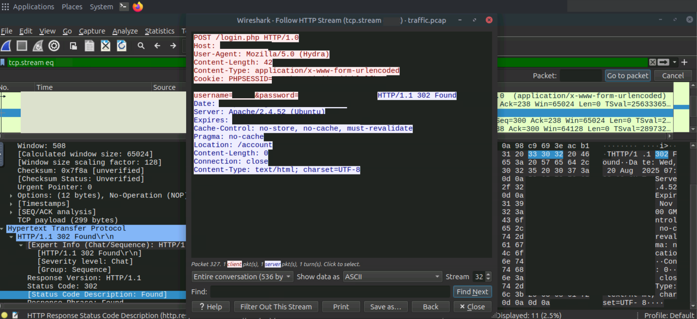

# Detecting Web Attacks

---

  

In my ongoing exploration of web security threats, I've been dissecting methods for spotting attacks that target public-facing sites 
and applications, which often guard sensitive backend resources like databases. These intrusions typically start with exploiting either 
client-end weaknesses or server vulnerabilities, and I've noted practical ways to uncover them using logs, traffic analysis, and 
protective firewalls. From what I've reviewed, client-side exploits hinge on flaws in browser behavior or user actions, potentially 
leading to data theft from the device itself, especially as sites incorporate more external components that expand risks. For 
instance, a seemingly innocent product image click might conceal a frame loading harmful code to swipe session cookies, allowing 
account hijacking without obvious signs.

Detecting such client-side issues from a security operations standpoint proves challenging, since server logs and network flows rarely 
capture browser-internal events, making endpoint oversight or browser safeguards essential for visibility. Among prevalent types, 
cross-site scripting stands out, where unfiltered input lets attackers inject scripts that execute in visitors' browsers, 
potentially grabbing session details instead of just triggering alerts. Other variants include forging requests via tricked browsers 
or overlaying deceptive elements to mislead clicks on safe-seeming content.

Shifting to server-side threats, these zero in on application code, configurations, or backend logic, enabling unauthorized access 
or data manipulation. Poor handling of form inputs, like searches or logins, can expose databases to breaches. Defenders benefit 
here because requests leave traces in server records and network packets, aiding in pattern recognition for scans or exploits. 
Brute-force efforts involve rapid credential guesses, sometimes via tools, as seen in a 2021 incident where attackers accessed 
personal data for over 50 million users at a major telecom firm. SQL injection manipulates queries through unchecked concatenation, 
altering commands to extract or alter data, with a 2023 flaw in file-transfer software impacting thousands of entities including 
governments and airlines. Command injection slips extra instructions into user-supplied data passed to the system shell.

For log-centric detection, web server access and error entries reveal request details that flag anomalies. A typical entry might 
log the requester's address, time, path, status, size, referrer, and agent string, where deviations like unusual geolocations, 
rapid repeats, error spikes, or tool signatures hint at malice. In a simulated sequence, an intruder might first probe directories 
with fuzzing, spotting valid paths via success codes, then hammer a login form with posts until a redirect signals entry, followed 
by testing injection strings on a search interface to potentially dump tables. However, logs often omit full payloads, especially 
in posts, showing only methods and codes without submitted values, depending on setup.

Network inspection via captures offers deeper insight, exposing headers, bodies, and data flows absent in logs, though encryption 
like HTTPS obscures payloads without keys. Focusing on clear HTTP, filters can isolate agents or destinations to trace sequences: 
initial directory scans, brute attempts revealing guessed credentials like weak admin passwords, and injection probes dumping user 
details in responses. MySQL traffic might even display queries and results directly.

In a hypothetical breach at a banking site, log review might outline steps but miss breached accounts or exfiltrated data, 
necessitating packet dives to reconstruct full interactions, using filters to streamline HTTP views or stream follows for complete 
exchanges.

Web application firewalls serve as proactive barriers, scrutinizing requests—including decrypted TLS—and applying rules to permit 
or halt them before server impact. Rule sets block pattern matches, deny shady sources via intel or geofilters, enforce custom 
constraints like method limits, or throttle rates to curb abuse. For example, flagging agents from known exploit tools could 
trigger blocks, while challenges like captchas handle ambiguous cases, given high bot traffic volumes. Integrated protections 
address top risks, updating against fresh threats, CVEs, or actor tactics, with some providers curating lists from botnets or 
anonymizers.

Overall, correlating logs, traffic, and firewall actions builds a robust detection strategy, moving past single indicators to 
comprehensive response.

---

| Description | Code/Command |
|-------------|--------------|
| Example cross-site scripting payload in a comment | Hello  |
| First SQL injection payload attempt | ' OR '1'='1 |
| Second SQL injection payload attempt | 1' OR 'a'='a |
| Brute-force successful password (redacted) | ******** |
| SQL injection payload in network traffic | ' OR '1'='1 -- |
| User-Agent string for SQL injection tool | sqlmap/1.9 |
| Rule to block specific User-Agent | If User-Agent contains "sqlmap" then BLOCK |

## Extracted Tables

| Log Field | Example Indicator |
|-----------|-------------------|
| 1. Client IP Address | A known malicious or outside of the expected geo range |
| 2. Timestamp and Requested Page | Requests made at unusual hours or repeated in a short period of time |
| 3. Status Code | Repeated 404 responses indicating a page could not be found |
| 4. Response Size | Significantly smaller or larger than normal response sizes |
| 5. Referrer | Referring pages that don't fit normal site navigation |
| 6. User-Agent | Outdated browser versions or common attack tools (e.g. sqlmap, wpscan) |

| Rule Type | Description | Example Use Case |
|-----------|-------------|------------------|
| Block common attack patterns | Blocks known malicious payloads and indicators | Block malicious User-Agents: sqlmap |
| Deny known malicious sources | Uses IP reputation, threat intel, or geo-blocking to stop risky traffic | Block IPs from recent botnet campaigns |
| Custom-built rules | Tailored to your specific application’s needs | Allow only GET/POST requests to /login |
| Rate-limiting & abuse prevention | Limits request frequency to prevent abuse | Limit login attempts to 5 per minute per IP |

---

### Key Takeaways
- Learn common client-side and server-side attack types
- Understand the benefits and limitations of log-based detection
- Explore network traffic–based detection methods
- Understand how and why Web Application Firewalls are used
- Practice identifying common web attacks using the methods covered
- OWASP Top 10 covers the ten most critical web security risks
- Complete Intro to Log Analysis for an overview of logs and useful indicators
- Wireshark: The Basics provides a great introduction to packet capture analysis
- Cross-Site Scripting (XSS) is the most common client-side attack, in which malicious scripts are run in a trusted website and
  executed in the user's browser
- Cross-Site Request Forgery (CSRF): The browser is tricked into sending unauthorized requests on behalf of the trusted user
- Clickjacking: Attackers overlay invisible elements on top of legitimate content, making users believe they are interacting with
  something safe
- Brute-force attacks occur when an attacker repeatedly attempts different usernames or passwords in an attempt to gain unauthorized
  access to an account
- SQL Injection (SQLi) relies on attacking the database that sits behind a website and occurs when applications build queries through
  string concatenation instead of using parameterized queries
- Command Injection is a common attack that occurs when a website takes user input and passes it to the system without checking it
- The attacker tests for potential directories and forms to exploit with a directory fuzz
- The attacker exploits the login.php form found with a brute-force attack
- Once the attacker gains access to the account, they attempt SQLi payloads on the /search form
- Begin by opening up the access.log file on the desktop
- Dive into the traffic.pcap file on the user's desktop to continue your investigation
- Use the http filter in Wireshark to view only HTTP traffic
- You can also right-click on any packet → follow HTTP Stream to reconstruct the full request and response between the client and server

---

### Gallery 

  <table>
    <tr>
      <td>
      <td></td>
    </tr>
    <tr>
      <td align="center"><strong>Figure 1a:</strong> Client Side Attacks</td>
      <td align="center"><strong>Figure 1b:</strong> Access Log Format</td>
    </tr>
    <tr>
      <td>
      <td></td>
    </tr>
     <tr>
      <td align="center"><strong>Figure 2a:</strong> Wireshark 1</td>
      <td align="center"><strong>Figure 2b:</strong> Wireshark 2</td>
    </tr>
  </table>

  <table>
    <tr>
      <td>
      <td></td>
    </tr>
    <tr>
      <td align="center"><strong>Figure 3a:</strong> Web Application Firewall</td>
      <td align="center"><strong>Figure 3b:</strong> Challenge Response Mechanism</td>
    </tr>
    <tr>
      <td>
      <td></td>
    </tr>
     <tr>
      <td align="center"><strong>Figure 4a:</strong> Analysis Activity - Access Log</td>
      <td align="center"><strong>Figure 4b:</strong> Analysis Activity - Access Log Decoding</td>
    </tr>
  </table>

  <table>
    <tr>
      <td></td>
      <td></td>
    </tr>
    <tr>
      <td align="center"><strong>Figure 5a:</strong> Wireshark Activity 1</td>
      <td align="center"><strong>Figure 5b:</strong> Wireshark Activity 2</td>
    </tr>
  </table>

---

