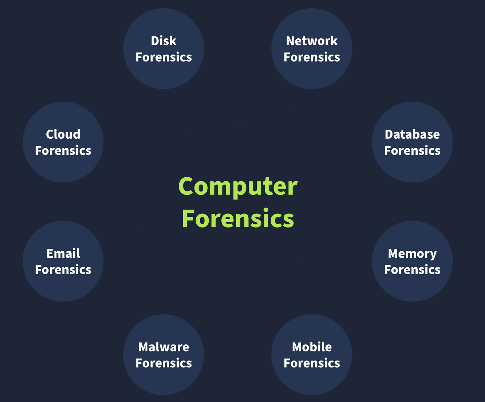
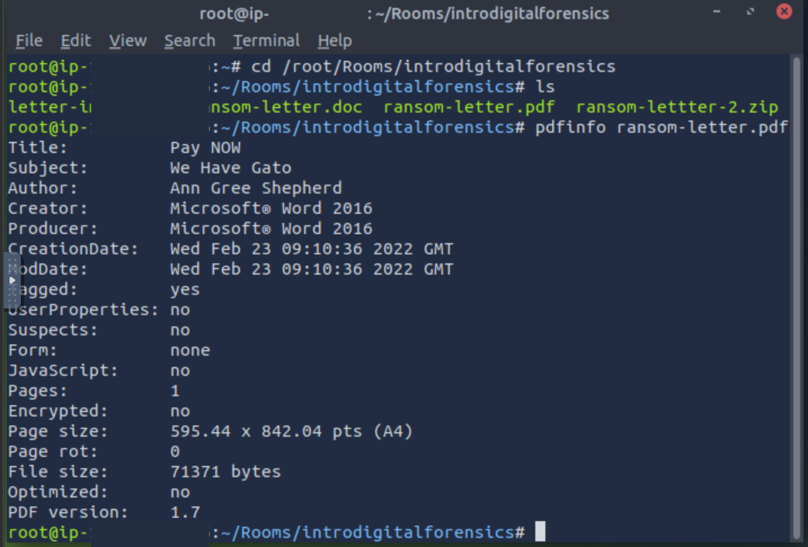
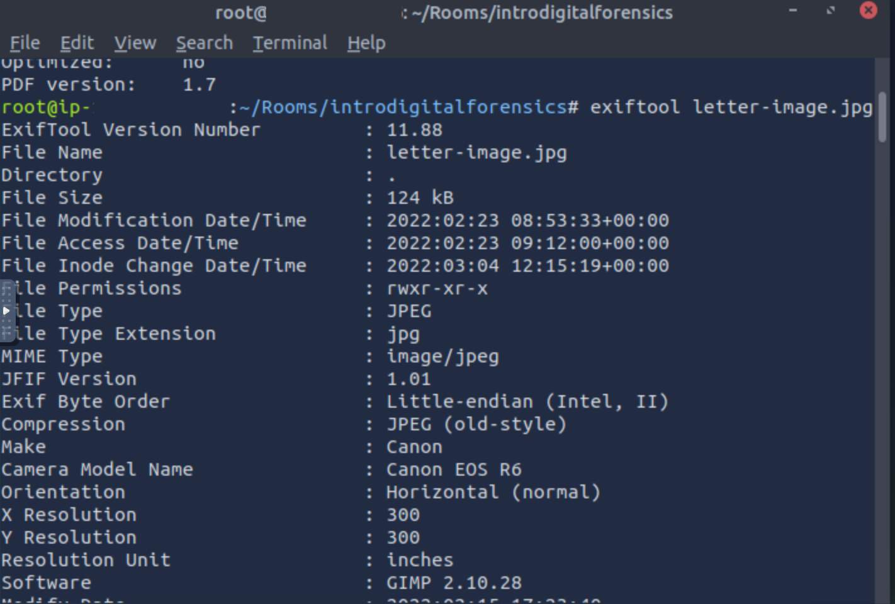

# Digital Forensics Fundamentals

---

Digital forensics involves applying systematic procedures to probe digital devices and uncover evidence tied to cyber crimes, defined 
as any illegal acts performed on or with electronic systems. Widespread adoption of digital devices has streamlined global communication
but also driven a surge in such offenses. A typical investigation begins when authorities, armed with warrants, seize items like 
laptops, mobile phones, hard drives, and USB drives from a suspect's location and transfer them to a forensics lab. Examination there 
once located planning maps on a laptop, route and security bypass documents on a hard drive, media depicting earlier offenses on the 
laptop, and mobile records of related illegal chats and calls, all of which proved decisive in court proceedings.

The National Institute of Standards and Technology (NIST) sets out a consistent four-phase approach adaptable to any case. Collection 
starts by pinpointing every potential source at the scene, ranging from personal computers and laptops to cameras and USBs, while 
documenting each item to guard against tampering. Examination sifts through potentially massive datasets to isolate relevant portions, 
whether media captured at a certain time or files linked to one user among many. Analysis then cross-references the filtered material 
against other evidence to reconstruct a precise chronological sequence of case-related actions. Reporting assembles a full account of 
methods, results, and suggested next steps, complete with an executive summary to accommodate audiences from law enforcement to 
management.

Distinct evidence types require tailored forensic specialties, each with unique collection and examination methods. Computer forensics 
centers on personal computers, the hardware most often implicated in crimes. Mobile forensics pulls call logs, text messages, GPS data,
and similar records from phones. Network forensics extends beyond single machines to scrutinize traffic logs spanning entire networks.
Database forensics targets intrusions that alter or steal information in dedicated storage systems. Cloud forensics addresses data held
on remote infrastructures, where sparse local traces can complicate efforts. Email forensics reviews communications to identify 
involvement in phishing or fraudulent operations.

Evidence acquisition demands careful handling to avoid altering originals, with practices that apply regardless of device. 
Authorization from competent authorities must precede any collection, since unauthorized data risks being excluded from court due to 
its sensitive character. A chain of custody document maintains an unbroken record by logging evidence descriptions, collectors' names, 
exact collection dates and times, storage sites, and every access event with the responsible individual's details; this trail confirms
authenticity and reliability when evidence reaches court, and a sample form is available at 
https://www.nist.gov/document/sample-chain-custody-formdocx. Write blockers form an indispensable safeguard when attaching a suspect's
hard drive to a workstation, as they block any write operations from background processes that might otherwise modify timestamps and 
undermine later analysis.

Desktop and laptop systems running Windows appear routinely in case evidence. Forensic imaging creates exact bit-by-bit replicas 
during collection. Disk images preserve all non-volatile data on storage media such as HDDs or SSDs, encompassing files, documents, 
and browsing history that survive system restarts. Memory images record volatile RAM contents including open files, running processes,
and live network connections, which vanish on shutdown or reboot and therefore must be captured first. Popular tools support both 
acquisition and review of these images. FTK Imager supplies a graphical interface for producing disk images in assorted formats while 
also permitting content inspection. Autopsy (https://www.autopsy.com/) functions as a popular open-source platform that imports disk 
images for keyword searching, deleted file recovery, metadata review, extension mismatch detection, and additional analysis. DumpIt 
(https://www.magnetforensics.com/resources/magnet-dumpit-for-windows/) delivers a lightweight command-line solution for generating 
memory images in multiple formats. Volatility (https://volatilityfoundation.org/) provides robust open-source memory analysis through
dedicated plugins for individual artifacts and extends compatibility to Windows, Linux, macOS, and Android.

Practical work with a ransom document originally sent in Microsoft Word and later converted to PDF, along with an extracted image, 
demonstrated how everyday device activity embeds recoverable traces. On the AttackBox, navigation to the case files began by changing 
into the /root/Rooms/introdigitalforensics directory. Advanced editors like Word retain extensive internal metadata beyond basic 
operating-system stamps such as creation or modification dates; exporting to PDF largely preserves this information depending on the 
writer. The pdfinfo utility extracted PDF details including creator, producer, creation and modification timestamps of October 10, 2018,
plus page count and version, confirming origin from Microsoft Word for Office 365. For the image, exiftool read embedded EXIF data that
routinely records camera or smartphone model, capture date and time, settings such as focal length, aperture, shutter speed, and ISO, 
and often GPS coordinates from device sensors. The reported position of 51 deg 31' 4.00" N, 0 deg 5' 48.30" W, when reformatted by 
substituting degree symbols and removing spaces, allowed precise location lookup on mapping services.

---

| Description | Code/Command |
|-------------|--------------|
| Change directory to the case files on the AttackBox | cd /root/Rooms/introdigitalforensics |
| Install pdfinfo on Kali Linux if missing | sudo apt install poppler-utils |
| Display PDF metadata | pdfinfo DOCUMENT.pdf |
| Install exiftool on Kali Linux if missing | sudo apt install libimage-exiftool-perl |
| Read all EXIF metadata from an image | exiftool IMAGE.jpg |

---

### Key Takeaways

- Phases of digital forensics: collection by identifying and documenting all devices without tampering; examination to filter relevant
  data subsets such as time-specific media or user-specific files; analysis by correlating evidence to build chronological case
  timelines; reporting with full methodology, findings, recommendations, and executive summaries for all audiences.
- Types of digital forensics: computer forensics for personal systems; mobile forensics for call records, texts, and GPS; network
  forensics for traffic logs; database forensics for data modification or exfiltration; cloud forensics for remote infrastructure;
  email forensics for phishing or fraud detection.
- Chain of custody document must record description of the evidence including name and type, names of collectors, date and time of
  collection, storage location of each item, and access times with the accessing individual's record to establish an unbroken trail
  proving integrity.
- EXIF metadata commonly embedded in images covers camera or smartphone model, date and time of capture, photo settings such as focal
  length, aperture, shutter speed, and ISO, and GPS coordinates indicating the photo location.

---

### Gallery 

  <table>
    <tr>
      <td align="center">
      <td align="center"></td>
    </tr>
    <tr>
      <td align="center"><strong>Figure 1a:</strong> NIST Framework Digital Forensics Four Phases</td>
      <td align="center"><strong>Figure 1b:</strong> Digital Forensics</td>
    </tr>
    <tr>
      <td align="center">
      <td align="center"></td>
    </tr>
     <tr>
      <td align="center"><strong>Figure 2a:</strong> PDFinfo</td>
      <td align="center"><strong>Figure 2b:</strong> Exiftool</td>
    </tr>
  </table>

---
