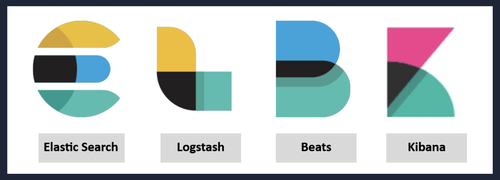
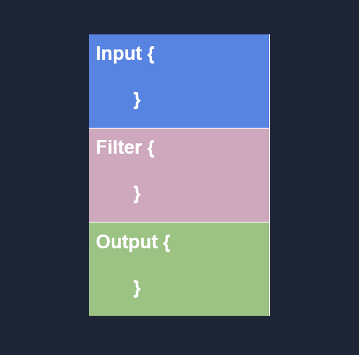
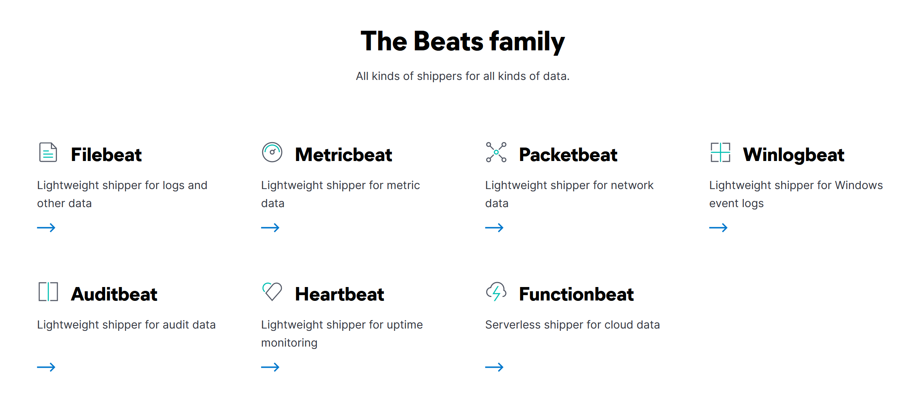
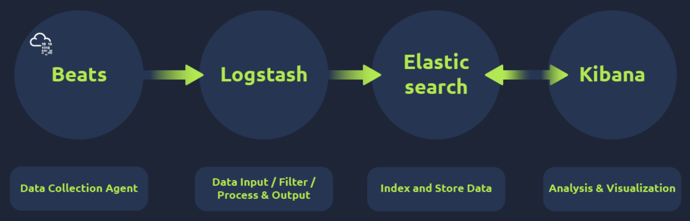
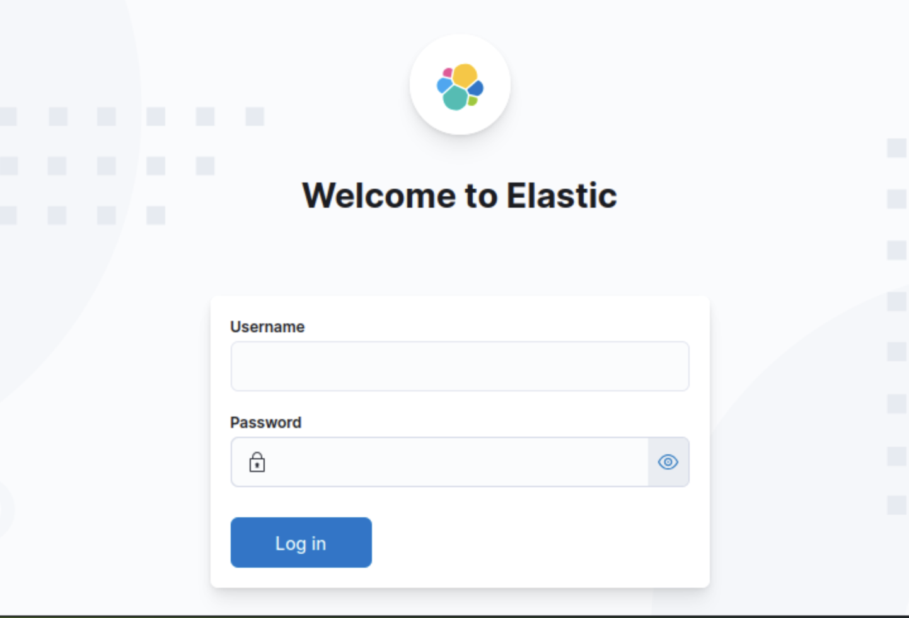
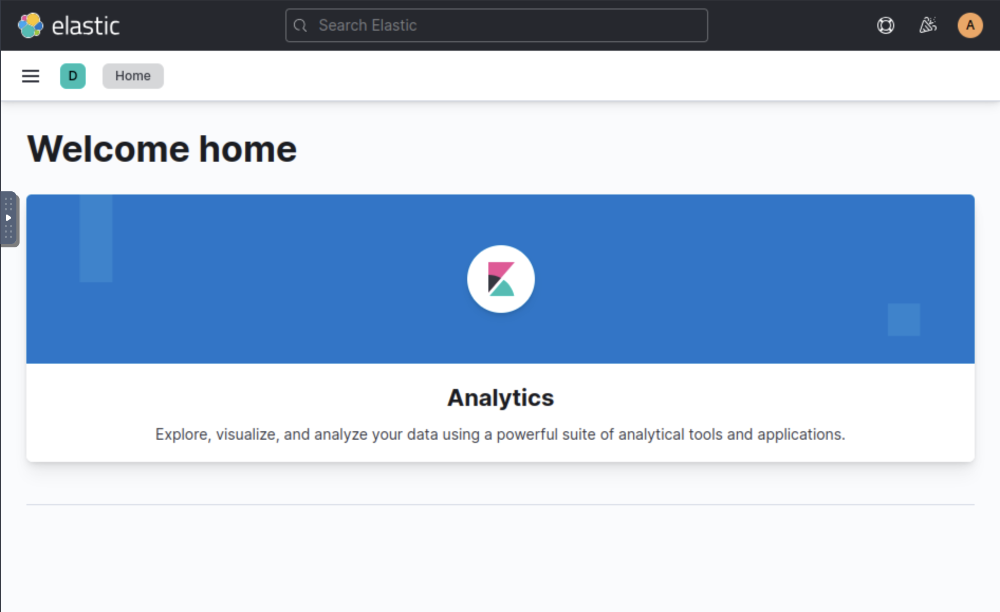

# Elastic Stack: The Basics

---

  

The Elastic Stack (ELK), comprising Elasticsearch, Logstash, Beats, and Kibana, has evolved from a general-purpose data search and 
visualization engine into a vital utility for the Security Operations Center (SOC). While it is not a purpose-built Security Information
and Event Management (SIEM) platform, its capacity to correlate and search through massive datasets in real time allows many security 
teams to utilize it as such. In my observations, the synergy between these components facilitates a streamlined log analysis pipeline. 
Beats act as single-purpose, host-based data shippers that transfer telemetry from endpoints—such as Windows event logs via Winlogbeat 
or network traffic through Packetbeat—directly to either Logstash or Elasticsearch. Logstash serves as the processing engine, 
utilizing a three-part configuration involving Input, Filter, and Output plugins to normalize and route data. Elasticsearch then 
functions as the backend database, a full-text search and analytics engine that organizes JSON-formatted (JavaScript Object Notation) 
documents and supports interactions through a RESTful Application Programming Interface (API).

Kibana provides the frontend interface where analysts spend the majority of their investigative time, particularly within the 
Discover tab. To access specific datasets, such as Virtual Private Network (VPN) logs, I must select the appropriate index pattern, 
which in this environment is defined as vpn_connections. The interface allows for the isolation of specific event spikes, 
like the unusual activity I noted on January 11, 2022, by interacting with the timeline and time interval charts. Navigating raw 
logs is simplified by the Fields Pane, which displays normalized fields and allows for quick filtering. By selecting specific fields, 
I can transform raw, noisy log entries into structured tables that highlight critical data points. Access to the local instance 
is managed through the platform's Virtual Private Network at http://<MACHINE_IP>, requiring specific credentials to begin the 
triaging process.

Efficiently querying these logs requires a firm grasp of the Kibana Query Language (KQL). This specialized search syntax allows 
for both free text searches and structured, field-based queries. In my research, I have found that while a free text search for a 
broad term is useful for general discovery, field-based searches using the Field: Value syntax provide the precision necessary 
for forensic investigations. KQL supports wildcards for partial string matching and logical operators such as AND, OR, and NOT to 
refine results. For instance, excluding specific geographic regions like Florida or correlating a specific Source IP with a username 
is trivial when the syntax is applied correctly.

The transition from raw data to actionable intelligence is completed through visualizations and dashboards. By utilizing the 
Visualization tab, I can create pie charts, bar charts, and data tables that summarize complex logs into presentable formats. 
Advanced analysis often involves the correlation of multiple fields, such as mapping source countries to client IP addresses. 
These individual components are eventually aggregated into centralized dashboards, providing a comprehensive "single pane of glass" 
view. This structured approach allows for the rapid detection of malicious patterns and failed connection attempts across an 
organization's infrastructure.

---

| Description | Code/Command |
| --- | --- |
| KQL Wildcard search for partial terms | `United*` |
| KQL AND logical operator for dual terms | `"United States" AND "Virginia"` |
| KQL OR logical operator for multiple choices | `"United States" OR "England"` |
| KQL NOT logical operator to exclude terms | `"United States" AND NOT ("Florida")` |
| Field-based search for specific IP and User | `Source_ip : <redacted_IP> AND UserName : <redacted>` |

---

### Extracted Tables

**Available Beats Agents**

| Beat Name | Purpose |
| --- | --- |
| Filebeat | Collects and ships log files |
| Metricbeat | Collects metrics from systems and services |
| Packetbeat | Collects network traffic flow data |
| Winlogbeat | Collects Windows event logs |
| Auditbeat | Collects audit data from Linux |
| Heartbeat | Monitors service uptime |

**ELK Instance Credentials**

| Attribute | Value |
| --- | --- |
| Username | <redacted> |
| Password | ******** |

---

>[!Note]
>Working through Elastic’s basics reminded me how it stacks up against Splunk. Elastic’s open-source heart (Elasticsearch for search, 
Kibana for dashboards) makes it flexible and cheap for security monitoring and observability. Splunk’s proprietary SPL delivers 
polished correlation and compliance reporting, but the licensing cost is steep. For hands-on learning without lock-in, Elastic feels 
more approachable.

---

### Key Takeaways

* ELK serves as an alternative SIEM by utilizing Elasticsearch (analytics), Logstash (processing), Beats (shipping), and Kibana (visualization).
* Logstash configurations are categorized into Input (source), Filter (normalization), and Output (destination) segments.
* The Discover tab in Kibana is the primary interface for log searching, utilizing Index Patterns to define which data to explore.
* Kibana Query Language (KQL) utilizes two search modes: Free text (general) and Field-based (specific).
* Procedural steps for dashboard creation:
* Create and save individual visualizations via the Visualization tab.
* Add descriptive titles and metadata before saving to the library.
* Navigate to the Dashboard tab and select "Create dashboard."
* Populate the dashboard using "Add from Library" to combine saved searches and visual elements.
* Save the final dashboard for persistent monitoring and visibility.
  
---

### Gallery 

  <table>
    <tr>
      <td>
      <td></td>
    </tr>
    <tr>
      <td align="center"><strong>Figure 1a:</strong> Elastic Logstash Search Beats Kibana</td>
      <td align="center"><strong>Figure 1b:</strong> Logstash Elastic Stack - The Basics</td>
    </tr>
    <tr>
      <td>
      <td></td>
    </tr>
     <tr>
      <td align="center"><strong>Figure 2a:</strong> The Beats Family</td>
      <td align="center"><strong>Figure 2b:</strong> How They Work Together With Kibana</td>
    </tr>
  </table>

  <table>
    <tr>
      <td>
      <td></td>
    </tr>
    <tr>
      <td align="center"><strong>Figure 3a:</strong> Welcome To Elastic</td>
      <td align="center"><strong>Figure 3b:</strong> Elastic - Welcome Home</td>
    </tr>
  </table>

---

