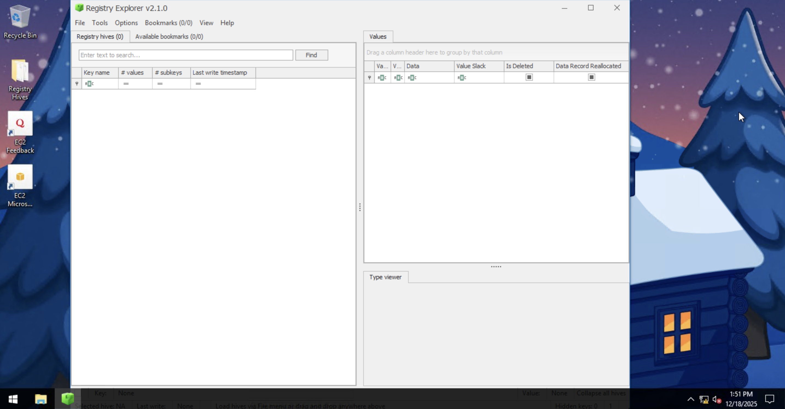
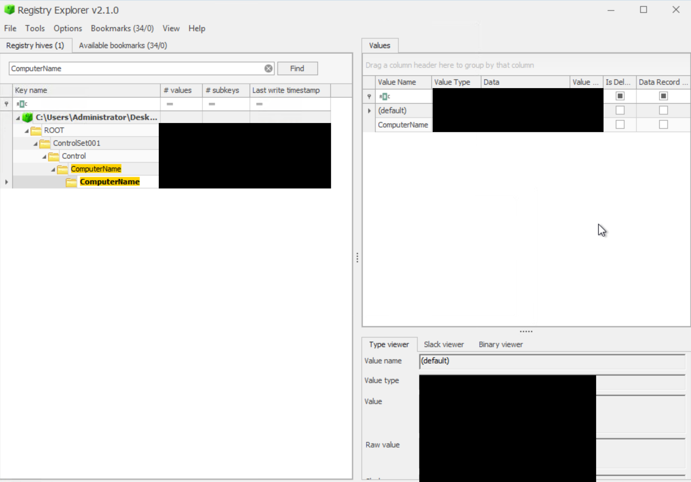
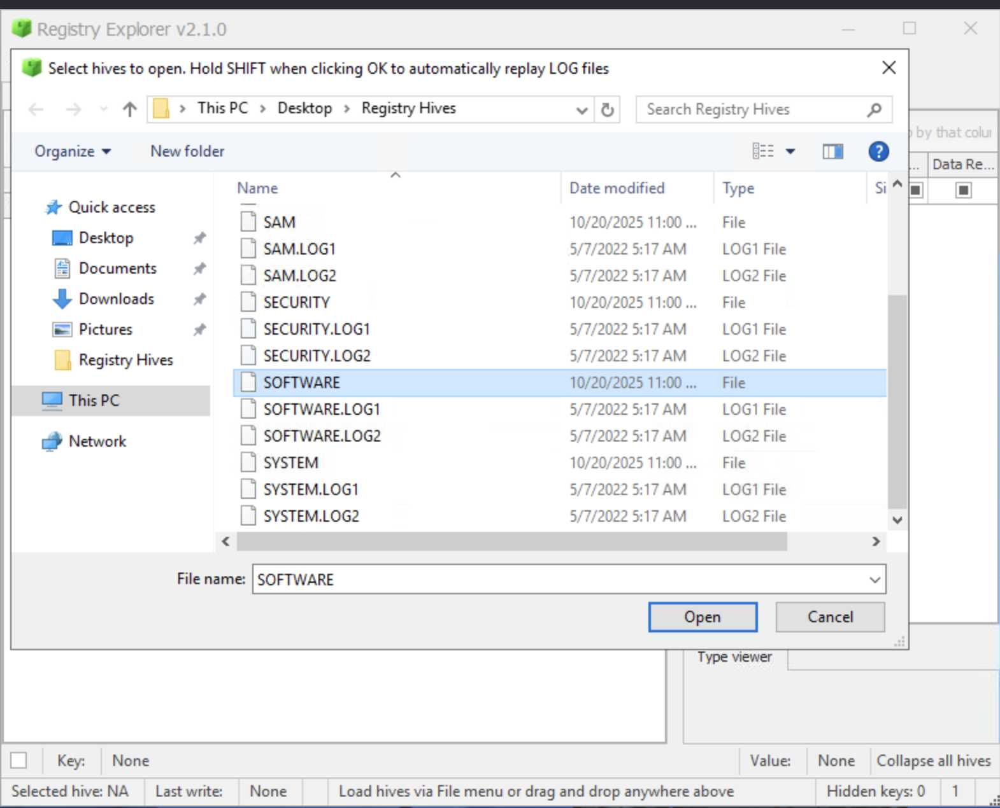
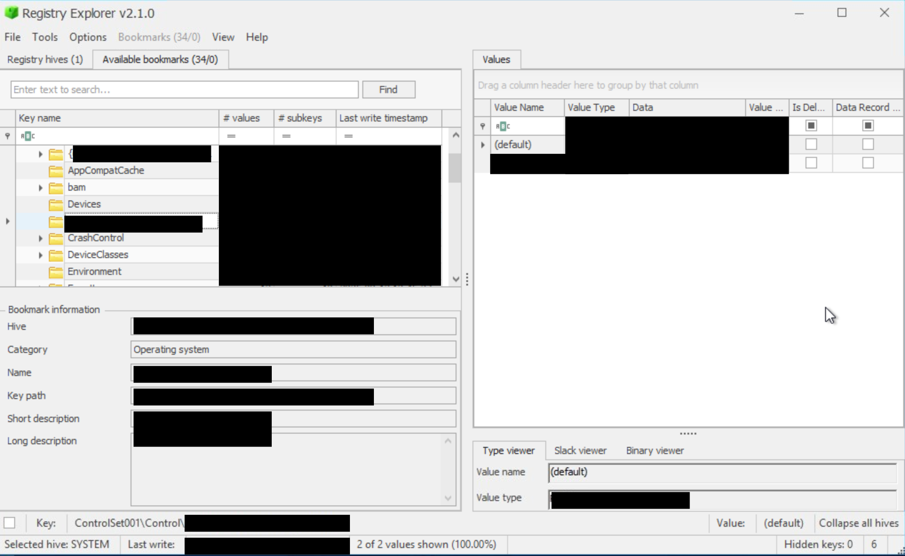
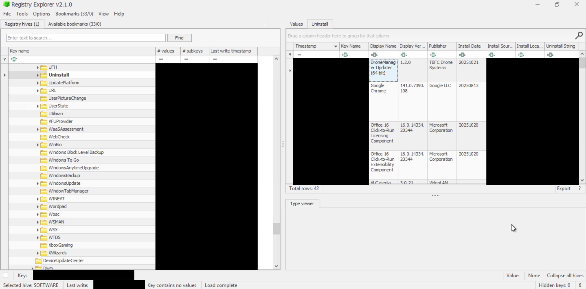
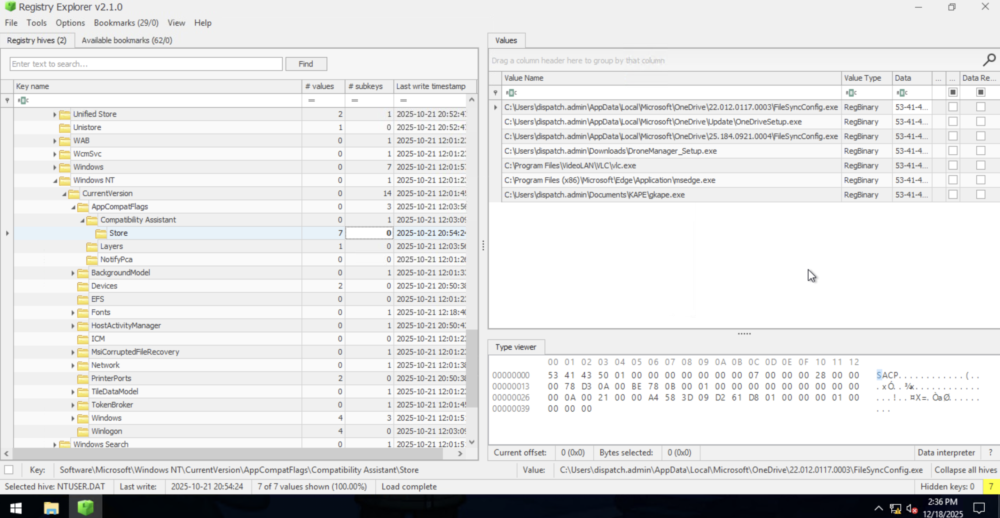
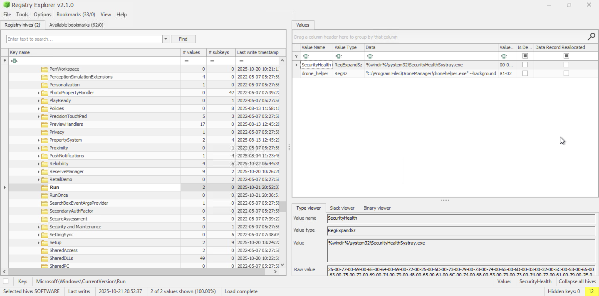

# Forensics - Registry Furensics

---
## Investigate the Gifts Delivery Malfunctioning

  <table>
    <tr>
      <td>
      <td></td>
    </tr>
    <tr>
      <td align="center"><strong>Figure 1a:</strong> The Registry Explorer</td>
      <td align="center"><strong>Figure 1b:</strong> Opened up the Software Hive</td>
    </tr>
  </table>

The Windows Registry serves as the central hierarchical database for the operating system, storing essential configuration data, 
hardware profiles, and user preferences. Architecturally, the registry is not a single entity but is composed of several discrete 
binary files known as hives. These hives are located at specific paths on the disk, with system-wide hives like SYSTEM, SOFTWARE, 
SECURITY, and SAM residing in the system32 config directory, while user-specific data is maintained in NTUSER.DAT and USRCLASS.DAT 
within individual user profiles. Accessing these files directly via standard text editors is impossible due to their binary format; 
therefore, the operating system provides the Registry Editor to visualize this data through structured root keys such as 
HKEY_LOCAL_MACHINE (HKLM) and HKEY_CURRENT_USER (HKCU).

During forensic investigations, the registry acts as a primary source of telemetry, recording system activities and user behavior. 
Critical artifacts include the USBSTOR key, which logs every USB device connected to the machine, and the RunMRU key, which tracks 
commands executed via the Run dialog. Analysts also prioritize keys such as UserAssist for GUI-based application execution history, 
TypedPaths for folder navigation records, and the Run keys for identifying persistence mechanisms used by malware. Because a live 
system's registry is subject to constant modification, forensic integrity requires the collection of hives for offline analysis. 
This process prevents the contamination of evidence and allows investigators to bypass the limitations of the built-in Registry 
Editor, which often obscures binary values.

Professional forensic workstations typically utilize specialized tools like Registry Explorer to parse these binary files. A 
significant challenge in offline analysis is dealing with "dirty" hives, which occur when a system is powered down abruptly or 
when hives are collected from a live environment without closing active handles. These hives may contain incomplete transactions 
that must be reconciled using transaction log files. Registry Explorer facilitates this by replaying logs to ensure the hive 
reaches a consistent state for accurate data extraction. By navigating through specific paths or using pre-defined bookmarks, 
investigators can efficiently recover hostnames, installation dates, and evidence of unauthorized software execution, which are 
vital for reconstructing an incident timeline.

| Description | Code/Command |
| --- | --- |
| USB device connection history | `HKEY_LOCAL_MACHINE\SYSTEM\CurrentControlSet\Enum\USBSTOR` |
| Commands entered in the Run dialog | `HKEY_CURRENT_USER\Software\Microsoft\Windows\CurrentVersion\Explorer\RunMRU` |
| Recently accessed applications (GUI) | `HKCU\Software\Microsoft\Windows\CurrentVersion\Explorer\UserAssist` |
| Explorer address bar history | `HKCU\Software\Microsoft\Windows\CurrentVersion\Explorer\TypedPaths` |
| Executable application paths | `HKLM\Software\Microsoft\Windows\CurrentVersion\App Paths` |
| Explorer search bar queries | `HKCU\Software\Microsoft\Windows\CurrentVersion\Explorer\WordWheelQuery` |
| Standard persistence/startup programs | `HKLM\Software\Microsoft\Windows\CurrentVersion\Run` |
| Recently accessed documents | `HKCU\Software\Microsoft\Windows\CurrentVersion\Explorer\RecentDocs` |
| Active computer hostname | `HKLM\SYSTEM\CurrentControlSet\Control\ComputerName\ComputerName` |
| List of installed applications | `HKLM\SOFTWARE\Microsoft\Windows\CurrentVersion\Uninstall` |
| Replaying transaction logs in Registry Explorer | `Hold SHIFT while clicking Open` |

### Key Takeaways Windows Registry hives are binary files stored on the disk that require specialized parsers for viewing.
* System-wide hives are located in `C:\Windows\System32\config\`, while user hives reside in the `C:\Users\username\` directory.
* Forensics must be performed offline to avoid evidence tampering and to ensure all data is readable.
* Dirty hives require the replay of transaction logs to provide a consistent and accurate view of the data.
* Specific registry keys track USB history, file access, command execution, and system persistence.
* Registry Explorer is the preferred tool for parsing hives and handling transaction log replays during an investigation.

---
### The Investigation

  <table>
    <tr>
      <td>
      <td></td>
    </tr>
    <tr>
      <td align="center"><strong>Figure 2a:</strong> Opening Software Hive</td>
      <td align="center"><strong>Figure 2b:</strong> Dispatch-srv01 machine</td>
    </tr>  
    <tr>
      <td>
      <td></td>
    </tr>
     <tr>
      <td align="center"><strong>Figure 3a:</strong> Uninstalled App Dronemanager updater</td>
      <td align="center"><strong>Figure 3b:</strong> NTUSER.DAT Hive App Installation Path</td>
    </tr>
  <tr>
      <td>
    </tr>
     <tr>
      <td align="center"><strong>Figure 4a:</strong> Software Hive Run - Running Applications</td>
    </tr>
  </table>

---
What application was installed on the dispatch-srv01 before the abnormal activity started?
- `DroneManager Updater`
  
What is the full path where the user launched the application (found in question 1) from?
- `C:\Users\dispatch.admin\Downloads\DroneManager_Setup.exe`
  
Which value was added by the application to maintain persistence on startup?
- `"C:\Program Files\DroneManager\dronehelper.exe" --background`

---
>[!Note]
>### You did it! Wareville is one step safer.
>The townsfolk are counting on you to keep Christmas secure.
>Head back to Wareville to continue your mission!

