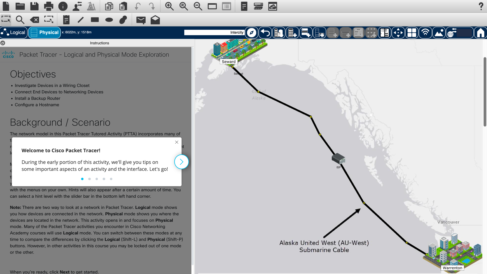
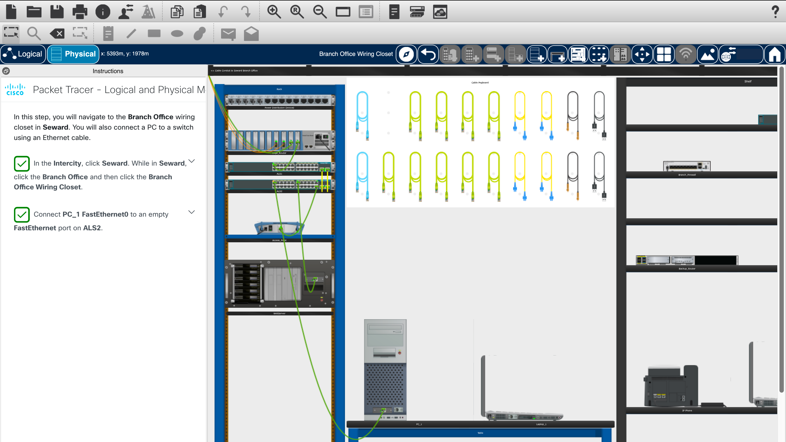
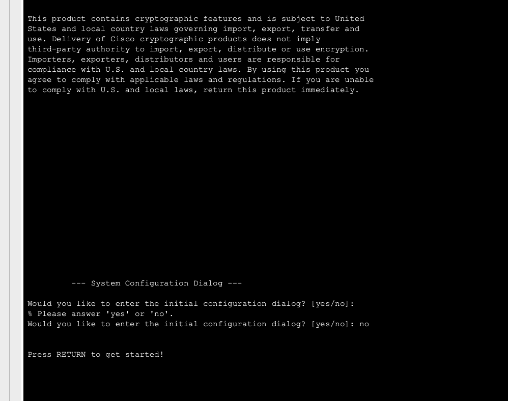
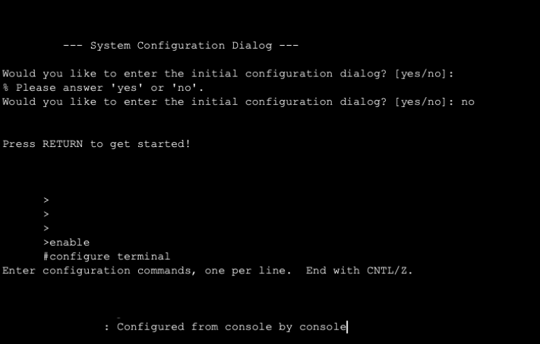
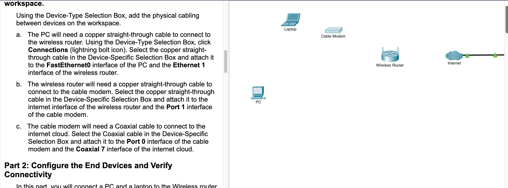
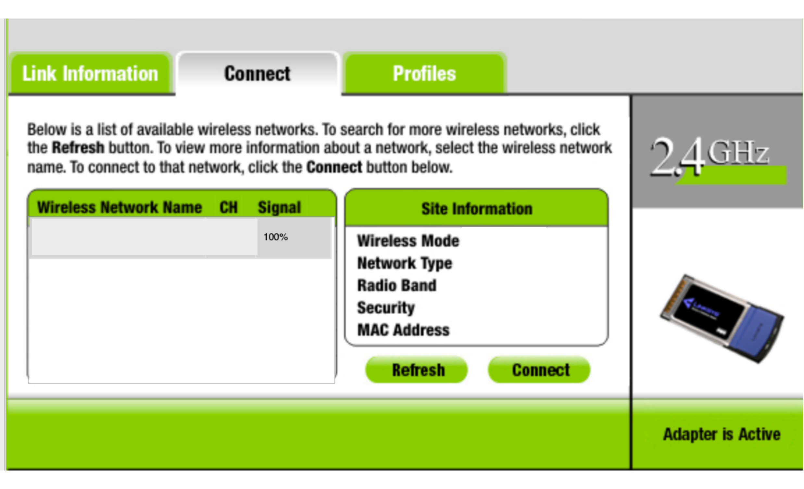
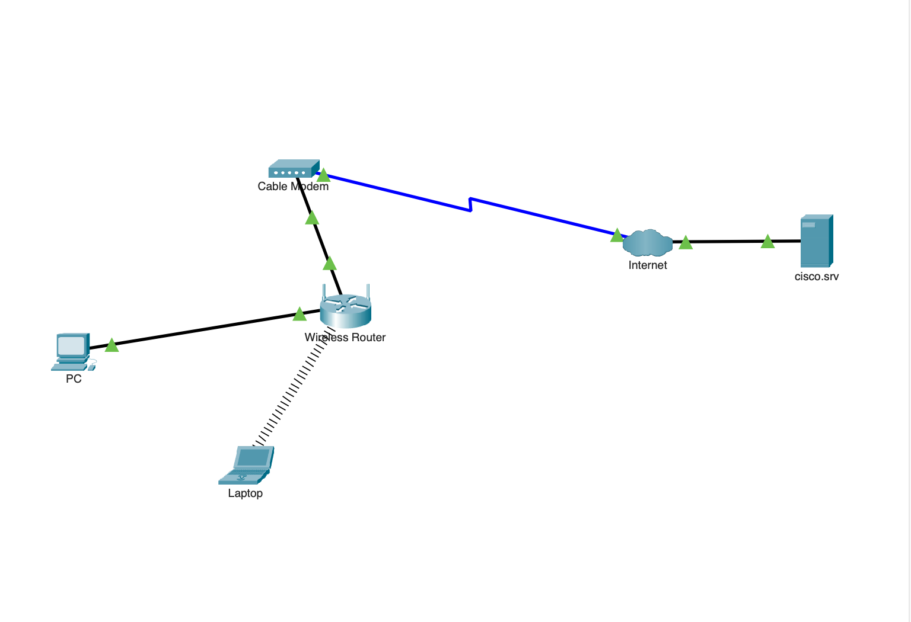
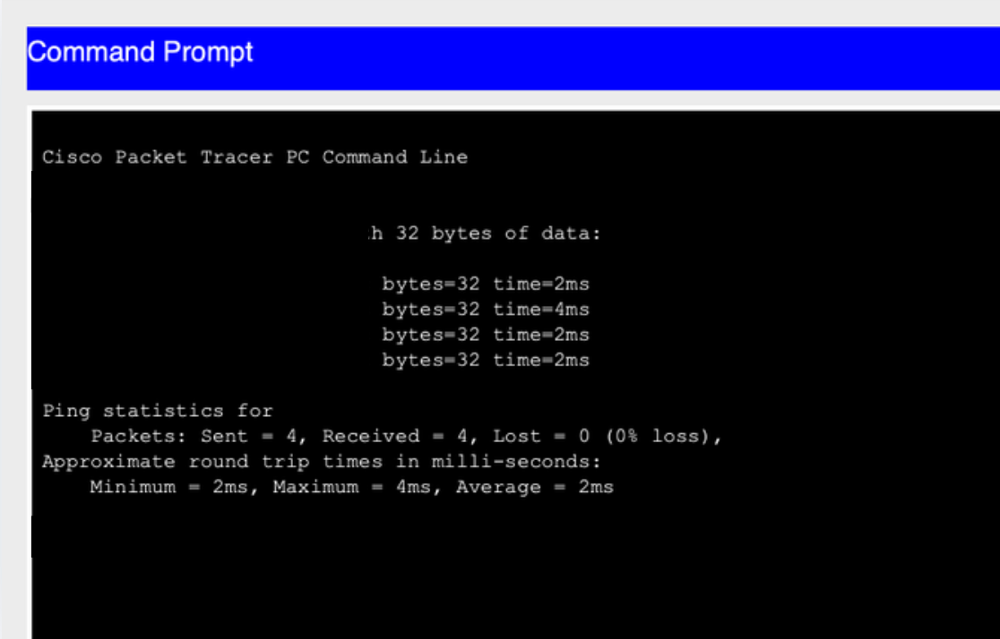
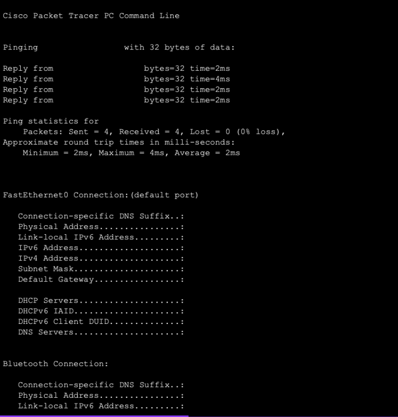
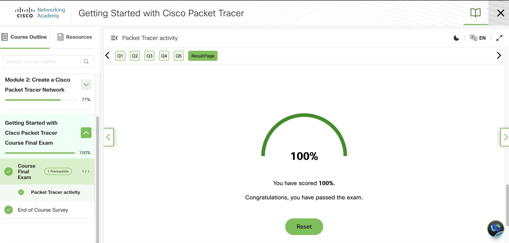

# Getting Started with Cisco Packet Tracer

---
Setting up Cisco Packet Tracer begins with the installation process and an orientation to the simulation environment through 
introductory video modules. The application provides a virtualized sandbox for network architecture, allowing for the deployment of 
routers, switches, and end devices without the cost of physical hardware. I have found this tool critical for modeling enterprise 
environments and testing security configurations in a non-destructive manner. The workflow typically moves from a high-level overview 
of the course objectives to the practical mastery of the software interface, which serves as the primary workspace for all subsequent 
laboratory exercises.

The Packet Tracer interface is divided into two distinct views: logical and physical. The logical workspace facilitates the design 
of network topologies using a drag-and-drop system for various device categories, including networking equipment, IoT devices, and 
various cabling types like copper straight-through or fiber. Conversely, the physical workspace allows for the visualization of these 
devices in a real-world context, such as within server racks or across geographical city maps. One of the most powerful features I 
utilize is Simulation Mode, which provides a granular view of protocol data units as they traverse the network. This allows for 
real-time analysis of the OSI layers and the inspection of packet headers for protocols like ARP, ICMP, and OSPF.

Executing a project, such as building a standard home network, involves selecting the appropriate media to connect devices and then 
accessing the command-line interface for granular configuration. The software supports a variety of file formats, including .pkt for 
standard network topologies and .pkz for portable, compressed activities. By configuring IP addressing schemes and routing protocols 
within the virtual Cisco IOS environment, connectivity can be verified using integrated desktop tools. This methodology of building, 
configuring, and testing provides a robust framework for verifying network logic before deploying changes to live infrastructure.

---
| Description | Code/Command |
| --- | --- |
| Enter Global Configuration mode | `configure terminal` |
| Assign an IP address to an interface | `ip address [address] [mask]` |
| Test connectivity to a remote host | `ping [target_ip]` |
| Trace the path of a packet across the network | `traceroute [target_ip]` |
| View the current device configuration | `show running-config` |
| Save the current configuration to NVRAM | `copy running-config startup-config` |
| Enable a network interface | `no shutdown` |

---
### Key Takeaways

* Complete the initial installation and account setup via the Networking Academy to access the latest Packet Tracer binaries.
* Utilize the logical workspace for topology design and the physical workspace to understand spatial equipment constraints.
* Leverage Simulation Mode for deep packet inspection and analyzing Protocol Data Unit (PDU) behavior across the OSI model.
* .pkt — Standard Packet Tracer file. Used to save a simulated network topology, device configurations, and optional embedded
  backgrounds. Ideal for general network designs and topologies.
* .pka — Packet Tracer Activity file. Contains a network topology (initial setup), built-in instructions window, step-by-step guidance,
  and activity scoring. Designed for guided learning, assignments, or assessments.
* .pkz — Compressed archive file. Bundles one or more Packet Tracer files (.pkt or .pka) along with additional resources (e.g., PDFs,
  images, or media) for easy sharing or backup.
* .pksz — Advanced activity package. Bundles an initial network, answer network, media assets, and scripting for hinting/completion
  tracking. Used for more complex scored activities.
* Practice building fundamental topologies, such as a home network, to master device selection and cabling logic.
* Use the integrated CLI to emulate Cisco IOS and perform granular device hardening and routing configurations.

---

### Gallery 

  <table>
    <tr>
      <td>
      <td></td>
    </tr>
    <tr>
      <td align="center"><strong>Figure 1a:</strong> Welcome to Cisco Packet Tracer</td>
      <td align="center"><strong>Figure 1b:</strong> Physical - Connecting PC</td>
    </tr>
    <tr>
      <td>
      <td></td>
    </tr>
     <tr>
      <td align="center"><strong>Figure 2a:</strong> Device Configuration Using CLI 1</td>
      <td align="center"><strong>Figure 2b:</strong> Device Configuration Using CLI 2</td>
    </tr>
  </table>

  <table>
    <tr>
      <td>
      <td></td>
    </tr>
    <tr>
      <td align="center"><strong>Figure 3a:</strong> Connecting Devices - Activity 1</td>
      <td align="center"><strong>Figure 3b:</strong> Device Internet Connection</td>
    </tr>
    <tr>
      <td>
      <td></td>
    </tr>
     <tr>
      <td align="center"><strong>Figure 4a:</strong> Connecting Devices - Activity 2</td>
      <td align="center"><strong>Figure 4b:</strong> Device Statistics 1</td>
    </tr>
  </table>

  <table>
    <tr>
      <td>
      <td></td>
    </tr>
    <tr>
      <td align="center"><strong>Figure 5a:</strong> Device Statistics CLI 2</td>
      <td align="center"><strong>Figure 5b:</strong> Course Final Exam</td>
    </tr>
  </table>

