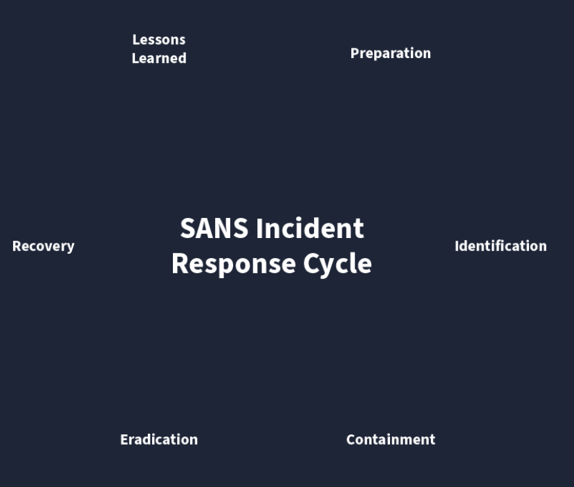
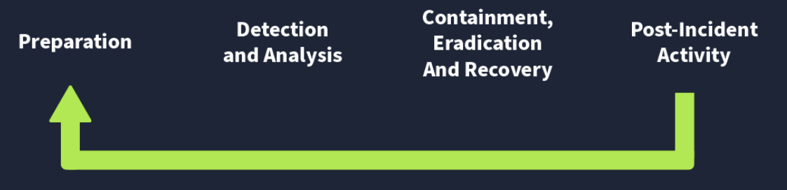
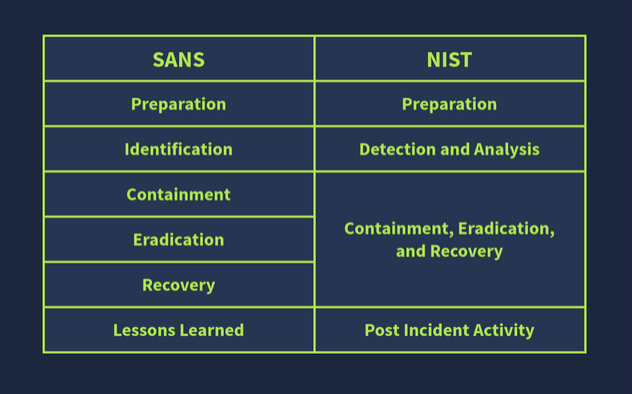
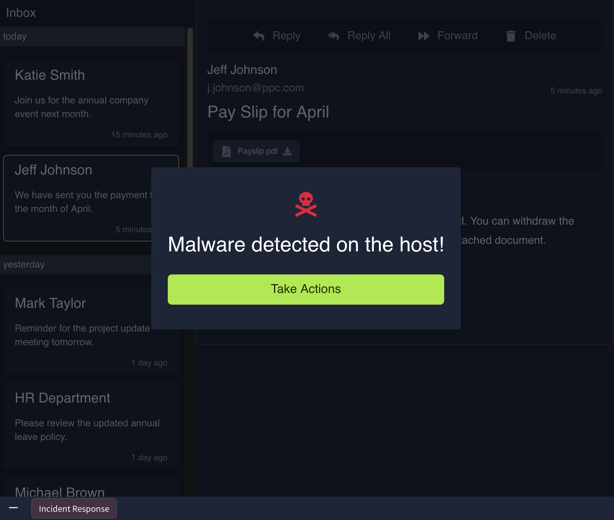
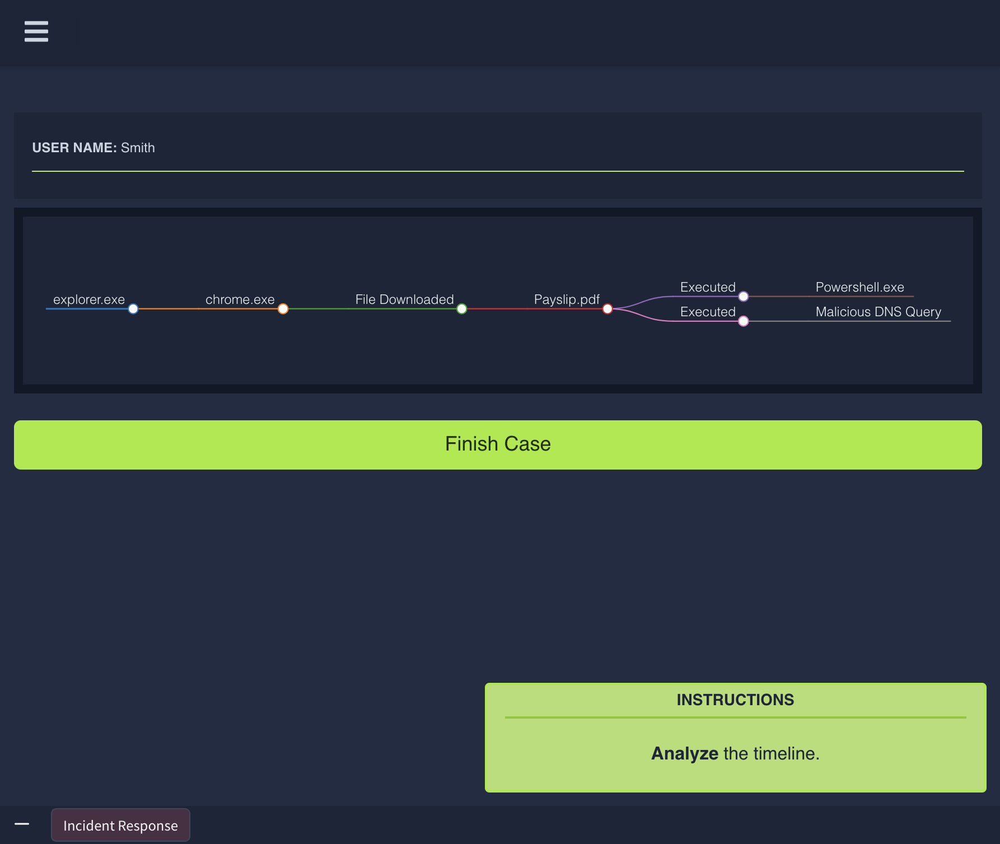

# Incident Response Fundamentals

---

Incident response fundamentals draw from the principle of layering protections around valuable assets, much like planning guards,
surveillance, and concealed storage for a home prone to break-ins, then extending those plans to cover what follows once defenses
are breached. In digital environments this translates directly to managing cyber security incidents that routinely generate heavy
financial losses for organizations, each demanding dedicated resources and foresight to curb escalation. Incident response itself
supplies the end-to-end process that moves from preventive controls through active containment and onward to impact reduction.

The material laid out core definitions of incidents together with severity ratings, the main incident categories, the established
phases under both SANS and NIST frameworks, the practical roles of detection and response tooling alongside playbooks, and the 
makeup of a formal incident response plan, all building on prior exposure to introductory defensive security concepts.

Events stream constantly from every process on laptops, phones, and similar devices whether user-initiated or running silently in
support of normal operations, and security solutions ingest these as logs to surface harmful patterns. Alerts fire when suspicious
clusters appear, after which teams must separate false positives such as routine cloud-storage backups that mimic large outbound 
transfers from true positives like phishing emails crafted to deliver system-compromising payloads. Once confirmed as genuine 
threats the alerts become incidents and receive severity labels of low, medium, high, or critical so response teams can triage 
competing cases, always elevating critical first.

Incidents resist blanket classification as mere hacking attempts and instead break down into distinct forms that can appear 
singly or overlap. Malware infections account for most cases and involve malicious programs delivered through text files, 
documents, executables, or similar vectors, each type carrying its own damage profile against systems, networks, or applications.
Security breaches occur when outsiders gain access to data meant solely for authorized eyes, a category carrying acute risk for 
any business whose operations hinge on confidentiality. Data leaks expose that same sensitive information to unauthorized parties
either through targeted action or simple human error and misconfiguration, often weaponized for reputational harm or extortion. 
Insider attacks originate internally, such as a departing employee planting malware via USB on their final day, and prove especial
ly dangerous because the actor already holds elevated legitimate access. Denial of service attacks strike at availability, one of
the three foundational cybersecurity pillars, by flooding targets with bogus requests until resources are exhausted and legitimate
users are locked out. No single type inherently ranks above another in impact because the same incident can devastate one 
organization while barely registering for another depending on its specific dependencies.

The variety of incidents requires consistent handling methods, supplied by the SANS and NIST frameworks that share a common core 
logic. SANS structures its approach around six phases captured in the PICERL mnemonic while NIST applies a similar sequence 
condensed to four phases. Organizations derive their operational procedures from these models and codify them inside an incident
response plan, the senior-management-approved reference that spells out every relevant step before, during, and after an event.

That plan captures roles and responsibilities, the incident response methodology itself, communication protocols reaching 
stakeholders and law enforcement, and the escalation paths to follow.

Within the identification phase manual inspection quickly proves unworkable, so dedicated solutions shoulder the load. The 
security information and event management solution known as SIEM pulls logs into one location and correlates them to flag 
incidents. Antivirus or AV runs continuous scans to catch known malicious code. Endpoint detection and response or EDR sits on 
every endpoint to counter advanced threats and can actively contain or eradicate them when triggered.

Playbooks supply the ready-made checklists that keep response consistent across incident categories, while runbooks expand those 
into the exact execution sequences adjusted to whatever investigative tools and staff are on hand at the time.

The lab exercise staged a live incident kicked off by downloading a malware attachment from a phishing email, then required 
mapping which hosts in the environment had executed the file versus merely received it, applying full containment and remediation
steps across all of them, and reviewing the complete event timeline on each infected machine through the provided interface.

This walkthrough clarified how events become incidents, how severity drives priority, the distinct incident families and their 
variable consequences, the guiding frameworks, the tooling that makes detection feasible, and the value of structured playbooks, 
all reinforced through the hands-on scenario.

---

Extracted Tables

| Phase | Explanation | Example |
|-------|-------------|---------|
| Preparation | This is the first phase. The preparation phase includes building the necessary resources to handle an incident. These resources include developing incident response teams, having a proper incident response plan in place, and deploying necessary security solutions to combat the incidents. | Conducting awareness training for employees on emails. emails are fraudulent emails sent by malicious attackers that can trick you into performing actions that can lead you to an incident. |
| Identification | The identification phase refers to looking for any abnormal behavior that may indicate an incident. This involves using various security solutions and techniques to monitor abnormal events. | The security team notices a huge amount of data being sent out from one of the hosts. Upon analysis, it was found to be compromised after a malicious file was downloaded from a email attachment. |
| Containment | Once an incident has been identified, the next step should be to contain it. This means minimizing the impact of the attack. This is usually done by isolating the victim machine, disabling the compromised user accounts, etc. | The Security team isolates the host from the network to minimize the impact and not allow the attacker to jump to other systems, leveraging the compromised host. |
| Eradication | This phase, as its name suggests, involves removing the threat from the attacked environment. The threat may be of any kind. The eradication phase will ensure the subject environment is clean, and now we can move to the recovery phase. | A deep malware scan was executed on the system to remove the malicious software from the host. |
| Recovery | The recovery phase is very important in this chain. It involves recovering the affected systems from backup or rebuilding them. The recovered systems are then tested and are ready to use. | The compromised host was re-configured, and the exfiltrated data was restored from the backup. |
| Lessons Learned | This is also an important part of the incident response lifecycle. Gaps in the detection and analysis of the incident are identified and documented, helping to improve the overall process in future incidents. | Conducting a post-incident review meeting to analyze the incident's root cause and improve the security to prevent future attacks. |

---

### Key Takeaways
- Malware Infections: Malware is a malicious program that can damage a system, network, or application. The majority of incidents are associated with malware infections. There are different types of malware, each with a unique potential to cause damage. Malware infections are mostly caused by files that can be text, documents, executables, etc.
- Security Breaches: Security Breaches arise when an unauthorized person gets access to confidential data (something we don’t want them to see or have). Security Breaches are of the utmost importance as many businesses rely on their confidential data, which must only be accessible to authorized personnel.
- Data Leaks: Data leaks are incidents in which confidential information of an individual or an organization is exposed to unauthorized entities. Many attackers use data leaks for reputational damage to their victims or use this technique to threaten their victims and get what they need from them. Unlike Security Breaches, data leaks can also be unintentionally caused by human errors or misconfigurations.
- Insider Attacks: Incidents from within an organization are known as insider attacks. Think about a disgruntled employee infecting the whole network through a USB on his last day. This is an example of an insider attack. Someone within your organization intentionally initiating an attack comes under this category. These attacks can be hazardous, as an insider always has greater access to resources than an outsider.
- Denial Of Service Attacks: Availability is one of the three pillars of cyber security. Defensive security solutions and people constantly find ways to protect information; they ensure that the data is available to the people simultaneously. This is because there is no point in protecting something that is unavailable to us. Denial of Service attacks, or attacks, are incidents where the attacker floods a system/network/application with false requests, eventually making it unavailable to legitimate users. This happens due to the exhaustion of resources available to entertain the requests.
- Key components of the Incident Response Plan: Roles and Responsibilities, Incident Response methodology, Communication plan with stakeholders including law enforcement, Escalation path to be followed.
- SIEM: The Security Information and Event Management Solution collects all important logs in one centralized location and correlates them to identify incidents.
- AV: Antivirus detects known malicious programs in a system and regularly scans your system for these.
- EDR: Endpoint Detection and Response is deployed on every system, protecting it against some advanced-level threats. This solution can also contain and eradicate the threat.
- Phishing email incident playbook: Notify all the stakeholders of the email incident
- Determine if the email was malicious by conducting header and body analysis of the email
- Look for any attachments with the email and analyze them
- Determine if anybody opened the attachments
- Isolate the infected systems from the network
- Block the email sender

---

### Gallery

  <table>
    <tr>
      <td align="center">
      <td align="center"></td>
    </tr>
    <tr>
      <td align="center"><strong>Figure 1a:</strong> SANS Incident Responce Cycle</td>
      <td align="center"><strong>Figure 1b:</strong> NIST Incident Response Framework</td>
    </tr>
    <tr>
      <td align="center">
      <td align="center"></td>
    </tr>
     <tr>
      <td align="center"><strong>Figure 2a:</strong> Comparison of SANS And NIST</td>
      <td align="center"><strong>Figure 2b:</strong> Labwork Incident Response</td>
    </tr>
  </table>

  <table>
    <tr>
      <td align="center">
      <td align="center"></td>
    </tr>
    <tr>
      <td align="center"><strong>Figure 3a:</strong> Malware Detected On The Host</td>
      <td align="center"><strong>Figure 3b:</strong> User Timeline</td>
    </tr>
  </table>

---

