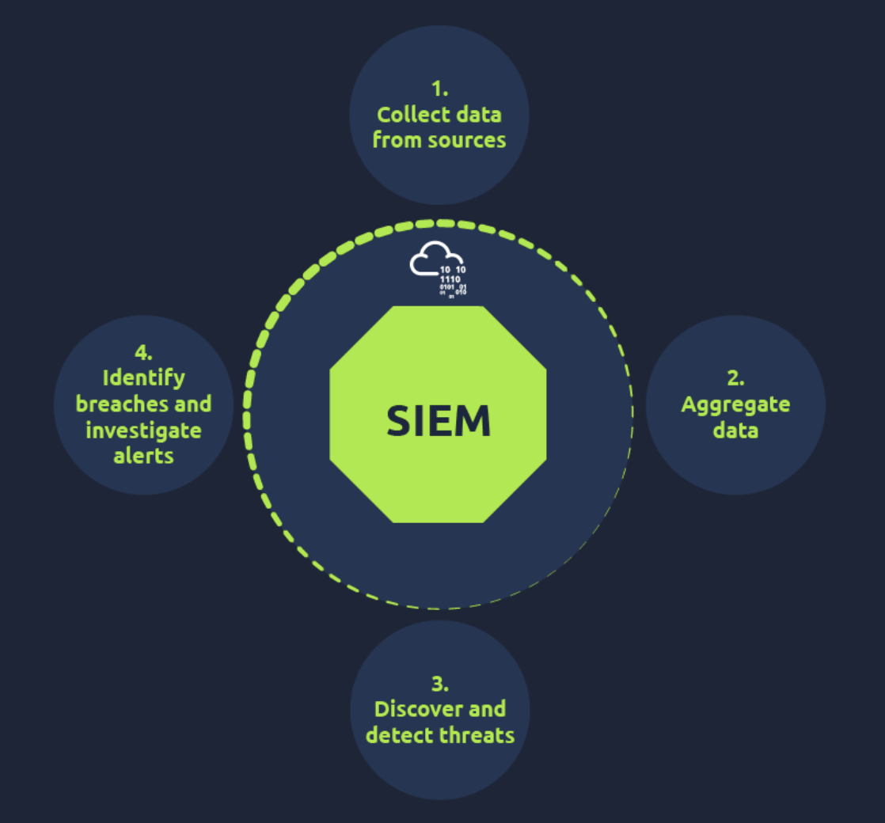
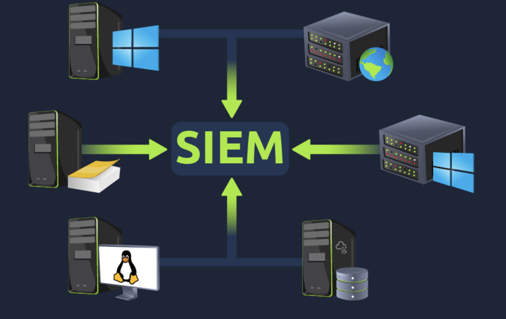
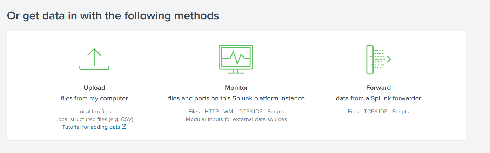
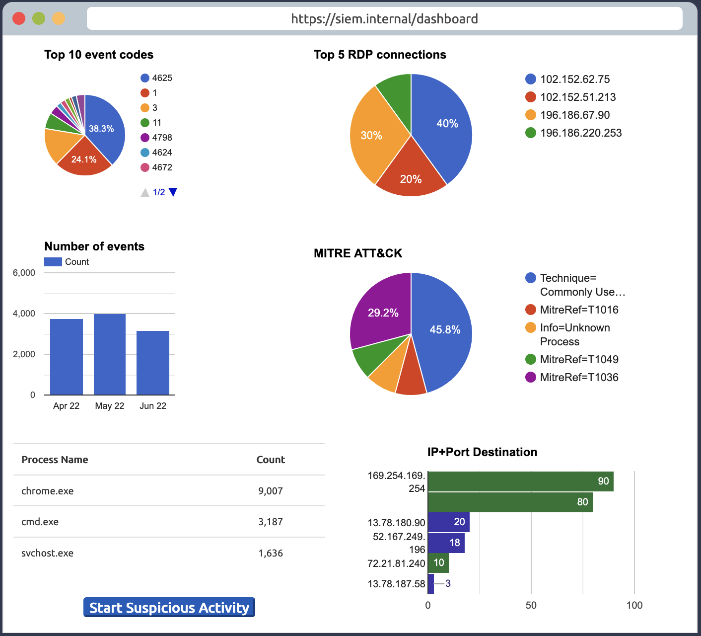
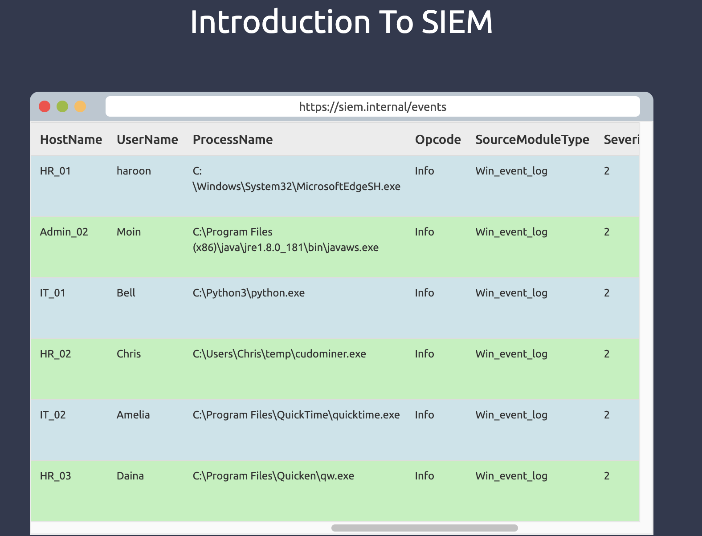
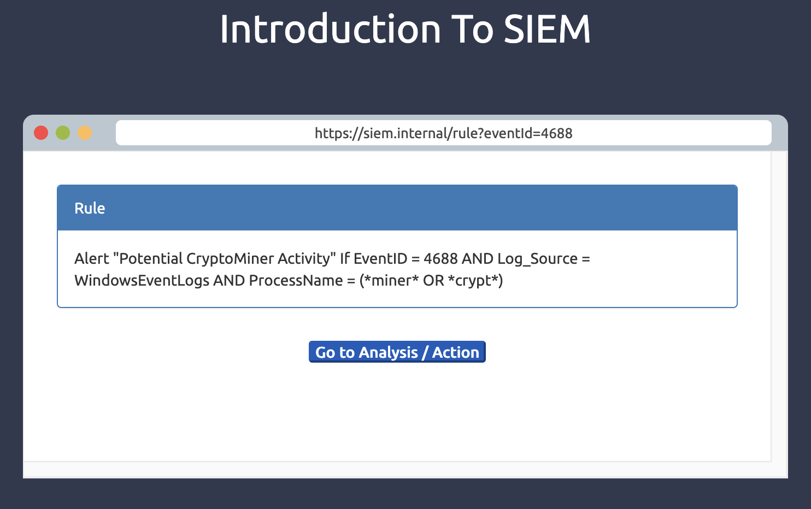

# Introduction to SIEM

---
Endpoint Detection and Response (EDR) monitors endpoints for advanced threats, extending beyond network perimeters amid remote 
work growth. Solutions include CrowdStrike Falcon, SentinelOne ActiveEDR, Microsoft Defender for Endpoint, OpenEDR, Symantec EDR. 
Core features encompass visibility via detailed telemetry—process modifications, registry changes, file and folder alterations, 
user actions—displayed in process trees with timelines and historical access for hunting. Detection integrates signatures, 
behaviors, anomalies through machine learning, fileless malware identification, custom indicators of compromise, MITRE ATT&CK 
mapping. Response allows host isolation, process termination, file quarantine, remote shell access via Real Time Response in 
CrowdStrike Falcon, artefact extraction like memory dumps, event logs, folder contents, registry hives.

EDR surpasses antivirus (AV) by providing ongoing behavioral monitoring versus entry-point signature checks. In scenarios with 
phishing-delivered Word documents embedding malicious Visual Basic for Applications scripts spawning obfuscated PowerShell to 
download payloads injected into svchost.exe for remote access, AV misses non-signature steps, while EDR flags unusual 
relationships, scripts, injections, connections, alerting with full chains.

Agents deploy on endpoints—Windows, Linux, Mac—to collect real-time telemetry, forwarding to consoles for correlation, machine 
learning, threat intelligence matching. Dashboards summarize detections by severity, time, file, hostname, username, MITRE 
tactics/techniques. True positives prompt triage for false/true classification, then actions. EDR focuses on hosts, lacking 
network threat coverage, integrating with security information and event management (SIEM), firewalls, data loss prevention 
(DLP), email gateways, identity and access management (IAM).

Telemetry includes process executions/terminations for relationships or payloads, network connections for command and control 
or exfiltration, command line in Command Prompt or PowerShell for scripts, file modifications during staging or ransomware, 
registry changes for configurations. This enables timeline reconstruction, root cause identification, informed legitimacy 
judgments.

Detection techniques involve behavioral analysis for anomalies like Word spawning PowerShell, baseline deviations such as 
auto-start registry edits, IOC matching for hashes or executables, MITRE mapping to tactics like persistence via scheduled 
tasks, machine learning for fileless or multi-stage patterns.

Response supports automated policy-based blocking, manual host isolation for containment, process kills for targeted 
neutralization, quarantine relocating files, remote access for scripts or deeper inspection, artefact collection for forensics.

Simulation triage examines detections for prioritization by severity—critical, high, medium, low, informational—focusing on 
visibility without acknowledgement or actions.

I find EDR's endpoint-centric telemetry invaluable for dissecting evasive tactics, shifting analysis from reactive to contextual.

---

| Attack Steps | AV's Response | EDR's Response |
|--------------|---------------|----------------|
| Step #1 | Does nothing if the downloaded file has no previous signature in the database | Logs the file download activity and monitors it |
| Step #2 | Does nothing upon the opening of the document since winword.exe is a legitimate utility | Records the execution of winword.exe and keeps monitoring |
| Step #3 | Does nothing if the executed macro has no previous signature | Detects and flags the macro execution due to the unusual parent-child relationship of winword.exe and PowerShell.exe processes |
| Step #4 | Typically, AVs will not detect obfuscated PowerShell scripts | Flags the obfuscated script execution |
| Step #5 | Will not flag malicious injection into svchost.exe since it does not monitor the memory injections | Detects Process Injection in svchost.exe |
| Step #6 | Lacks Network Level Visibility | Flags the unexpected behaviour of svchost.exe, making an outbound connection |
| Final Action | May be marked as clean | Generates an alert with the full attack chain and enables the analyst to take actions from within the EDR |

---

### Key Takeaways
- Behavioral Detection: Observes file behavior, flagging unusual parent-child relationships like winword.exe spawning
  PowerShell.exe
- Anomaly Detection: Flags deviations from baseline, such as process modifying auto-start registry key
- IOC matching: Flags matches to known indicators, like downloaded file dropping executable with threat intelligence hash
- MITRE ATT&CK Mapping: Maps flagged activity to tactics/techniques, e.g., scheduled task creation to Persistence via
  Scheduled Task/Job
- Machine Learning Algorithms: Detects complex patterns in fileless or multi-stage attacks where individual actions
  appear benign
- Isolate Host: Contains spread by network isolation
- Terminate Process: Neutralizes without full isolation, avoiding disruption to critical operations
- Quarantine: Moves files to isolated location preventing execution for review
- Remote Access: Enables shell for custom actions, scripts, deeper visibility
- Artefacts Collection: Extracts memory dumps, event logs, folder contents, registry hives for forensics
- To view events in a Windows environment, type `Event Viewer` in the search bar.
- Common locations where Linux stores logs are:
- `/var/log/httpd:` Contains HTTP Request  / Response and error logs.
- `/var/log/cron:` Events related to cron jobs are stored in this location.
- `/var/log/auth.log` and `/var/log/secure:` Stores authentication-related logs.
- `/var/log/kern:` This file stores kernel-related events.

---

### Gallery 

  <table>
    <tr>
      <td>
      <td></td>
    </tr>
    <tr>
      <td align="center"><strong>Figure 1a:</strong> Siem Introduction</td>
      <td align="center"><strong>Figure 1b:</strong> Splunk Siem</td>
    </tr>
    <tr>
      <td>
      <td></td>
    </tr>
     <tr>
      <td align="center"><strong>Figure 2a:</strong> Siem Log Ingestion</td>
      <td align="center"><strong>Figure 2b:</strong> Splunk Siem Log Ingestion</td>
    </tr>
  </table>

  <table>
    <tr>
      <td>
      <td></td>
    </tr>
    <tr>
      <td align="center"><strong>Figure 3a:</strong> Siem Dashboard Activity</td>
      <td align="center"><strong>Figure 3b:</strong> Siem Dashboard Activity Events</td>
    </tr>
    <tr>
      <td>
    </tr>
     <tr>
      <td align="center"><strong>Figure 4a:</strong> Siem Dashboard Activity Rule</td>
    </tr>
  </table>

---

