# Network Traffic Basics

---
In my documentation of foundational network monitoring techniques, network traffic analysis stands out as a method for seizing, 
reviewing, and interpreting data moving across connections to gain thorough insight into exchanges both within and beyond the perimeter.
It extends past mere reliance on software like Wireshark, incorporating the alignment of various records, detailed examination of 
packets, and metrics on flows to achieve targeted aims. This proficiency remains critical for positions ranging from beginner security 
operations center analysts to those in defensive and offensive operations, where sifting through vast data to spot routine versus
irregular patterns forms the core. The emphasis here covers outlining this analysis, its necessity, observable elements, methods for
observation, and notable origins and patterns of traffic.

An incident I noted involved a notification about abnormal DNS requests from a machine at <TARGET_IP>, directing repeated inquiries 
to identical top-level domains via distinct subdomains. Firewall entries logged types of queries, times, and origins, but omitted 
payloads. Deeper packet review exposed possible control directives in TXT replies, like encoded strings, illustrating how attackers 
leverage DNS for hidden channels or signaling. Such cases reveal the value in traffic scrutiny, as perimeter gear tracks queries 
without internals, enabling threats like embedded orders to infected hosts.

Overall, this analysis serves to oversee connection efficiency, identify oddities such as abrupt surges or lags, and probe dubious 
interactions like outbound data through DNS or harmful archives fetched over HTTP. In operations centers, it facilitates spotting 
threats, piecing together breaches, and confirming warnings. One example showed a device shifting from standard actions around 
mid-afternoon coordinated time, with traffic yielding a questionable compressed file from HTTP. Another highlighted excess DNS 
compared to norms, uncovering tunneling for leakage.

Using the TCP/IP framework common to networked gear, monitorable aspects align with its tiers. Application components include 
protocol-specific fronts and actual content; in HTTP, a fetch might target suspicious_package.zip, with approvals signaling success 
yet concealing binaries. Transport divides and wraps these into segments, typically TCP or UDP, with logs often noting ports and 
indicators but skipping sequences vital for flagging takeovers, where erratic numbering prompts checks. Internet appends addressing, 
fragmenting oversized units, with common logs on origins, targets, and lifetimes, but offsets and sizes key to spotting reassembly 
manipulations like overlaps evading detectors. Link incorporates physical addressing, logs usually showing hardware identifiers, 
yet requiring full contexts for poisons like ARP where duplicates or conflicts indicate interference.

In practice, origins split into transit points like barriers, exchangers, stand-ins, intrusion sensors, routers, and controllers,
producing minor flows from routing like EIGRP or OSPF, oversight like SNMP or pings, recording like SYSLOG, and aids like ARP, STP, 
or DHCP, versus terminals like processors, workstations, connected objects, outputters, virtual instances, remote assets, and 
portables handling most capacity. Patterns group as perimeter-crossing, traversing defenses via client-server like HTTPS, DNS, SSH, 
VPN, SMTP, RDP with inbound and outbound directions, stressing rule and record setups for oversight, or internal, less watched but 
crucial for breach spreads exploiting authentications, shares, infrastructure, communications, copies, or supervision.

In HTTPS with decryption, a station's appeal goes to an advanced barrier with intermediary, which mimics the endpoint while linking 
anew to the true one, relays, examines returns, and passes if benign, yielding dual links. External DNS begins at a station querying 
an inner resolver on 53, which caches or routes outward via paths and defenses to set externals, reversing for deliveries. SMB to 
shares like \\<redacted>\MARKETING initiates with Kerberos verification, where logins secure granting tickets for service ones, 
then employ them for linkages before access.

Gathering data mixes records, complete grabs, and overviews. Records offer initial views, varying per maker like Microsoft events, 
capturing select fields without wholes, as in Linux authentications or web accesses via Syslog or common formats. Protocols like 
Syslog or SNMP standardize transmissions to gatherers. For more, link records with grabs and stats. Grabs use inline duplicators at 
physical levels, forwarding copies sans delay to analyzers, or port copies on intermediaries, like Cisco SPAN directing from one 
interface to another, applicable to virtuals like VMware or clouds like AWS VPC mirroring.

Analysis tools encompass Wireshark for breakdowns, tcpdump for lines, and protectors like Snort, Suricata, and Zeek. Stats via 
NetFlow amass flow details for noting controls, leaks, or shifts, while IPFIX, evolving from Cisco's proprietary to open standard, 
adds field choices. These embed in gear, needing activation and targets like advanced barriers or sensors.

---

This structure aids in mapping responses, linking model specifics to actual assessments beyond partial records.

| Description | Code/Command |
|-------------|--------------|
| DNS log entry example 1 | 2025-10-03 09:15:23    SRC=<TARGET_IP>      QUERY=<redacted>.malicious-tld.com    QTYPE=A      |
| DNS log entry example 2 | 2025-10-03 09:15:31    SRC=<TARGET_IP>      QUERY=<redacted>.malicious-tld.com    QTYPE=A     |
| DNS log entry example 3 | 2025-10-03 09:15:45    SRC=<TARGET_IP>      QUERY=<redacted>.malicious-tld.com       QTYPE=TXT     |
| DNS log entry example 4 | 2025-10-03 09:15:45    SRC=<TARGET_IP>      QUERY=<redacted>.malicious-tld.com       QTYPE=TXT    |
| DNS response packet capture | Domain Name System (response)     Transaction ID: 0x4a2b     Flags: 0x8180 Standard query response, No error         1... .... .... .... = Response: Message is a response         .... .... .... 0000 = RCODE: No error (0)     Questions: 1     Answer RRs: 1     Authority RRs: 0     Additional RRs: 0     Queries         <redacted>.evilc2.com: type TXT, class IN     Answers         <redacted>.evilc2.com: type TXT, class IN, TTL 60, TXT length: 20             TXT: "<redacted>" |
| HTTP GET request header | GET /downloads/suspicious_package.zip HTTP/1.1 Host: <redacted>.thm User-Agent: curl/7.85.0 Accept: */* Connection: close |
| HTTP response header | HTTP/1.1 200 OK Date: Mon, 29 Sep 2025 10:15:30 GMT Server: nginx/1.18.0 Content-Type: application/zip Content-Length: 10485760 Content-Disposition: attachment; filename="suspicious_package.zip" Last-Modified: Mon, 29 Sep 2025 09:54:00 GMT ETag: "5d8c72-9f8a1c-3a2b4c" Accept-Ranges: bytes Connection: close **SUSPICIOUS FILE SIZE:** [`binary ZIP file bytes follow — 10,485,760 bytes`] |
| Firewall log entry example 1 | 2025-10-13 09:15:32 ACCEPT TCP src=<TARGET_IP> dst=<TARGET_IP> sport=51432 dport=443 flags=SYN len=60 |
| Firewall log entry example 2 | 2025-10-13 09:15:32 ACCEPT TCP src=<TARGET_IP> dst=<TARGET_IP> sport=443 dport=51432 flags=SYN,ACK len=60 |
| Authentication log example | Oct  8 11:20:15 <redacted> sshd[2145]: Accepted password for <redacted> from <TARGET_IP> port 52234 ssh2 |
| Apache access log example | <TARGET_IP> - - [08/Oct/2025:11:20:18 +0200] "GET /index.html HTTP/1.1" 200 2326 "-" "Mozilla/5.0" |
| Cisco SPAN configuration | Switch(config)# monitor session 1 source interface fastEthernet0/1 Switch(config)# monitor session 1 destination interface fastEthernet0/2 |

### Extracted Tables

#### Session Hijacking Capture

| No. | Time | Source | Destination | Protocol | Length | Info |
|-----|------|--------|-------------|----------|--------|------|
| 1 | 0.000000 | <TARGET_IP> | <TARGET_IP> | TCP | 74 | 51432 → 80 [SYN] Seq=0 Win=64240 Len=0 MSS=1460 |
| 2 | 0.000120 | <TARGET_IP> | <TARGET_IP> | TCP | 74 | 80 → 51432 [SYN, ACK] Seq=0 Ack=1 Win=65535 Len=0 MSS=1460 |
| 3 | 0.000220 | <TARGET_IP> | <TARGET_IP> | TCP | 66 | 51432 → 80 [ACK] Seq=1 Ack=1 Win=64240 Len=0 |
| 4 | 0.010500 | <TARGET_IP> | <TARGET_IP> | TCP | 1514 | 51432 → 80 [PSH, ACK] Seq=1 Ack=1 Win=64240 Len=1460 |
| 5 | 0.010620 | <TARGET_IP> | <TARGET_IP> | TCP | 66 | 80 → 51432 [ACK] Seq=1 Ack=1461 Win=65535 Len=0 |
| 6 | 0.020100 | <TARGET_IP> | <TARGET_IP> | TCP | 74 | 51432 → 80 [PSH, ACK] **SUSPICIOUS SEQUENCE #:** `Seq=34567232` Ack=1 Win=64240 Len=20 |

#### Fragmentation Overlap Capture

| No. | Time | Source | Destination | Protocol | Length | Info |
|-----|------|--------|-------------|----------|--------|------|
| 1 | 0.000000 | <TARGET_IP> | <TARGET_IP> | UDP | 1514 | Fragmented IP protocol (UDP) (id=0x1a2b) [MF] Offset=0, Len=1480 |
| 2 | 0.000015 | <TARGET_IP> | <TARGET_IP> | UDP | 1514 | Fragmented IP protocol (UDP) (id=0x1a2b) [MF] Offset=1480, Len=1480 |
| 3 | 0.000030 | <TARGET_IP> | <TARGET_IP> | UDP | 600 | Fragmented IP protocol (UDP) (id=0x1a2b) Offset=1480, Len=64   <-- Overlap |
| 4 | 0.000045 | <TARGET_IP> | <TARGET_IP> | ICMP | 98 | Destination unreachable (Fragment reassembly time exceeded) |

#### ARP Poisoning Capture

| No. | Time | Source | Destination | Protocol | Length | Info |
|-----|------|--------|-------------|----------|--------|------|
| 1 | 0.000000 | <TARGET_IP> | Broadcast | ARP | 60 | Who has <TARGET_IP>? Tell <TARGET_IP> |
| 2 | 0.000025 | <TARGET_IP> | <TARGET_IP> | ARP | 60 | <TARGET_IP> is at <redacted> |
| 3 | 1.002010 | <TARGET_IP> | <TARGET_IP> | ARP | 60 | <TARGET_IP> is at <redacted>  <-- Attacker spoof |
| 4 | 1.002015 | <TARGET_IP> | <TARGET_IP> | ARP | 60 | <TARGET_IP> is at <redacted>  <-- Attacker spoof |
| 5 | 1.100000 | <TARGET_IP> | <TARGET_IP> | TCP | 74 | 54433 → 80 [SYN] Seq=0 Win=64240 Len=0 |
| 6 | 1.100120 | <TARGET_IP> | <TARGET_IP> | TCP | 74 | 54433 → 80 [SYN] Seq=0 Win=64240 Len=0  <-- Relayed via attacker |

---

### Key Takeaways
- Grasp network traffic analysis as seizing, reviewing, and linking data for oversight.
- Spot application fronts and contents, transport wraps with indicators and orders, internet splits with positions, link addresses.
- Gather through records for essentials, whole grabs via duplicators or copies for detail, stats like NetFlow or IPFIX for summaries.
- Identify origins as transit (barriers, routers) and terminals (stations, processors), patterns as perimeter (out-in) and internal (sideways).
- For HTTPS decryption: station appeals to intermediary; intermediary links to true endpoint, reviews, relays.
- For outer DNS: station inquires inner; inner stores or sends out, gets and sends back.
- For SMB Kerberos: login gets granting ticket; station seeks service one; applies for link, then reaches share.
- Practices for grabs: position aptly, time briefly for space, favor duplicators for speed.

---

### Gallery 

  <table>
    <tr>
      <td>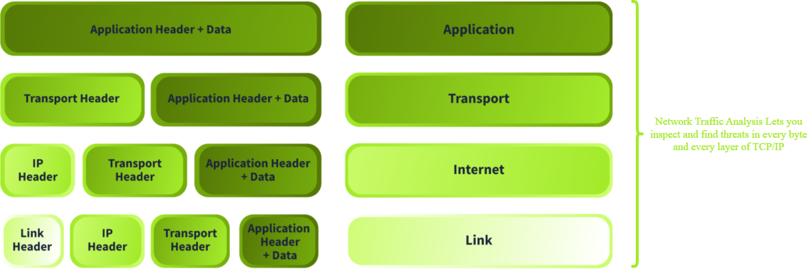
      <td>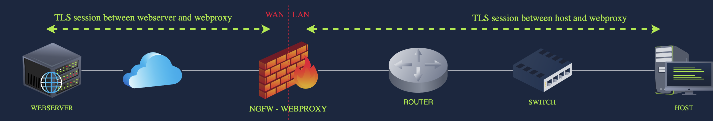</td>
    </tr>
    <tr>
      <td align="center"><strong>Figure 1a:</strong> Different Layers of the TCP/IP Model</td>
      <td align="center"><strong>Figure 1b:</strong> HTTPS</td>
    </tr>
    <tr>
      <td>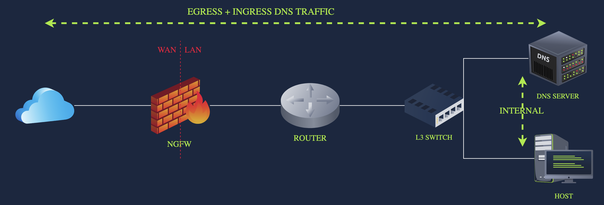
      <td>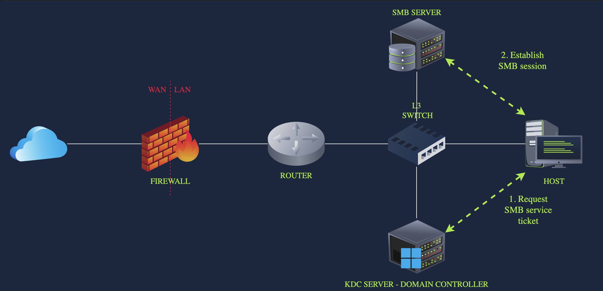</td>
    </tr>
     <tr>
      <td align="center"><strong>Figure 2a:</strong> External DNS</td>
      <td align="center"><strong>Figure 2b:</strong> SMB With Kerberos</td>
    </tr>
  </table>

  <table>
    <tr>
      <td>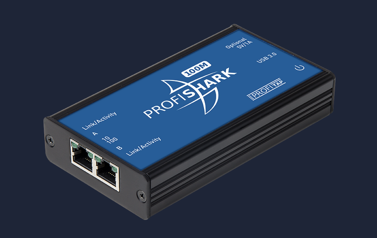
      <td>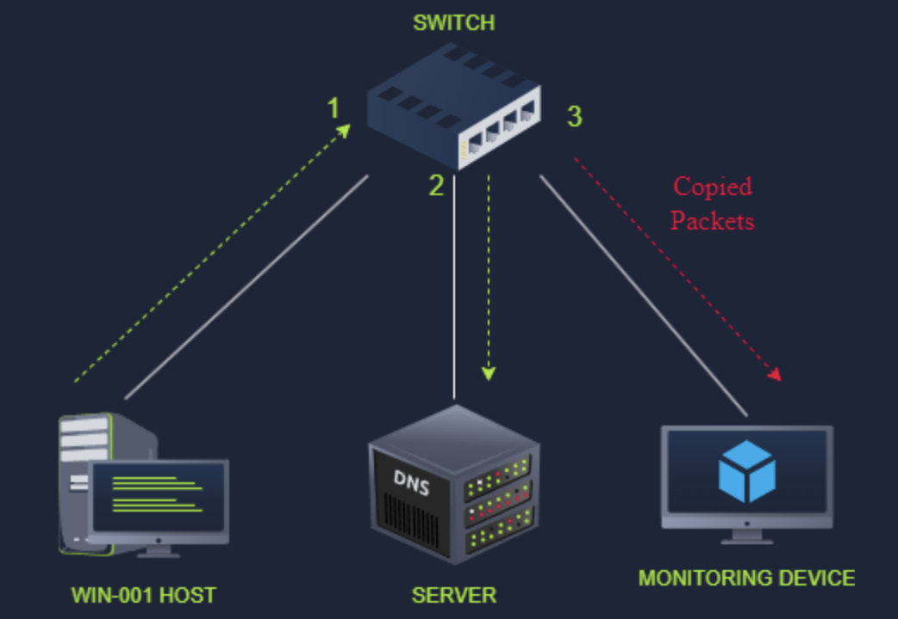</td>
    </tr>
    <tr>
      <td align="center"><strong>Figure 3a:</strong> Network Tap</td>
      <td align="center"><strong>Figure 3b:</strong> Port Mirroring</td>
    </tr>
    <tr>
      <td>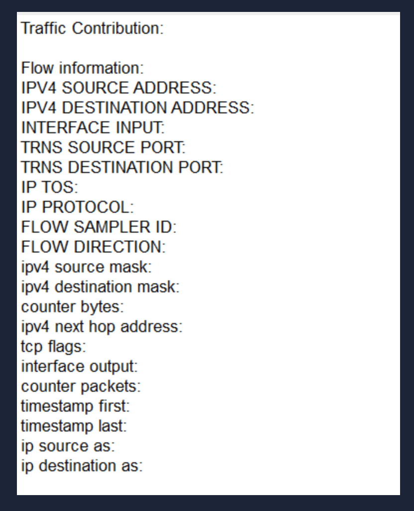
      <td>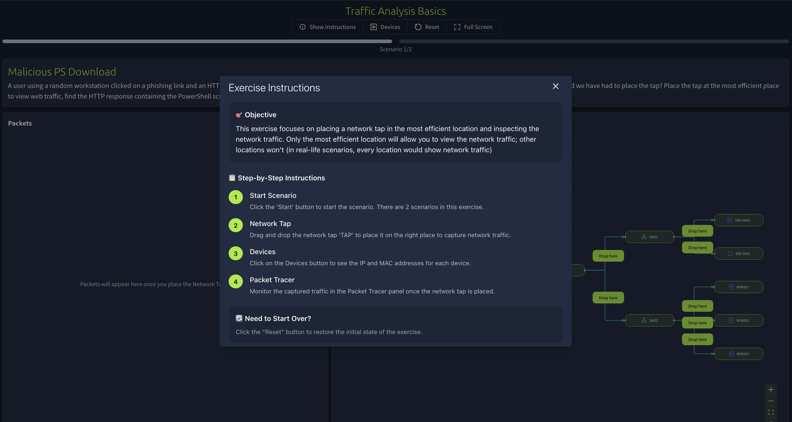</td>
    </tr>
     <tr>
      <td align="center"><strong>Figure 4a:</strong> Network Statistics</td>
      <td align="center"><strong>Figure 4b:</strong> Traffic Analysis Basics - Activity 1</td>
    </tr>
  </table>

  <table>
    <tr>
      <td>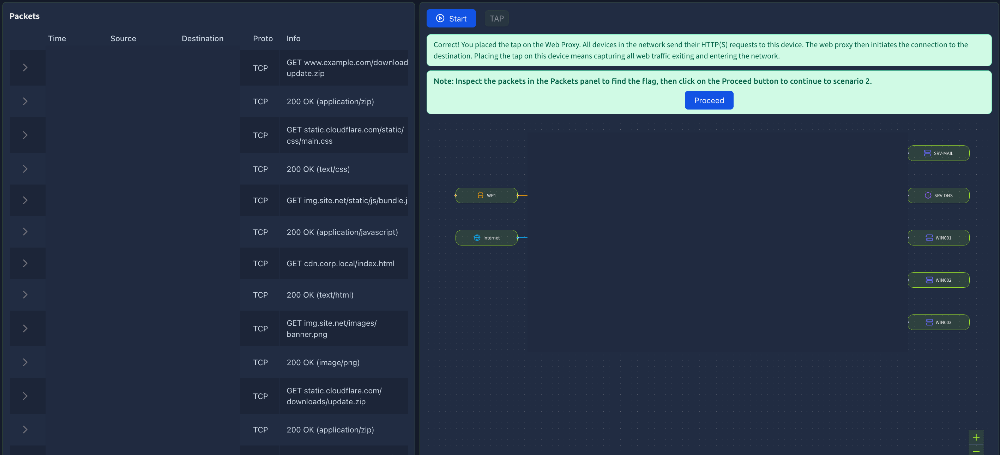
      <td>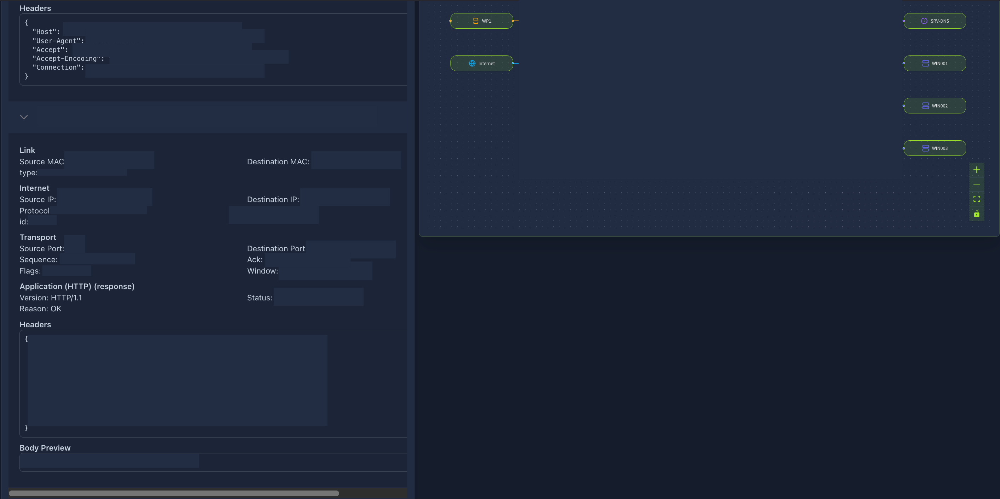</td>
    </tr>
    <tr>
      <td align="center"><strong>Figure 5a:</strong> Traffic Analysis Basics Activity</td>
      <td align="center"><strong>Figure 5b:</strong> Traffic Analysis Basics Activity Found Flag</td>
    </tr>
    <tr>
      <td>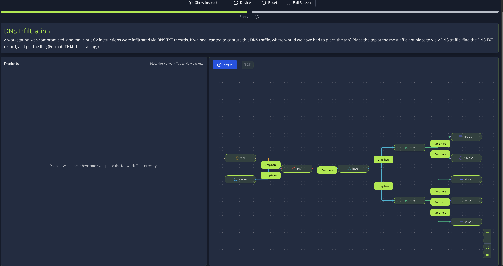
      <td>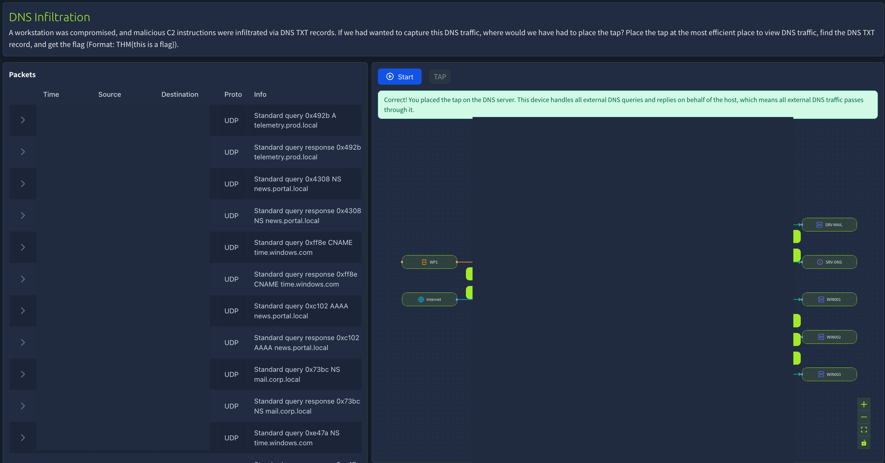</td>
    </tr>
     <tr>
      <td align="center"><strong>Figure 6a:</strong> Traffic Analysis Basics Activity 2</td>
      <td align="center"><strong>Figure 6b:</strong> Traffic Analysis Basics Activity</td>
    </tr>
  </table>

  <table>
    <tr>
      <td>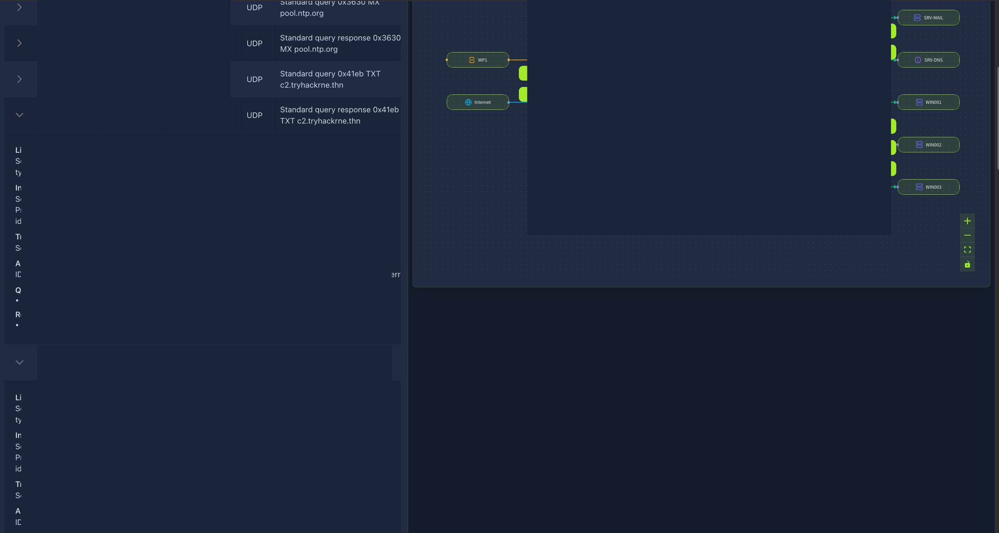
    </tr>
    <tr>
      <td align="center"><strong>Figure 1a:</strong> Traffic Analysis Basics Activity - Found Flag 2</td>
    </tr>
  </table>

---
