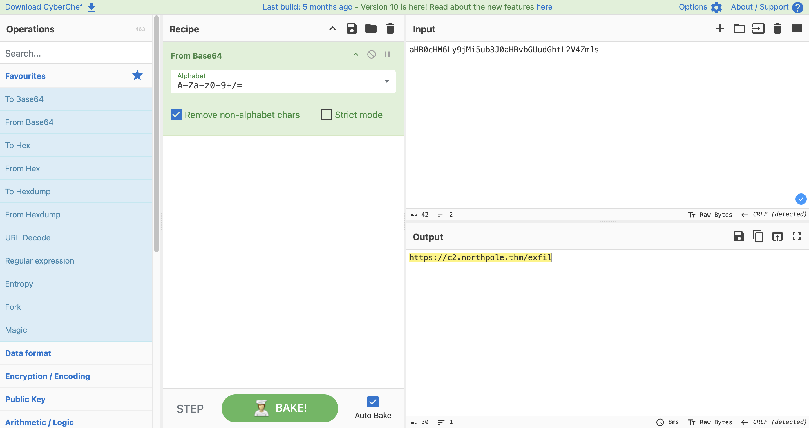
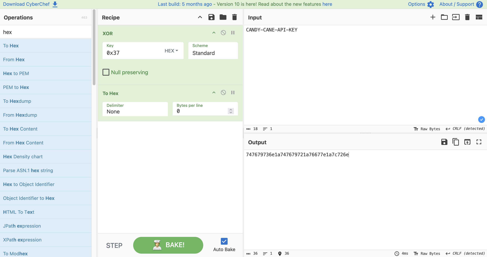

# Obfuscation - The Egg Shell File

---
## Obfuscation & Deobfuscation

Obfuscation serves as a primary defensive and offensive tactic to hinder forensic analysis and bypass signature-based security 
controls. By transforming plain text into a non-human-readable format, threat actors can delay incident response and evade 
automated detection systems that scan for known malicious strings. Simple substitution ciphers like ROT1 and ROT13 function 
by shifting characters forward in the alphabet by a fixed number of positions, preserving the original string length and word 
spacing while masking the content.

More advanced techniques involve bitwise operations such as XOR. This process combines input bytes with a specific key to produce 
an output that often includes non-printing characters or uncommon symbols. While identifying XOR obfuscation is difficult, visual 
patterns like consistent string length and repeating character sequences can indicate its use. CyberChef is a standard utility 
for analyzing such transformations, providing a modular interface to chain multiple operations—referred to as recipes—to process 
and revert obfuscated data.

Detection often relies on recognizing structural patterns unique to specific techniques. Base64 is characterized by alphanumeric 
strings frequently ending in padding characters like equals signs, whereas ROT-based ciphers maintain standard sentence 
structures. In modern attacks, layered obfuscation is common, where data is sequentially processed through multiple methods 
like compression, bitwise operations, and encoding. Successful deobfuscation requires reversing these layers in the exact opposite 
order of their application. When faced with unknown patterns, analysts use automated heuristic tools or "Magic" operations to 
guess the underlying cipher through intensive testing of common decoding algorithms.

---

| Description | Code/Command |
| --- | --- |
| ROT1 obfuscated string example | `dbsspu dpjot hp css` |
| Input for XOR demonstration | `carrot supremacy` |
| XOR output using key "a" (Hex) | `ikxxe~*yzxogkis!` |
| Base64 encoded layered payload | `H4sIADKZ42gA/32PT2sqQRDE7/MpitGDgrPEJJcXyOGha1xwVaLwyLvI6rbuhP3HTHswm/3uzmggIQfrUD3VzI/u7iDXljepNkFth6KDmYsWnBF2R2OoZOyrPCUDXSKB1UWdEzjZ5hQI8c9oJrU4cn1kyPXbMgRW0X/nF8WLcTSJwvFX9Jr/jUP5i1NOgPeLfjxvtKQQL8RqlOk8jZgKfGJSmTDZZWqxfacdoxFAl0814Rl6j153EyxXkR1VJSe6JNNHAzmOXiHRgnJLPk+iWeiyR63+uIm6Hb5B92NG5YGzK5sm7FnfTSxfzl3rgoJ1tWKjy0NPnpxUHKs0xXT6VBSy7zjZ3A3UY4tmOPjTAs29t4dWQu2vpwyua7niJ7iyCeZJQaIVZ/xwdy/JAQAA` |
| Navigate to the script directory | `cd .\Desktop\` |
| Execute the PowerShell script | `.\SantaStealer.ps1` |

---
### Using Cyberchef

  <table>
    <tr>
      <td>
      <td></td>
    </tr>
    <tr>
      <td align="center"><strong>Figure 1a:</strong> Northpole link</td>
      <td align="center"><strong>Figure 1b:</strong> Xor && Hex</td>
    </tr>
  </table>

---
### Key Takeaways - Use ROT1 and ROT13 for basic character shifting where word structure remains visible but content is masked.
* Employ XOR for byte-level transformation, noting that the resulting string length matches the original but may contain
  unreadable characters.
* Identify Base64 by looking for alphanumeric sequences with potential trailing `=` or `==` padding.
* Reverse layered obfuscation by applying deobfuscation operations in the strict reverse order of the original encoding.
* Utilize the "Magic" operation in [CyberChef](https://gchq.github.io/CyberChef/) for automated identification of unknown
  obfuscation patterns.
* Look for visual clues like "one letter off" words for ROT1 and the transformation of "the" to "gur" for ROT13.

---
>[!Note]
>### You did it! Wareville is one step safer.
>The townsfolk are counting on you to keep Christmas secure.
>Head back to Wareville to continue your mission!

