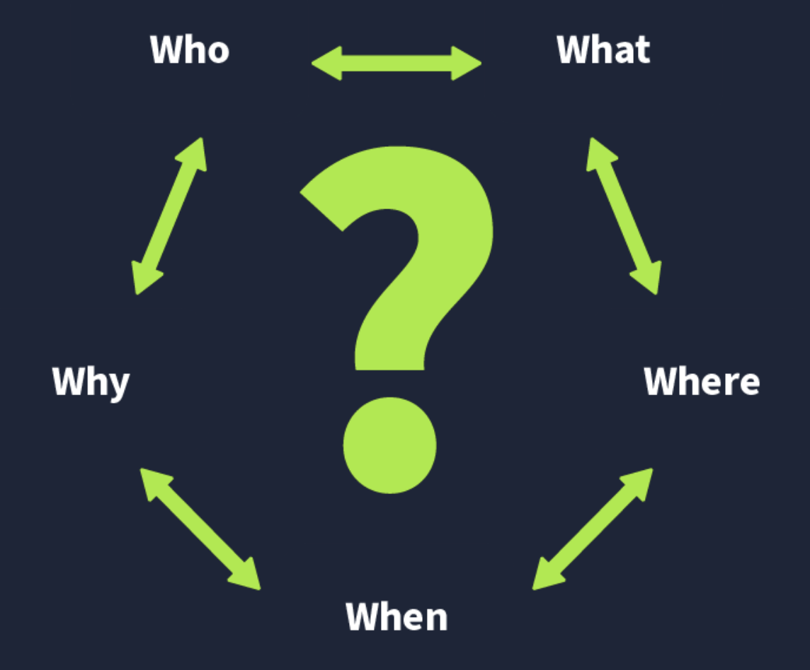
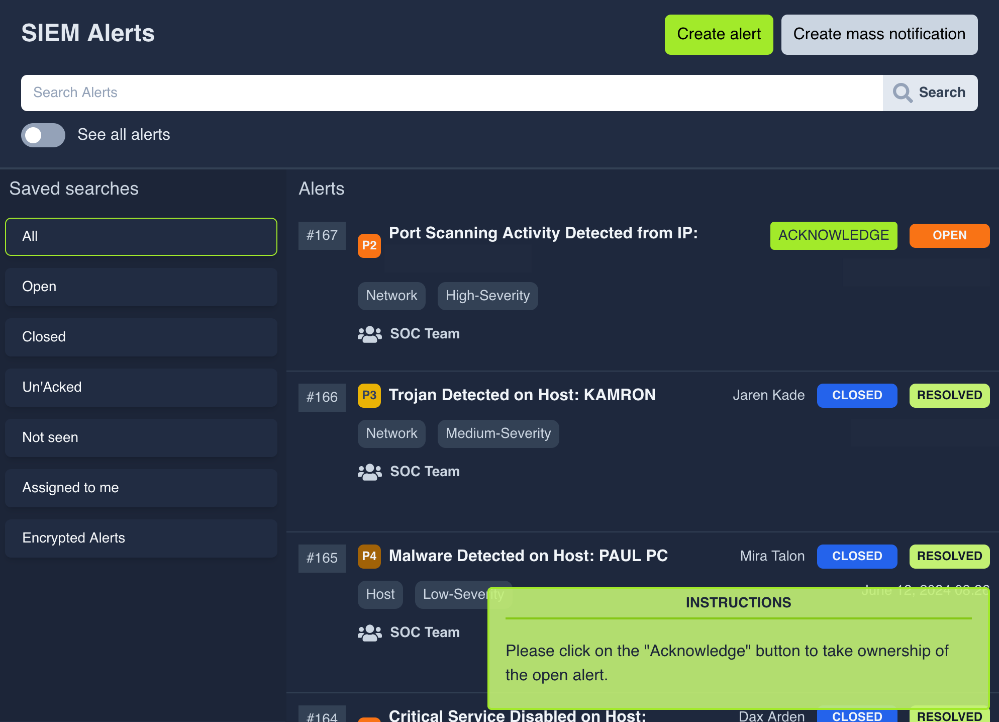
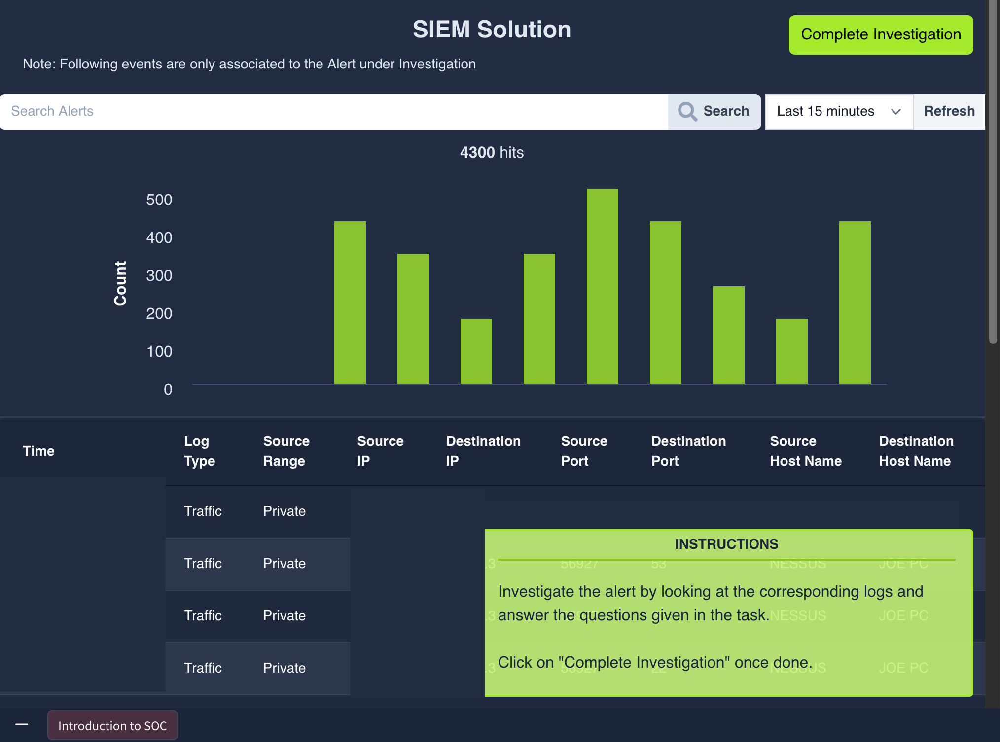
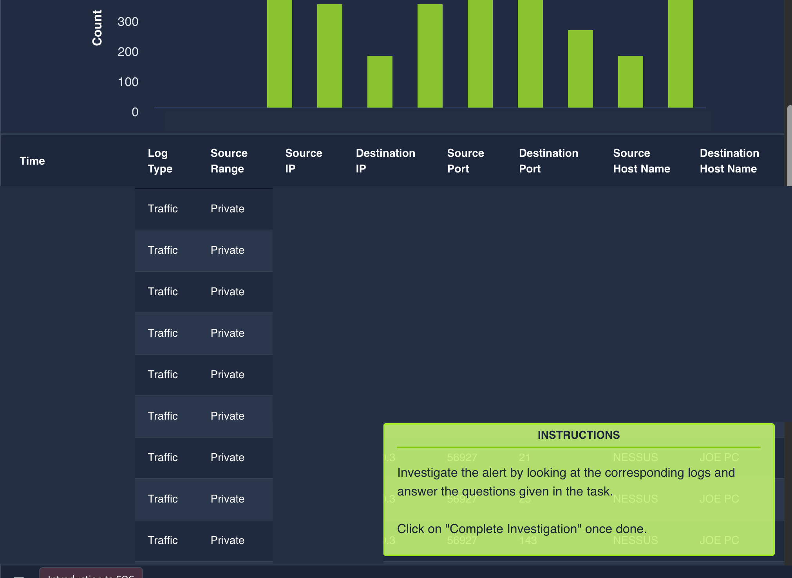
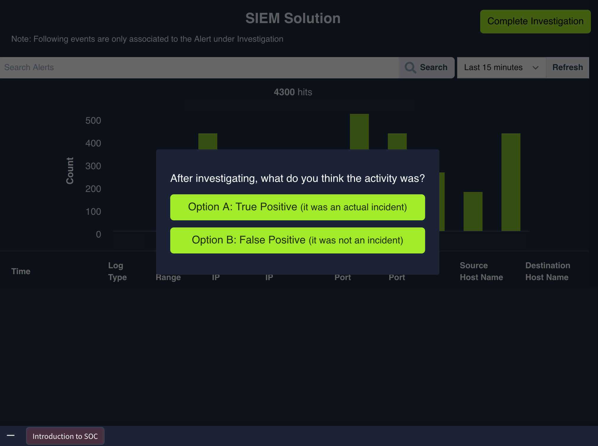
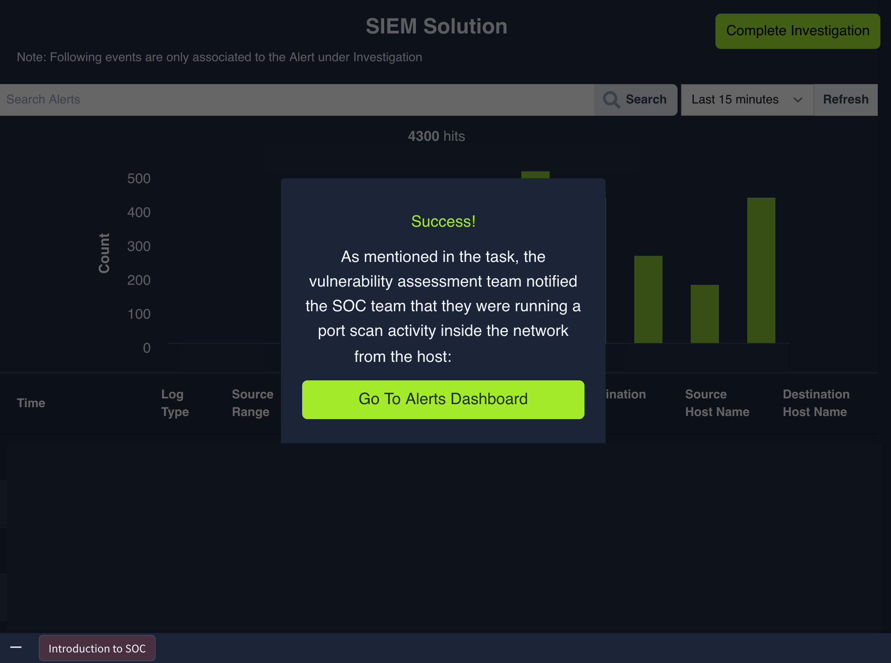

# SOC Fundamentals

---

The SOC Fundamentals room on TryHackMe introduces the Security Operations Center. Technology has boosted efficiency yet brought 
heavier responsibility for safeguarding critical data, often called secrets, now held digitally across networks and systems 
rather than in physical files. Organizations store vast amounts of confidential information where any unauthorized disruption, 
loss, or alteration can inflict serious damage. Threat actors routinely uncover and exploit fresh vulnerabilities in these 
environments, rendering traditional security measures inadequate in many cases. A dedicated team focused solely on organizational
security therefore becomes essential. A Security Operations Center, or SOC, operates as a specialized facility run by a security
team that monitors the network and resources continuously, twenty-four hours a day and seven days a week, to spot suspicious 
activity and stop harm before it spreads. The material here examines core concepts in this defensive security domain, covering 
a baseline understanding of the SOC, detection and response activities, the interplay of people, processes, and technology, plus 
a hands-on exercise.

The SOC team centers its efforts on sustaining strong detection and response functions. Security solutions integrate across the 
company’s network and systems to enable centralized, continuous monitoring that catches and addresses incidents promptly. 
Detection includes spotting vulnerabilities in device software such as operating systems or applications, for example unpatched 
MS Windows systems exposed to known issues. It also covers unauthorized activity, such as an attacker using stolen employee 
credentials to log in, where details like geographic location provide early clues. Policy violations fall under detection as 
well, varying by organization but including actions like downloading pirated media or transmitting confidential files insecurely.
Intrusions represent another category, whether from successful exploitation of a web application or a user visiting a malicious 
site that infects their machine. Once an incident surfaces, response steps focus on limiting impact, conducting root cause 
analysis, and assisting the broader incident response effort.

Three pillars—people, process, and technology—form the foundation of any mature SOC environment. Professionals using advanced 
tools while following defined procedures create an effective setup capable of handling varied incidents. I found the emphasis 
on these pillars particularly useful for seeing how the pieces fit together in daily operations.

People remain indispensable even as automation advances, because security tools generate abundant alerts that create noise 
without human review. Much like a fire brigade sifting through multiple alarms only to find most stem from routine cooking smoke,
a SOC without analysts wastes resources on false positives. The SOC team includes several roles. Level 1 analysts act as first 
responders, triaging alerts from security solutions to judge whether they indicate real harm and escalating them through proper 
channels. Level 2 analysts perform deeper investigations, correlating data from multiple sources when initial triage needs more 
context. Level 3 analysts, drawing on extensive experience, hunt proactively for threat indicators and lead responses to critical 
incidents, handling containment, eradication, and recovery. Security engineers deploy and configure the tools analysts rely on to
keep them running smoothly. Detection engineers build the rules that drive those tools, sometimes as a dedicated role or in 
support of senior analysts. The manager oversees team processes, coordinates with the organization’s Chief Information Security 
Officer on current posture and ongoing efforts, and adjusts as needed. Role numbers and responsibilities scale with the 
organization’s size and risk level.

Processes define how each role operates. Alert triage forms the core first step, analyzing each alert to establish severity and 
set priorities by answering the five Ws—what occurred, when, where, who was involved, and why. Harmful alerts then move to 
reporting, escalated as tickets with full five-W details, supporting analysis, and screenshot evidence for higher-level review 
and resolution. In serious cases the process advances to incident response and forensics, where specialized teams investigate 
root causes through system and network artifacts; the separate Incident Response room covers that workflow in greater depth.

Technology supplies the security solutions that centralize data from devices and applications, automating much of the detection 
and response workload that would otherwise demand excessive manual effort. Security Information and Event Management, or SIEM, 
collects logs from various network sources, applies detection rules and advanced features such as user behavior analytics, 
threat intelligence, and machine learning to surface alerts after correlation across sources. Note that SIEM primarily delivers
detection capabilities within the SOC. Endpoint Detection and Response, or EDR, delivers real-time and historical visibility at
the device level along with automated response options for detailed endpoint investigations. A firewall serves as a network 
security barrier between internal systems and external networks like the internet, inspecting traffic and enforcing rules to 
block unauthorized flows. Additional solutions such as antivirus, intrusion detection or prevention systems, extended detection
and response platforms, and security orchestration tools each address specific needs, with selection driven by the 
organization’s threat landscape and available resources.

The practical exercise puts the pillars into action by simulating the work of a Level 1 analyst. An alert arrives indicating 
port scanning activity on a network host, with access granted to the SIEM for reviewing associated logs and answering the five
Ws. The team had already confirmed authorized scanning originated from host <redacted>. This walkthrough demonstrates triage in
a realistic setting.

The room wraps up by outlining SOC responsibilities and illustrating how people, processes, and technology combine in routine
use cases. Hands-on practice resolving an actual alert as a Level 1 analyst reinforces the concepts covered.

---

**Extracted Tables**

| 5 Ws | Answers |
|------|---------|
| What? | A malicious file was detected on one of the hosts inside the organization’s network. |
| When? | The file was detected at 13:20 on June 5, 2024. |
| Where? | The file was detected in the directory of the host: "GEORGE PC". |
| Who? | The file was detected for the user George. |
| Why? | After the investigation, it was found that the file was downloaded from a pirated software-selling website. The investigation with the user revealed that they downloaded the file as they wanted to use a software for free. |

---

## Key Takeaways
- Building a baseline for the Security Operations Center
- Detection and response in the SOC
- The role of People, Processes, and Technology
- Practical exercise as Level 1 Analyst
- Detect vulnerabilities in device software such as operating systems or programs
- Detect unauthorized activity using clues like geographic location
- Detect policy violations such as downloading pirated media or insecure file transmission
- Detect intrusions from exploited applications or malicious sites
- Support incident response by minimizing impact and performing root cause analysis
- Level 1 Analyst: first responder performing basic alert triage and reporting
- Level 2 Analyst: deeper investigation and data correlation
- Level 3 Analyst: proactive threat hunting plus containment, eradication, and recovery for severe incidents
- Security Engineer: deploys and configures security solutions
- Detection Engineer: creates and maintains detection rules
- Manager: oversees processes and updates CISO on security posture
- Perform alert triage by answering the five Ws to determine severity and priority
- Report escalated alerts as tickets with five-W details, analysis, and evidence
- Initiate incident response and forensics for critical malicious activity to establish root cause
- Deploy SIEM for centralized log collection, rule-based detection, user behavior analytics, and machine learning
- Use EDR for endpoint visibility, investigation, and automated response
- Implement firewall for network traffic monitoring and blocking of unauthorized flows
- Select additional tools such as antivirus, IDS/IPS, XDR, or SOAR based on threat surface and resources
- Simulate Level 1 Analyst triage on port scanning alert using SIEM logs and five Ws

---

### Gallery 

  <table>
    <tr>
      <td align="center">
      <td align="center"></td>
    </tr>
    <tr>
      <td align="center"><strong>Figure 1a:</strong> 5 W's</td>
      <td align="center"><strong>Figure 1b:</strong> Siem Dashboard</td>
    </tr>
    <tr>
      <td align="center">
      <td align="center"></td>
    </tr>
     <tr>
      <td align="center"><strong>Figure 2a:</strong> Alert Port Scan Activity - 0</td>
      <td align="center"><strong>Figure 2b:</strong> Alert Port Scan Activity - 1</td>
    </tr>
  </table>

  <table>
    <tr>
      <td align="center">
      <td align="center"></td>
    </tr>
    <tr>
      <td align="center"><strong>Figure 3a:</strong> Decision</td>
      <td align="center"><strong>Figure 3b:</strong> Success</td>
    </tr>
  </table>

---

