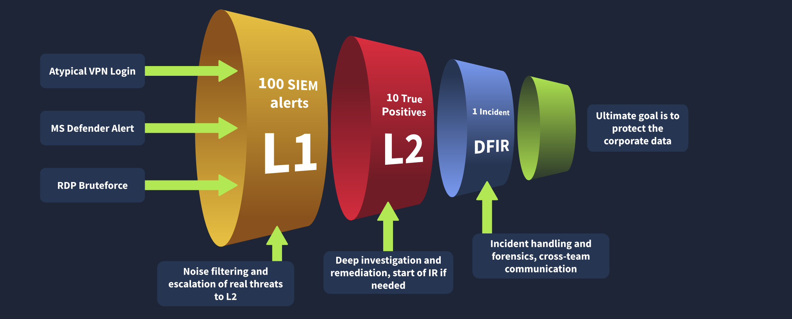
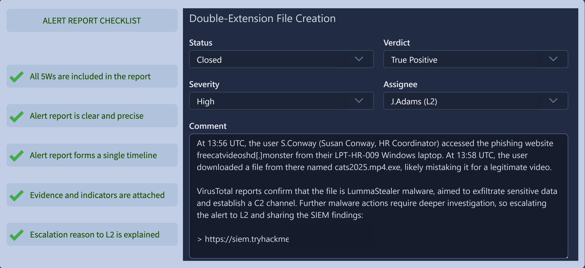
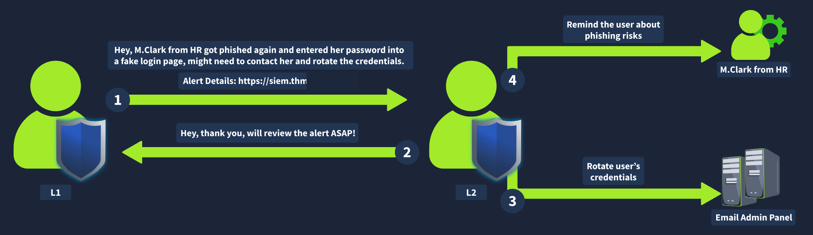
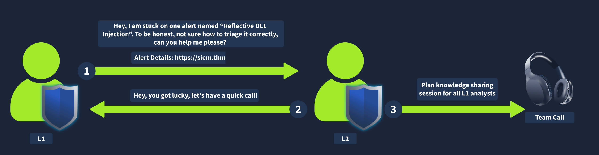
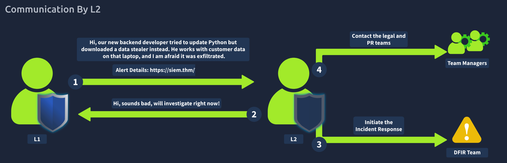
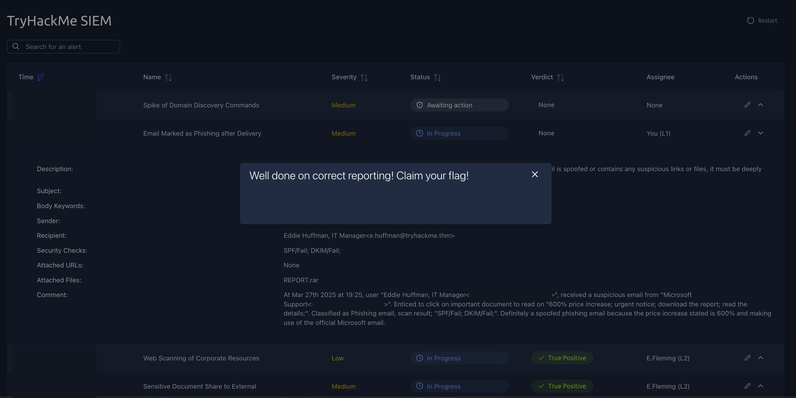
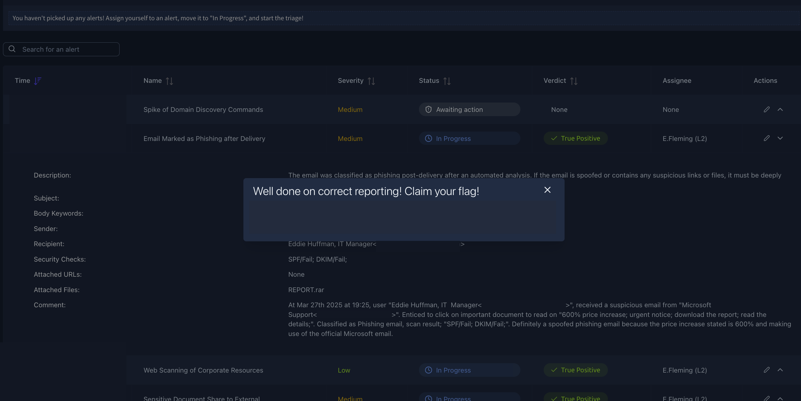
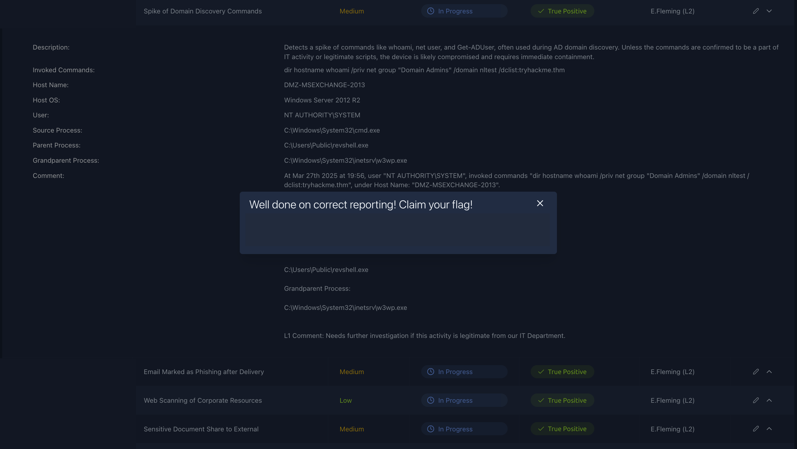

# SOC L1 Alert Reporting

---
Systems underpin the digital infrastructure, encompassing physical servers, virtual machines, and cloud services like 
Microsoft 365, where sensitive data resides—bank details, emails, or operational controls. Breaching a system amplifies impact 
compared to individual accounts; a mail server compromise exposes thousands of mailboxes for theft or extortion, an admin 
endpoint unlocks broader network access, an industrial server enables ransomware lockdown, and a web management panel permits 
defacement or persistent footholds.

Intrusions often initiate through user behaviors—inserting malicious USBs, downloading tainted software, or reusing weak 
credentials—with stolen passwords factoring into a majority of breaches. Vulnerabilities in software provide direct paths; 
tens of thousands of CVEs surface yearly, hundreds exploited in campaigns, including zero-days persisting until patches emerge. 
Supply chain attacks inject malice into trusted components, compromising downstream users en masse, as evidenced in notable 
breaches and even TryHackMe's encounter with a vulnerable animation library.

Misconfigurations, unlike inherent flaws, stem from setup errors—default credentials unchanged, exposed cloud buckets, or 
insecure IoT devices conscripted into botnets. Response to vulnerabilities involves awaiting vendor patches while applying 
stopgaps like IP restrictions, vendor workarounds, or IPS/WAF filters. Misconfigurations demand reconfiguration, supported by 
audits, scans, and testing.

Mitigation requires rigorous practices. Patch management ensures timely updates. IT education minimizes risky setups. Network 
controls limit exposure to trusted sources. Endpoint protection detects and halts threats.

SOC analysts rarely configure systems directly but must grasp these vectors to detect anomalies, inform remediation, and 
propose enhancements that bolster resilience. Resources like The DFIR Report at https://www.thedfirreport.com detail intrusion
patterns, CISA's Known Exploited Vulnerabilities Catalog at https://www.cisa.gov/known-exploited-vulnerabilities-catalog 
prioritizes urgent fixes, BleepingComputer at https://www.bleepingcomputer.com covers supply chain developments, and 
Check Point's Threat Map at https://threatmap.checkpoint.com visualizes global activity.

---

### Key Takeaways: SOC 1 Alert 
- Apply patch management to track and deploy updates reducing exploitation risk
- Educate IT on configuration risks to prevent preventable exposures
- Restrict network access to trusted IPs and users hardening external surfaces
- Install antivirus or EDR on endpoints to block and detect malicious execution
- Perform penetration testing to simulate attacks identifying weaknesses
- Run vulnerability scans detecting outdated software or weak credentials
- Conduct configuration audits matching against benchmarks like CIS standards

---

## Alert Reporting 

Alert reporting serves as a critical bridge between initial triage and deeper investigation or remediation, particularly 
when uncertainty lingers or escalation becomes necessary. Level 1 analysts often encounter alerts requiring senior input, 
system owner clarification, or coordination across teams, making structured documentation essential before closure or handoff. 
Effective reports preserve investigative context indefinitely—far beyond the typical 3-12 month retention of raw logs—while 
sharpening analytical clarity through the discipline of summarization.

The Five Ws framework structures concise yet comprehensive reporting, ensuring recipients such as Level 2 analysts, DFIR 
specialists, or IT staff grasp the incident without reconstructing the work. Who identifies the affected entity—user account, 
process owner, or endpoint. What details the precise action or sequence triggering the alert, from authentication attempts 
to command execution. When captures the temporal scope, including start and end timestamps of suspicious activity. Where 
specifies the source or location—hostname, IP address, device, or external domain. Why articulates the analyst’s verdict 
reasoning, linking observed indicators to threat context and justifying true positive or false positive classification.

This approach proves particularly valuable during escalation. True positives demanding further action—malware containment, 
host isolation, credential reset, or external coordination—transfer seamlessly when supported by a thorough report. Level 2 
then builds directly on the L1 foundation rather than starting from scratch. Communication extends beyond internal escalation; 
contacting affected users via secure channels (never compromised platforms), consulting HR on personnel anomalies, or 
notifying IT on configuration issues maintains operational integrity.

In high-pressure scenarios—unresponsive seniors, alert floods, or post-closure realizations of potential 
misclassification—procedures dictate immediate outreach to backups, alternative verification methods, queue prioritization 
updates, or engineer notification for parsing issues. The SOC dashboard simulation reinforces these mechanics; accurate 
reporting, verdict assignment, and status updates yield progress, while inconsistencies block flags.

I find the Five Ws consistently useful in real environments—its simplicity forces precision and reduces miscommunication 
when handing off time-sensitive incidents.

---

### Key Takeaways: Alert Reporting 
- Document alerts with the Five Ws framework: Who (affected entity), What (action/sequence), When (timeframe), Where
  (location/source), Why (verdict reasoning)
- Use detailed reports for true positives requiring escalation to preserve context and accelerate Level 2 analysis
- Escalate alerts indicating major attacks, needing remediation, external coordination, or when clarification from seniors is
  required
- Reassign to on-shift Level 2 with notification via chat or in-person, ensuring the report accompanies the handoff
- Communicate securely—avoid compromised channels for user validation, prioritize critical alerts during floods, and report
  parsing or tool issues immediately
- Maintain indefinite alert records through thorough comments, supplementing limited raw log retention

---

## Communication 

Communication during alert handling often proves as critical as the technical analysis itself, particularly when urgency 
demands rapid escalation or coordination beyond the immediate SOC team. In cases of critical alerts requiring senior review 
but the on-shift Level 2 analyst remains unresponsive after thirty minutes, procedures call for escalating through emergency 
contacts—first attempting to reach Level 2 directly by phone, then Level 3 if needed, and finally the SOC manager to avoid 
delays in containment.

When an alert indicates potential compromise of internal collaboration tools such as Slack or Teams, validation with the 
affected user must occur through secure, out-of-band channels—never via the suspected platform itself. Phone calls or 
alternative verified methods prevent adversary interception and ensure accurate confirmation of legitimate activity.

During sudden alert surges where critical items appear alongside routine volume, maintain standard prioritization—severity 
first, then age—while promptly notifying the on-shift Level 2 of the increased load to enable resource adjustment or workload 
redistribution.

Should a misclassification become apparent days later—perhaps through new context or pattern recognition—immediate outreach 
to Level 2 remains mandatory. Silent persistence by adversaries means early false closures can allow dwell time of weeks 
before impact, making prompt correction essential regardless of elapsed time.

When SIEM parsing fails or logs prove unsearchable, preventing full triage, do not bypass the alert. Investigate available 
elements and escalate the tooling issue to Level 2 or the SOC engineer without delay, preserving chain of custody and visibility.

These scenarios underscore the necessity of predefined crisis communication protocols—emergency contact lists, out-of-band 
verification standards, and clear escalation ladders—that keep response momentum intact under pressure.

---

### Key Takeaways: Communication
- Escalate unresponsive Level 2 on critical alerts by calling L2, then L3, then manager using emergency contacts
- Validate suspected collaboration tool compromises via phone or secure alternative channels only
- Notify Level 2 immediately during alert floods while continuing severity-based prioritization
- Report suspected misclassifications to Level 2 without delay to mitigate potential adversary persistence
- Escalate unparseable SIEM logs or search failures to Level 2 or SOC engineer rather than skipping triage

---

### Gallery 

  <table>
    <tr>
      <td>
      <td></td>
    </tr>
    <tr>
      <td align="center"><strong>Figure 1a:</strong> Alert Funnel</td>
      <td align="center"><strong>Figure 1b:</strong> Report Format</td>
    </tr>
    <tr>
      <td>
      <td></td>
    </tr>
     <tr>
      <td align="center"><strong>Figure 2a:</strong> Escalation Guide</td>
      <td align="center"><strong>Figure 2b:</strong> Requesting L2 Support</td>
    </tr>
  </table>

  <table>
    <tr>
      <td>
      <td></td>
    </tr>
    <tr>
      <td align="center"><strong>Figure 3a:</strong> Communication By L2</td>
      <td align="center"><strong>Figure 3b:</strong> My Reporting 1</td>
    </tr>
    <tr>
      <td>
      <td></td>
    </tr>
     <tr>
      <td align="center"><strong>Figure 4a:</strong> My Report 1 Escalation To L2</td>
      <td align="center"><strong>Figure 4b:</strong> My Report 2 Escalation To L2</td>
    </tr>
  </table>

---
