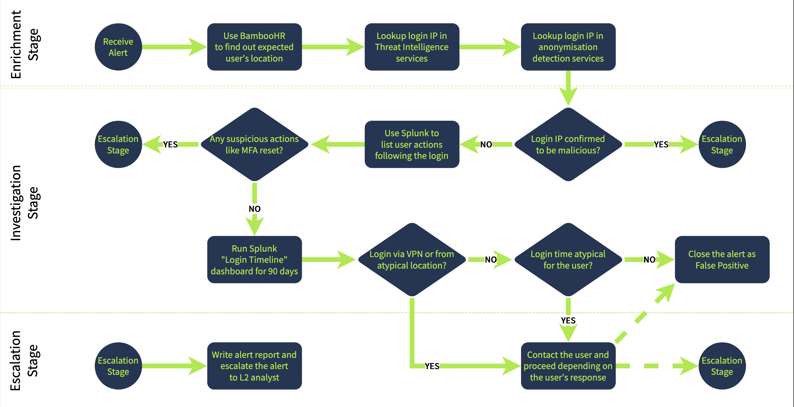
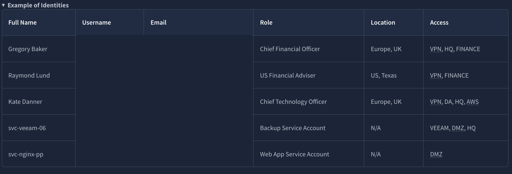
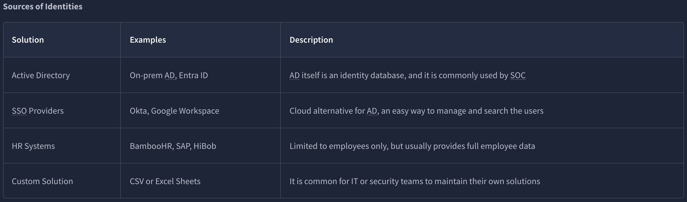
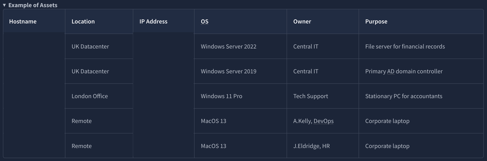
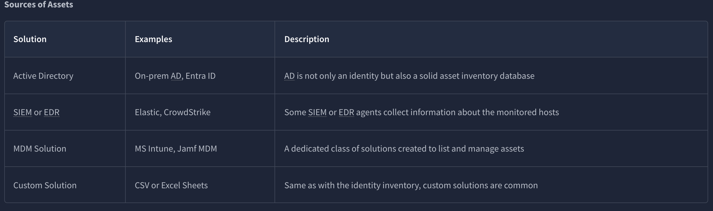
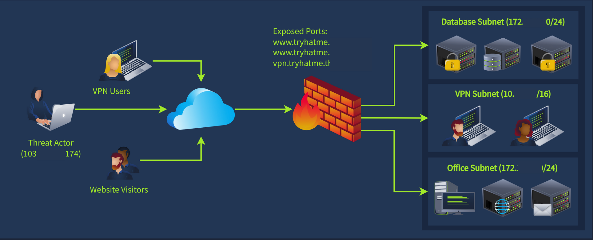
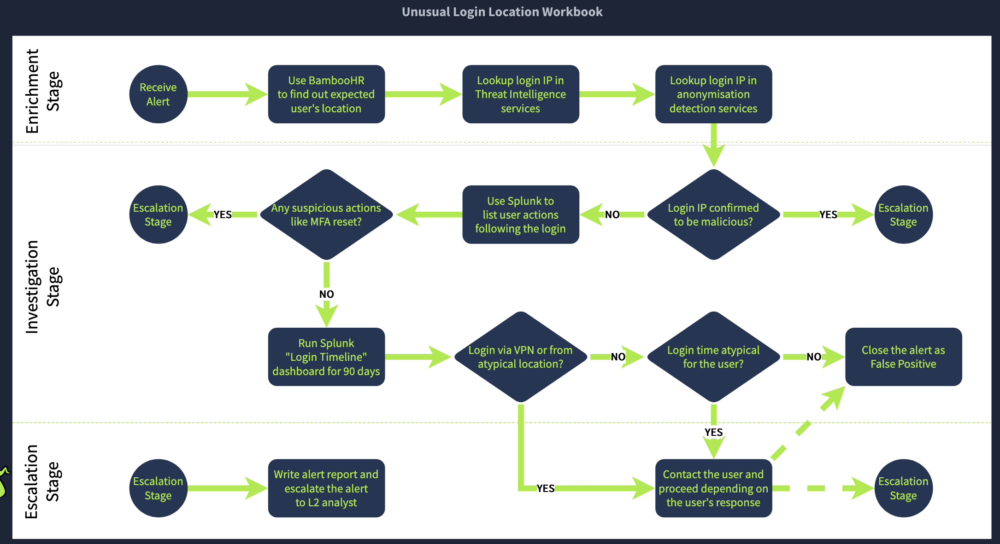

# SOC Workbooks and Lookups

---
Asset inventories catalog organizational endpoints and servers, detailing purpose, location, and access rights, while identity 
inventories list user and service accounts with attributes like roles, privileges, and contact details. These resources prove 
indispensable during triage, providing rapid context—such as whether a financial server's access by an HR employee aligns with 
normal operations or signals compromise.

Network diagrams map subnets, locations, and interconnections, clarifying anomalous traffic patterns. In scenarios involving 
repeated connections to non-standard ports followed by internal scans, diagrams reveal if activity stems from legitimate VPN 
allocations or post-brute-force discovery, with firewall rules blocking certain pivots while allowing others.

Workbooks standardize triage through structured steps, ensuring junior analysts cover essential actions without oversight. 
Seniors craft them for common vectors, dividing into phases: enrichment gathers threat intelligence and asset/identity data, 
investigation correlates SIEM logs to determine legitimacy, escalation routes confirmed threats to seniors or initiates user 
verification.

I've found dividing investigations into these modular blocks streamlines complex alerts, reducing variability and aiding quick 
verdicts.

---

### Key Takeaways
- Enrichment: Gather threat intelligence and identity/asset details for user and system context
- Investigation: Correlate gathered data with SIEM logs to assess if activity is expected
- Escalation: Forward to Level 2 or contact user for verification if required

---

### Gallery 

  <table>
    <tr>
      <td>
      <td></td>
    </tr>
    <tr>
      <td align="center"><strong>Figure 1a:</strong> Unusual Login Location Workbook</td>
      <td align="center"><strong>Figure 1b:</strong> Example Of Identities</td>
    </tr>
    <tr>
      <td>
      <td></td>
    </tr>
     <tr>
      <td align="center"><strong>Figure 2a:</strong> Source Of Identities</td>
      <td align="center"><strong>Figure 2b:</strong> Example Of Assets</td>
    </tr>
  </table>

  <table>
    <tr>
      <td>
      <td></td>
    </tr>
    <tr>
      <td align="center"><strong>Figure 3a:</strong> Source Of Assets</td>
      <td align="center"><strong>Figure 3b:</strong> A Network Diagram</td>
    </tr>
    <tr>
      <td>
    </tr>
     <tr>
      <td align="center"><strong>Figure 4a:</strong> Unusual Login Location Workbook 2</td>
    </tr>
  </table>

---

