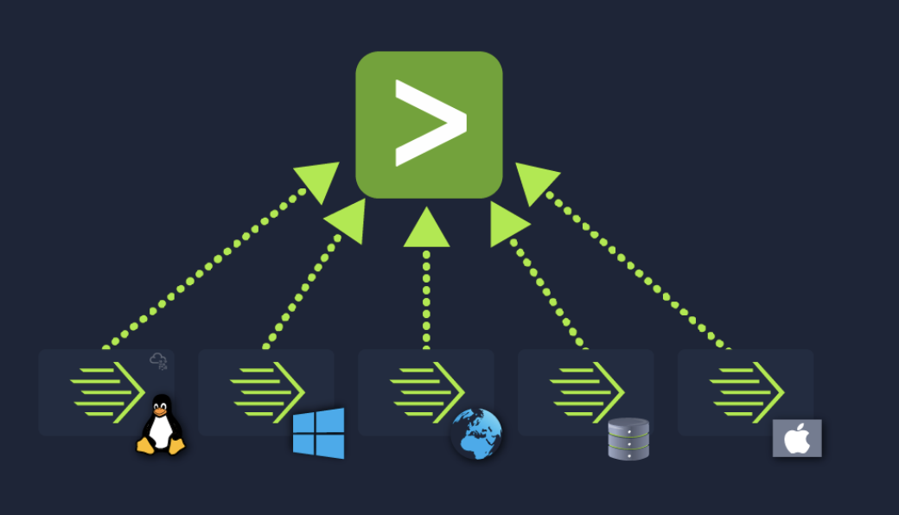
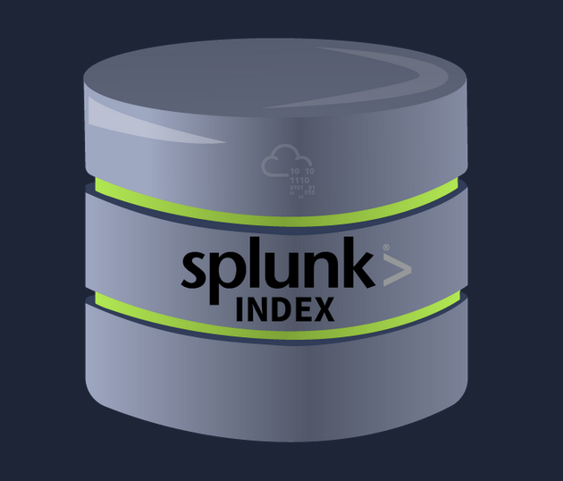
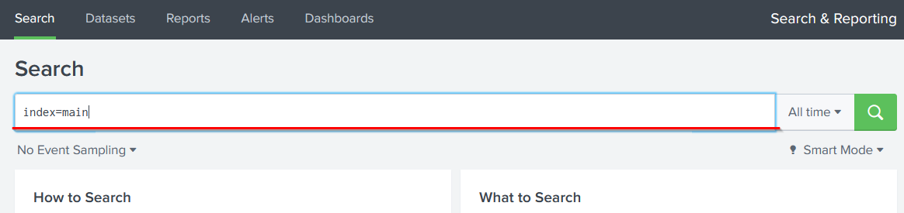
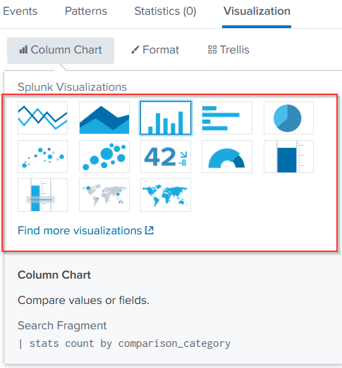
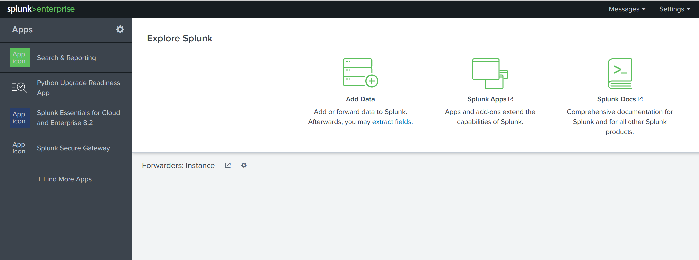
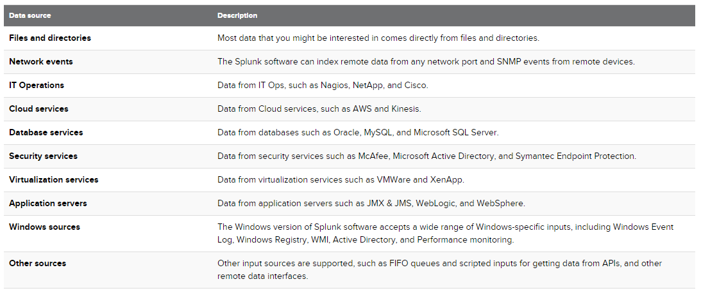
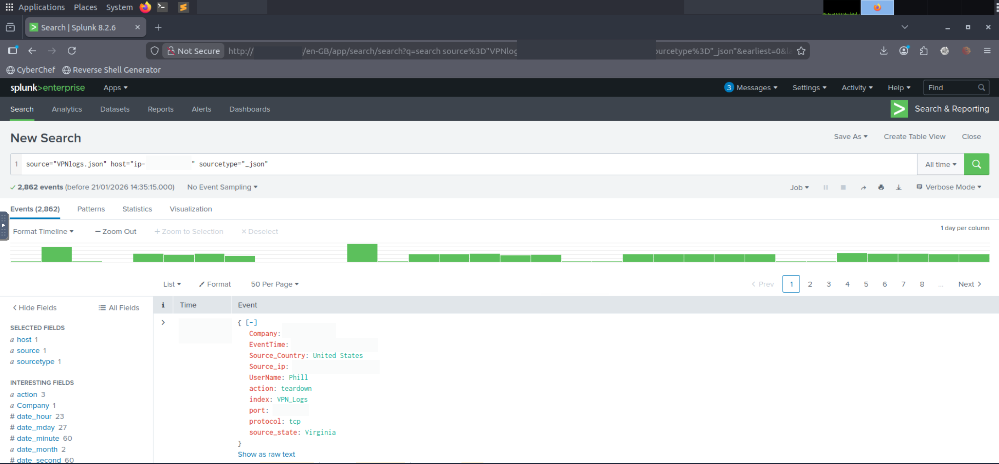
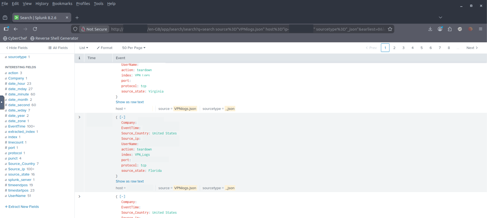

# Splunk: The Basics

---

  

Splunk stands as a prominent Security Information and Event Management (SIEM) solution for real-time log collection, analysis, 
and correlation, aiding network activity visibility and threat detection acceleration. Architecture comprises forwarders—lightweight 
agents on monitored endpoints gathering data from web servers, Windows event logs, PowerShell, Sysmon, Linux hosts, databases—forwarding 
to indexers. Indexers parse and normalize into field-value pairs, categorizing and storing events for efficient retrieval. Search heads, 
via the Search & Reporting app, facilitate querying with Search Processing Language (SPL), returning field-value pairs transformable 
into tables or visualizations like pie, bar, or column charts.

Interface opens to a home screen with the Splunk Bar providing messages, settings, activity, help, find, and app switching. Apps panel 
displays installed applications, defaulting to Search & Reporting. Explore Splunk offers shortcuts for data addition, new apps, and 
documentation. Home dashboard permits selection from defaults or customs, with a Yours tab for user-created ones.

Data ingestion categorizes sources per Splunk documentation. Upload process requires selecting source, type (e.g., JSON, syslog), 
input settings for index and hostname, review, and completion. VPN logs demonstrate this, available for download and upload.
The component separation keeps endpoint overhead low while concentrating processing power centrally.

---

### Key Takeaways
- Deploy forwarders on endpoints to capture logs from web servers, Windows events, PowerShell, Sysmon, Linux hosts, databases
- Process with indexer parsing, normalizing to field-value pairs, categorizing, storing events
- Query through search head using SPL, generating tables or charts from results
- Use Splunk Bar for messages, settings, activity, help, find, app switching
- Access Apps panel listing installed apps, default Search & Reporting
- Leverage Explore Splunk shortcuts for data addition, new apps, documentation
- Configure home dashboard selecting defaults or customs, Yours tab for personal
- Ingest via upload selecting source, type, input settings (index, hostname), review, complete
- Categorize data sources following Splunk documentation organization
- [Splunk Navigation](https://docs.splunk.com/Documentation/Splunk/8.1.2/SearchTutorial/NavigatingSplunk)

---

### Gallery 

  <table>
    <tr>
      <td>
      <td></td>
    </tr>
    <tr>
      <td align="center"><strong>Figure 1a:</strong> Splunk</td>
      <td align="center"><strong>Figure 1b:</strong> Splunk - 3 Main Components</td>
    </tr>
    <tr>
      <td>
      <td></td>
    </tr>
     <tr>
      <td align="center"><strong>Figure 2a:</strong> Splunk Forwarder</td>
      <td align="center"><strong>Figure 2b:</strong> Splunk Indexer</td>
    </tr>
  </table>

  <table>
    <tr>
      <td>
      <td></td>
    </tr>
    <tr>
      <td align="center"><strong>Figure 3a:</strong> Splunk Search Head</td>
      <td align="center"><strong>Figure 3b:</strong> Splunk Search Head Visualization</td>
    </tr>
    <tr>
      <td>
      <td></td>
    </tr>
     <tr>
      <td align="center"><strong>Figure 4a:</strong> Splunk Home Screen</td>
      <td align="center"><strong>Figure 4b:</strong> Splunk Data Sources</td>
    </tr>
  </table>

  <table>
    <tr>
      <td>
      <td></td>
    </tr>
    <tr>
      <td align="center"><strong>Figure 5a:</strong> Splunk Search 1</td>
      <td align="center"><strong>Figure 5b:</strong> Splunk Search 2</td>
    </tr>
  </table>

---
