# SQL Fundamentals

---

  

In my latest dive into database basics through the TryHackMe platform, I explored foundational concepts starting with the role of data 
in cybersecurity. Data represents raw facts like numbers or text that gain value when organized, and databases serve as structured 
repositories for storing, managing, and retrieving this information efficiently. I noted how relational databases organize data into 
tables with fixed schemas, using rows for records and columns for attributes, while non-relational ones handle unstructured or varying 
data formats more flexibly. Primary keys uniquely identify each record, foreign keys link tables, and schemas outline the overall 
structure. SQL emerged as the standard language for interacting with these systems, enabling precise queries and manipulations.

Shifting to practical elements, I worked through creating and managing databases. Starting a new one involves a simple command to 
establish it, followed by selecting it for use and verifying existing ones. Tables get defined with specifics like data types and 
constraints, then inspected for structure. Inserting data populates these tables, reading pulls specific or all records, updating 
modifies existing entries based on conditions, and deleting removes them entirely. Clauses refine queries, such as filtering results, 
sorting them, limiting output, grouping aggregates, or applying conditions to groups. Operators compare values, combine conditions 
logically, match patterns, check inclusions, or range boundaries. Functions perform calculations like counts or averages, manipulate 
strings through concatenation or case changes, and handle dates with current timestamps or formatting.

This session reinforced how these building blocks form the backbone of data handling in security contexts, where mishandling can lead 
to vulnerabilities. I found the progression from theory to hands-on queries particularly effective for grasping how small syntax 
variations yield powerful control over data sets.

---

| Description | Code/Command |
|-------------|--------------|
| Create a new database | CREATE DATABASE thm_books; |
| Select a database for use | USE thm_books; |
| List all databases | SHOW DATABASES; |
| Create a table with columns and constraints | CREATE TABLE books (id INT AUTO_INCREMENT PRIMARY KEY, title VARCHAR(255) NOT NULL, author VARCHAR(255) NOT NULL, genre VARCHAR(100), year_published YEAR); |
| List all tables in the current database | SHOW TABLES; |
| Describe the structure of a table | DESCRIBE books; |
| Insert a new record into a table | INSERT INTO books (title, author, genre, year_published) VALUES ('The Great Gatsby', 'F. Scott Fitzgerald', 'Fiction', 1925); |
| Retrieve all records from a table | SELECT * FROM books; |
| Retrieve specific columns from a table | SELECT title, author FROM books; |
| Update a record based on a condition | UPDATE books SET year_published = 1926 WHERE id = 1; |
| Delete a record based on a condition | DELETE FROM books WHERE id = 1; |
| Filter records with a condition | SELECT * FROM books WHERE genre = 'Fiction'; |
| Sort records in descending order | SELECT * FROM books ORDER BY year_published DESC; |
| Limit the number of results | SELECT * FROM books LIMIT 5; |
| Group records and count them | SELECT genre, COUNT(*) FROM books GROUP BY genre; |
| Apply condition to grouped results | SELECT genre, COUNT(*) FROM books GROUP BY genre HAVING COUNT(*) > 1; |
| Use equality operator | SELECT * FROM books WHERE year_published = 1925; |
| Use inequality operator | SELECT * FROM books WHERE year_published != 1925; |
| Use greater than operator | SELECT * FROM books WHERE year_published > 2000; |
| Use less than or equal operator | SELECT * FROM books WHERE year_published <= 2000; |
| Combine conditions with AND | SELECT * FROM books WHERE genre = 'Fiction' AND year_published > 1900; |
| Combine conditions with OR | SELECT * FROM books WHERE genre = 'Fiction' OR genre = 'Non-Fiction'; |
| Negate a condition | SELECT * FROM books WHERE NOT genre = 'Fiction'; |
| Pattern matching with LIKE | SELECT * FROM books WHERE title LIKE '%Great%'; |
| Check values in a list | SELECT * FROM books WHERE genre IN ('Fiction', 'Mystery'); |
| Check values in a range | SELECT * FROM books WHERE year_published BETWEEN 1900 AND 2000; |
| Count all records | SELECT COUNT(*) FROM books; |
| Sum values in a column | SELECT SUM(year_published) FROM books; |
| Average value in a column | SELECT AVG(year_published) FROM books; |
| Minimum value in a column | SELECT MIN(year_published) FROM books; |
| Maximum value in a column | SELECT MAX(year_published) FROM books; |
| Concatenate strings | SELECT CONCAT(title, ' by ', author) FROM books; |
| Convert to uppercase | SELECT UPPER(title) FROM books; |
| Convert to lowercase | SELECT LOWER(title) FROM books; |
| Get current date and time | SELECT NOW(); |
| Format a date | SELECT DATE_FORMAT(NOW(), '%Y-%m-%d'); |
| Drop a table | DROP TABLE books; |
| Drop a database | DROP DATABASE thm_books; |

---

### Key Takeaways
- Data consists of raw facts that become useful when structured and analyzed.
- Databases organize data for efficient storage and retrieval, essential in cybersecurity for managing large volumes securely.
- Relational databases use fixed schemas with tables, rows, and columns; non-relational suit varied data formats.
- Primary keys ensure record uniqueness; foreign keys connect related tables.
- Schemas define database organization, including tables and relationships.
- SQL is the language for querying and managing relational databases.
- To create a database: Issue the creation command, select it, and confirm via listing.
- To build a table: Specify columns, data types, and keys like primary.
- Inspect tables by listing them or describing their structure.
- CRUD covers creation via inserts, reading via selects, updates with conditions, and deletions.
- WHERE clause filters based on criteria.
- ORDER BY sorts results ascending or descending.
- LIMIT restricts output rows.
- GROUP BY aggregates data; HAVING filters groups.
- Comparison operators test equality, inequality, greater/less than.
- Logical operators AND/OR combine, NOT negates.
- LIKE matches patterns with wildcards.
- IN checks against value lists; BETWEEN for ranges.
- Aggregate functions: COUNT totals, SUM adds, AVG averages, MIN/MAX find extremes.
- String functions: CONCAT joins, UPPER/LOWER change case.
- Date functions: NOW gets current timestamp, DATE_FORMAT styles dates.
- Listing databases may reveal special ones like THM{<redacted>}.
- Official MySQL documentation for further reference: https://dev.mysql.com/doc/.
- SELECT GROUP_CONCAT(name SEPARATOR ' & ') FROM hacking_tools WHERE RIGHT(amount, 1) != '0';
  will return a concatenated list of names of tools where the amount does not end in 0.
- Other Clauses:
- DISTINCT → Removes duplicate rows  
- GROUP BY → Groups rows for aggregation  
- HAVING → Filters groups (after GROUP BY)  
- ORDER BY → Sorts the final result

---

### Gallery 

  <table>
    <tr>
      <td align="center">
      <td align="center">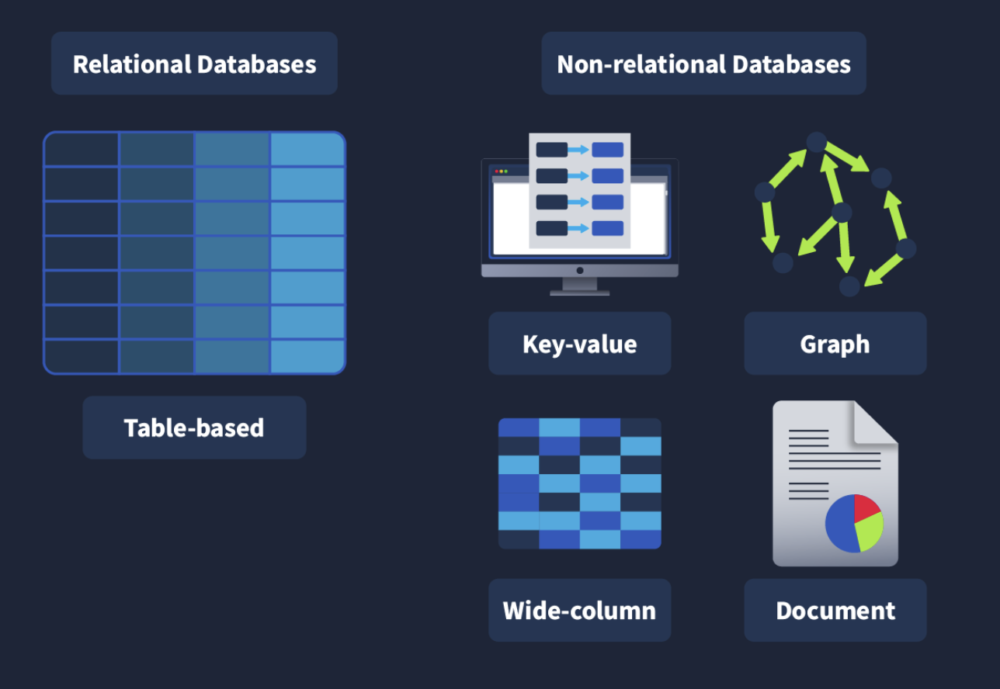</td>
    </tr>
    <tr>
      <td align="center"><strong>Figure 1a:</strong> MySQL</td>
      <td align="center"><strong>Figure 1b:</strong> Types Of Databases</td>
    </tr>
    <tr>
      <td align="center">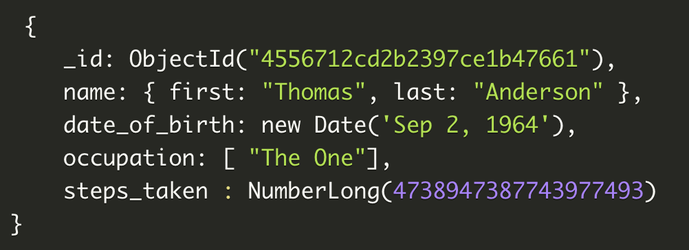
      <td align="center">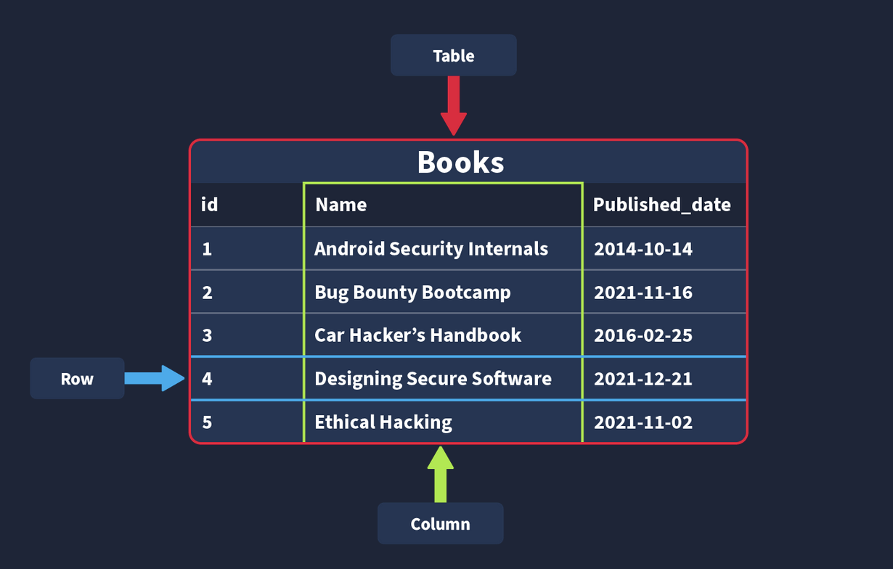</td>
    </tr>
     <tr>
      <td align="center"><strong>Figure 2a:</strong> Non-Relational Database</td>
      <td align="center"><strong>Figure 2b:</strong> Table, Row, Column</td>
    </tr>
  </table>

  <table>
    <tr>
      <td align="center">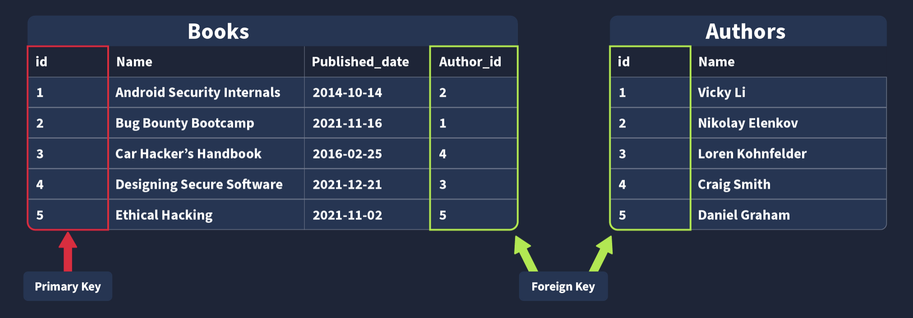
      <td align="center">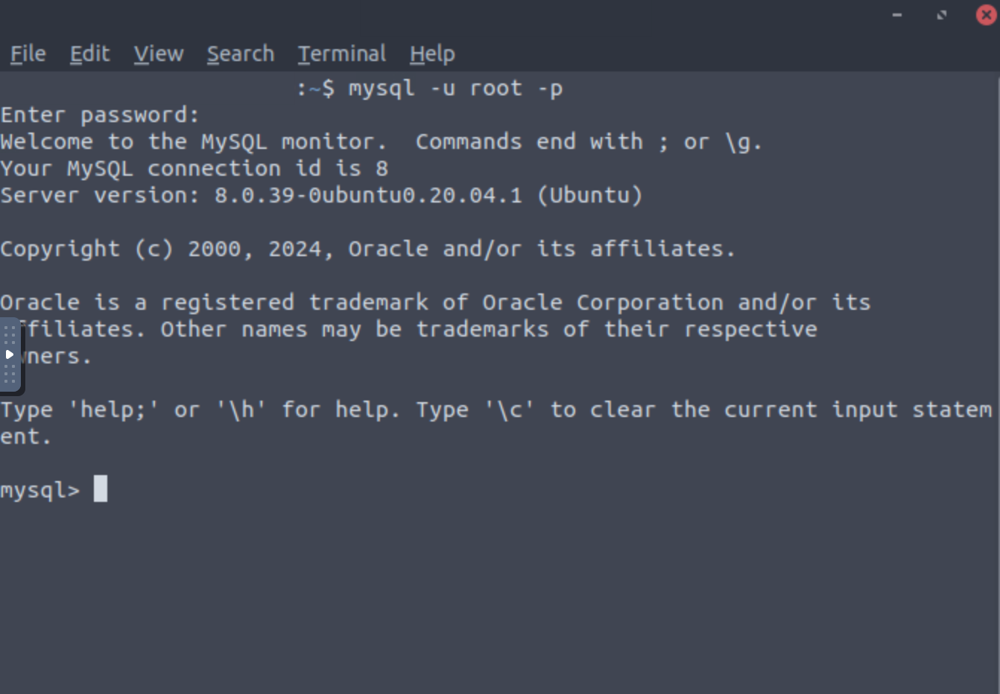</td>
    </tr>
    <tr>
      <td align="center"><strong>Figure 3a:</strong> Relational Database</td>
      <td align="center"><strong>Figure 3b:</strong> MySQL Terminal</td>
    </tr>
    <tr>
      <td align="center">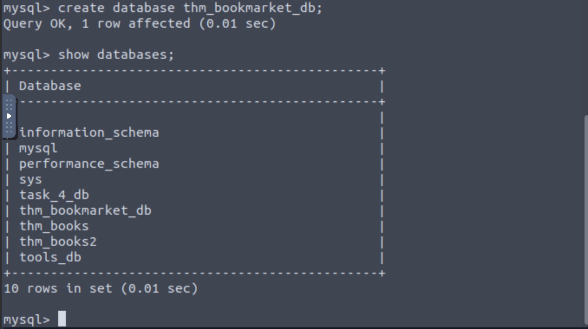
      <td align="center">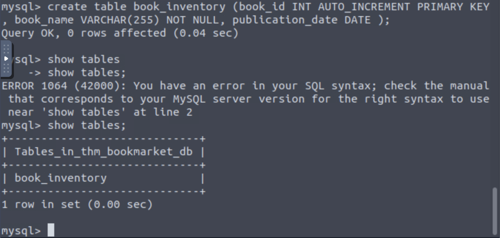</td>
    </tr>
     <tr>
      <td align="center"><strong>Figure 4a:</strong> Creating MySQL Database</td>
      <td align="center"><strong>Figure 4b:</strong> Created MySQL Table</td>
    </tr>
  </table>

  <table>
    <tr>
      <td align="center">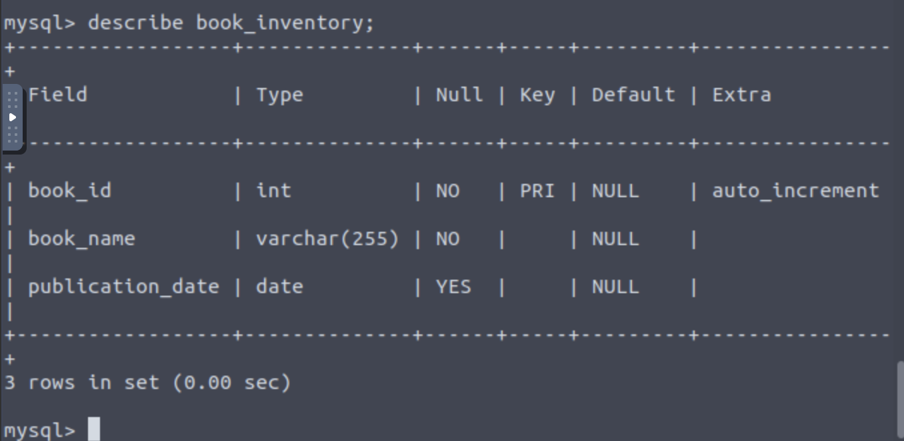
      <td align="center">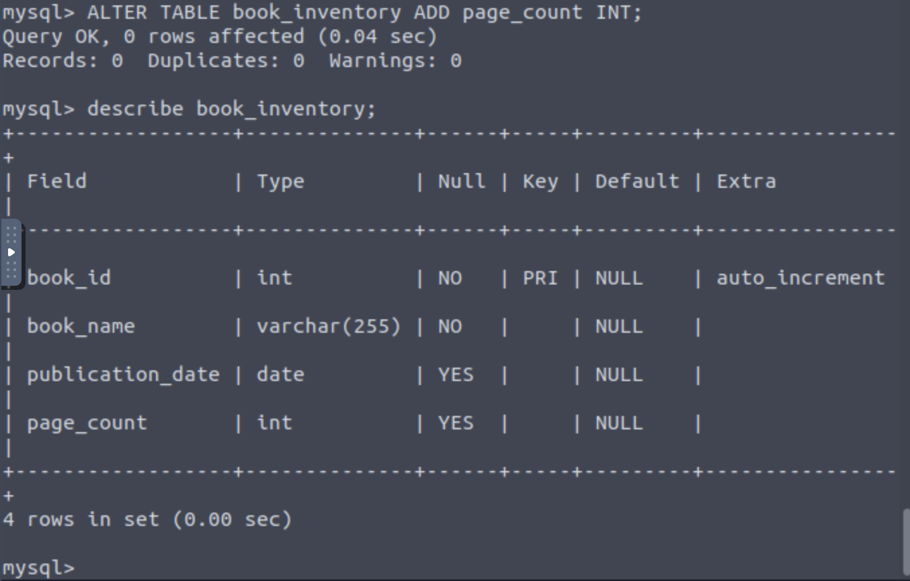</td>
    </tr>
    <tr>
      <td align="center"><strong>Figure 5a:</strong> Describe Book Inventory Table</td>
      <td align="center"><strong>Figure 5b:</strong> Altered Book Inventory Table</td>
    </tr>
    <tr>
      <td align="center">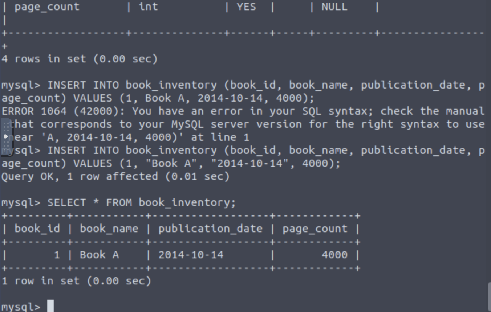
      <td align="center">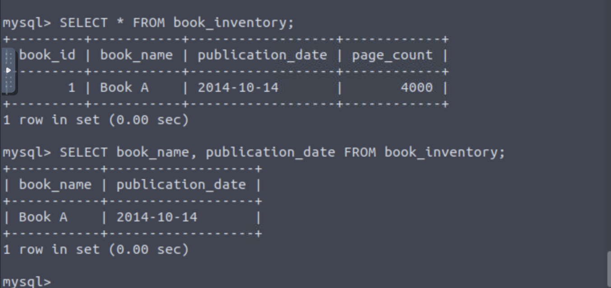</td>
    </tr>
     <tr>
      <td align="center"><strong>Figure 6a:</strong> Inserted And Viewed The Row</td>
      <td align="center"><strong>Figure 6b:</strong> Selected Two Columns From The Row</td>
    </tr>
  </table>

  <table>
    <tr>
      <td align="center">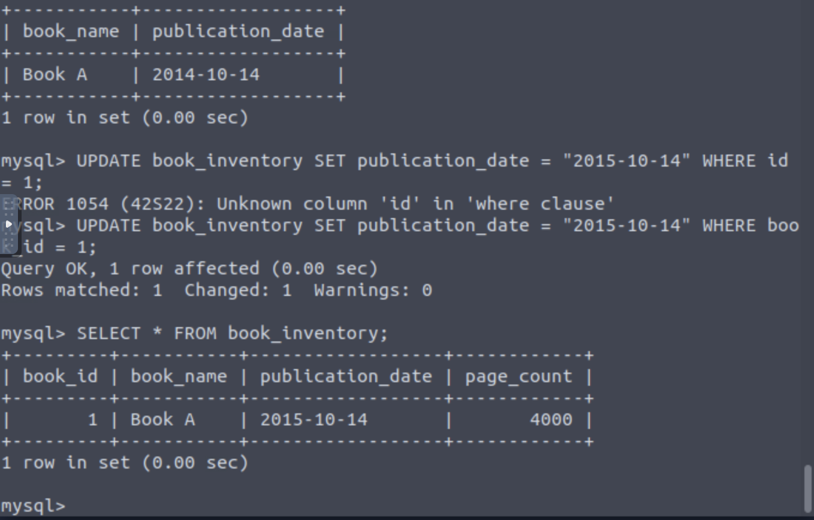
      <td align="center">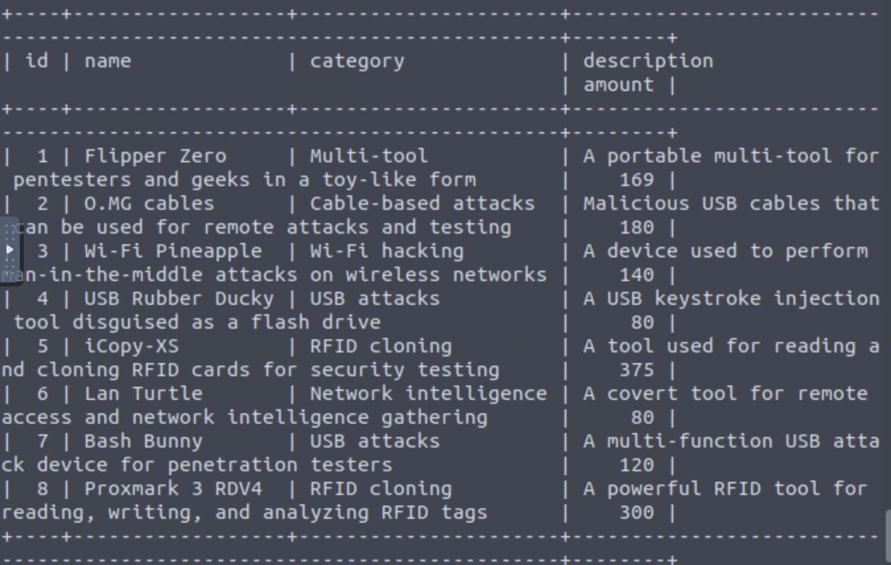</td>
    </tr>
    <tr>
      <td align="center"><strong>Figure 7a:</strong> Updated Data On A Row</td>
      <td align="center"><strong>Figure 7b:</strong> Select All From Table</td>
    </tr>
  </table>

---

