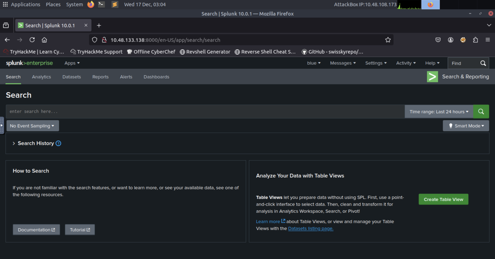
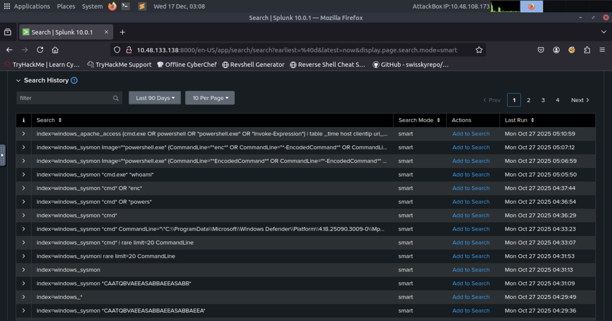
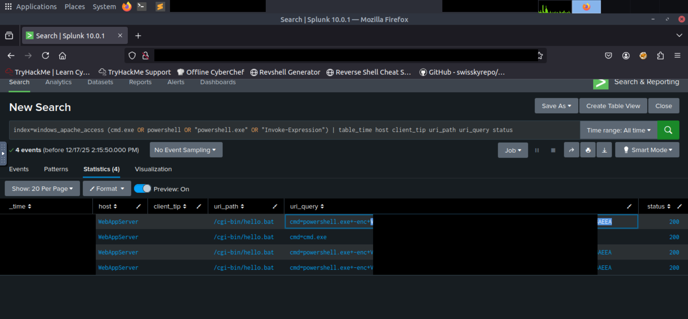
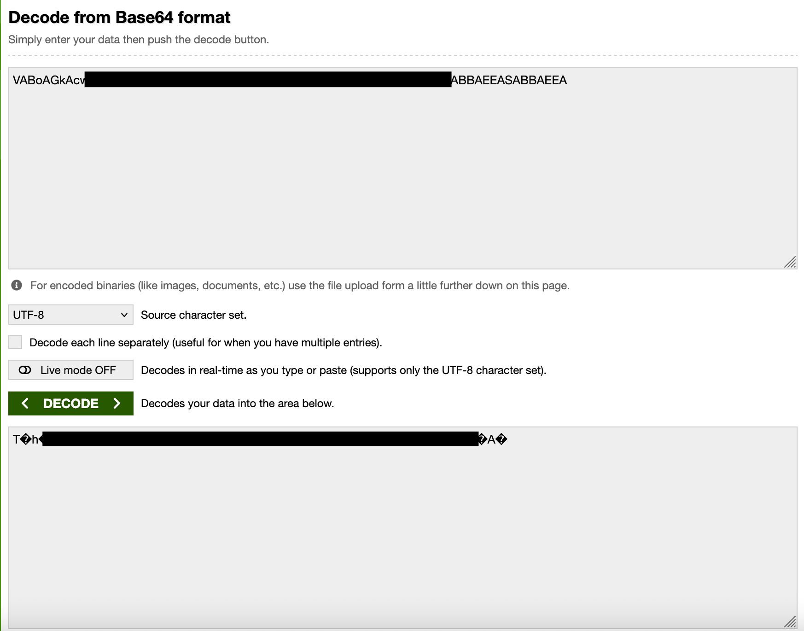
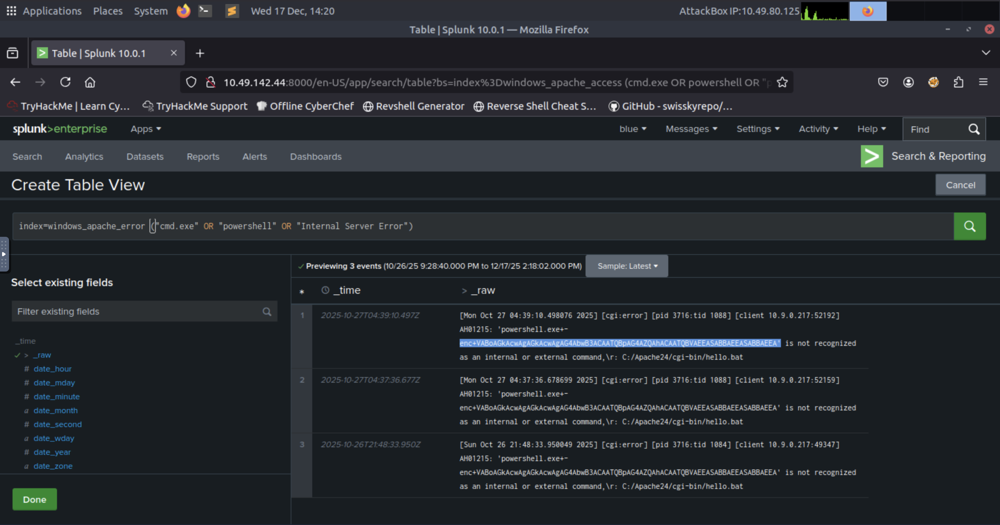
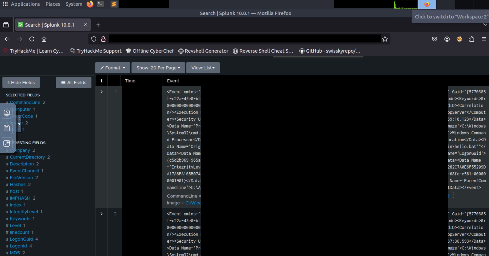
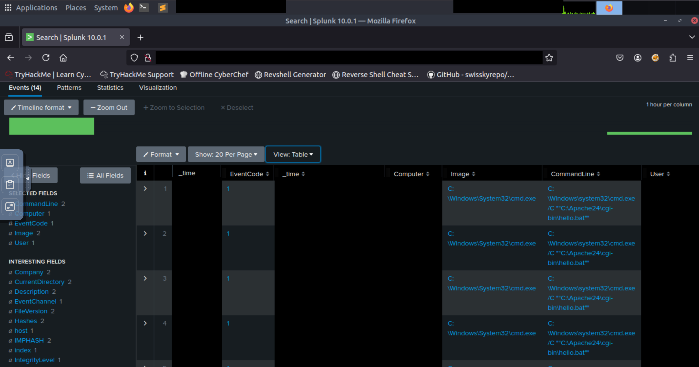
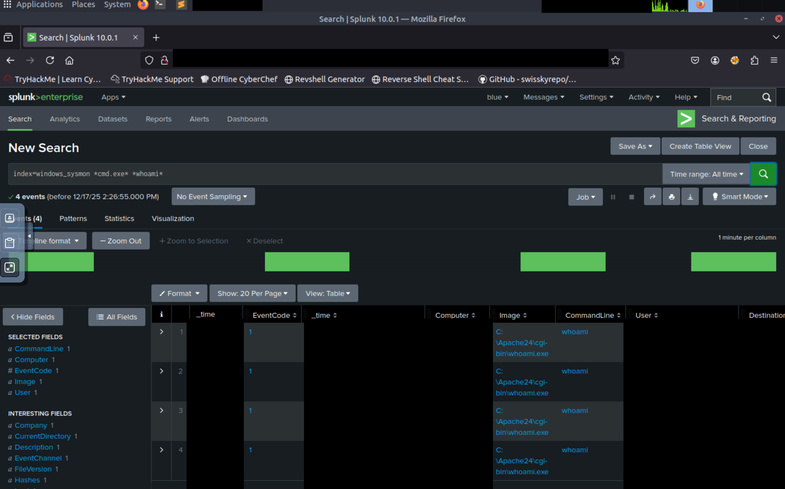
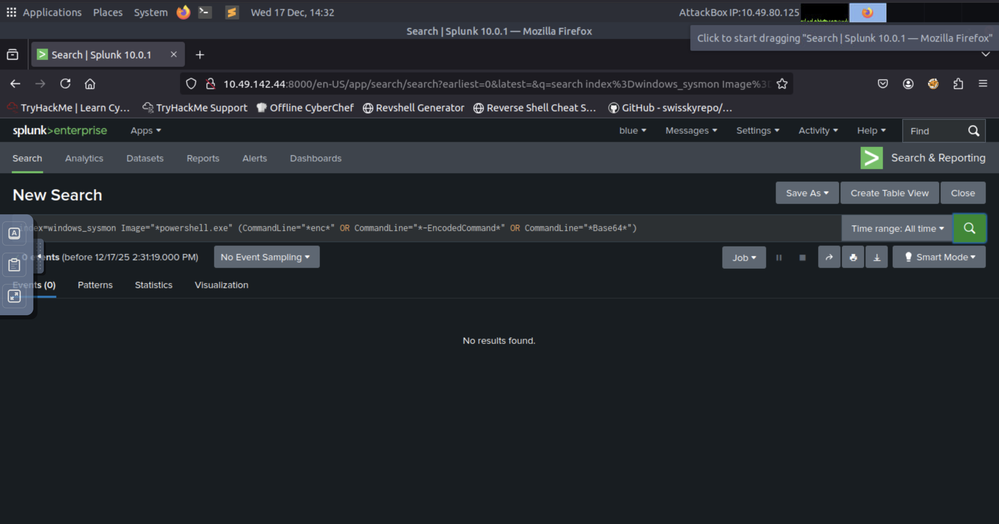

# Web Attack Forensics - Drone Alone

---
### Today, we are using Splunk

  <table>
    <tr>
      <td></td>
      <td></td>
    </tr>
    <tr>
      <td align="center"><strong>Figure 1a:</strong> Logged-in to Splunk</td>
      <td align="center"><strong>Figure 1b:</strong> Splunk search</td>
    </tr>
  </table>

Forensic investigation of web-based attacks requires a multi-layered approach to log analysis, specifically targeting the 
intersection of web server access, error logs, and endpoint process telemetry. When auditing environments for potential compromise, 
the initial phase involves inspecting web access logs for anomalous URI queries. Attackers frequently attempt command injection 
by passing system-level binaries or shell interpreters—such as `cmd.exe` or `powershell.exe`—through vulnerable scripts or CGI 
bin applications. Obfuscation is a common hurdle during this phase; identifying Base64-encoded strings within these queries is 
essential. Decoding these strings often reveals the attacker's true intent, ranging from simple reconnaissance to the execution 
of complex payloads.

Complementing access log analysis is the scrutiny of web server error logs. While a successful injection might return a standard 
HTTP 200 status, many attempts trigger an HTTP 500 Internal Server Error if the backend script fails to handle the injected syntax. 
Finding references to system shells within error logs strongly suggests that the server attempted to process malicious input 
but encountered an execution failure. This provides a clear indicator of exploitation attempts that may have bypassed initial 
web-layer filtering but were interrupted at the application layer.

Verification of successful exploitation requires correlating web events with endpoint process creation logs, such as those 
provided by Sysmon. A critical indicator of a compromised web server is the presence of an unexpected process hierarchy. Under 
normal operations, a web server process like `httpd.exe` should only spawn worker threads. If logs indicate that `httpd.exe` acted 
as the parent image for `cmd.exe` or `powershell.exe`, it confirms that a command injection vulnerability was successfully 
exploited to achieve code execution on the operating system. Post-exploitation behavior often follows a predictable pattern, 
beginning with enumeration commands like `whoami` to determine the privilege level of the hijacked process. Finally, monitoring 
for PowerShell execution using flags such as `-EncodedCommand` or `-enc` is vital, as this remains a primary method for fileless 
malware delivery and script execution while attempting to evade signature-based detection.

| Description | Code/Command |
| --- | --- |
| Search web access logs for command execution keywords | `index=windows_apache_access (cmd.exe OR powershell OR "powershell.exe" OR "Invoke-Expression") | table _time host clientip uri_path uri_query status` |
| Inspect Apache error logs for shells or internal errors | `index=windows_apache_error ("cmd.exe" OR "powershell" OR "Internal Server Error")` |
| Identify anomalous child processes spawned by Apache | `index=windows_sysmon ParentImage="*httpd.exe"` |
| Detect post-exploitation reconnaissance (enumeration) | `index=windows_sysmon *cmd.exe* *whoami*` |
| Search for obfuscated/encoded PowerShell payloads | `index=windows_sysmon Image="*powershell.exe" (CommandLine="*enc*" OR CommandLine="*-EncodedCommand*" OR CommandLine="*Base64*")` |

---

### Key Takeaways Monitor web access logs for system-level keywords and Base64-encoded strings within URI queries to identify 
potential injection vectors.
* Audit HTTP 500 error logs for shell references, as they often mark the boundary between a blocked attempt and a backend
  execution failure.
* Use process relationship analysis to flag instances where web server binaries (e.g., `httpd.exe`) spawn system interpreters,
  a high-fidelity indicator of a successful breach.
* Track post-exploitation enumeration activity, specifically the execution of `whoami`, to confirm attacker presence and situational
  awareness.
* Investigate PowerShell executions containing encoding flags (`-enc`, `-EncodedCommand`) to uncover hidden payloads and malicious
  intent.

---
### More on Splunk Forensics

  <table>
    <tr>
      <td>
      <td></td>
    </tr>
    <tr>
      <td align="center"><strong>Figure 2a:</strong> Extracting the hacker's command</td>
      <td align="center"><strong>Figure 2b:</strong> Decoded hacker's command</td>
    </tr>
    <tr>
      <td>
      <td></td>
    </tr>
     <tr>
      <td align="center"><strong>Figure 3a:</strong> Unrecognized server commands</td>
      <td align="center"><strong>Figure 3b:</strong> The system ran unusual processes</td>
    </tr>
        <tr>
      <td>
      <td></td>
    </tr>
     <tr>
      <td align="center"><strong>Figure 4a:</strong> The system ran unusual processes - table view</td>
      <td align="center"><strong>Figure 4b:</strong> Hacker used whoami command to determine user</td>
    </tr>
        <tr>
      <td>
    </tr>
     <tr>
      <td align="center"><strong>Figure 5a:</strong> The hacker command muahahaha was never ran</td>
    </tr>
    
  </table>

---
>[!Note]
>### You did it! Wareville is one step safer.
>The townsfolk are counting on you to keep Christmas secure.
>Head back to Wareville to continue your mission!

