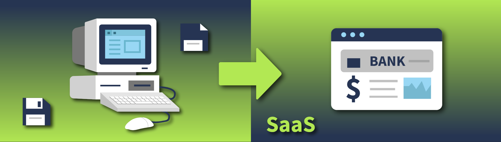
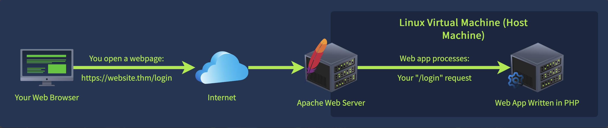
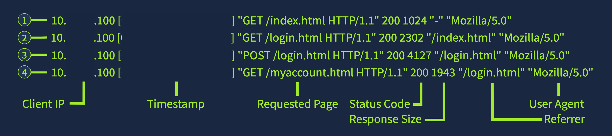
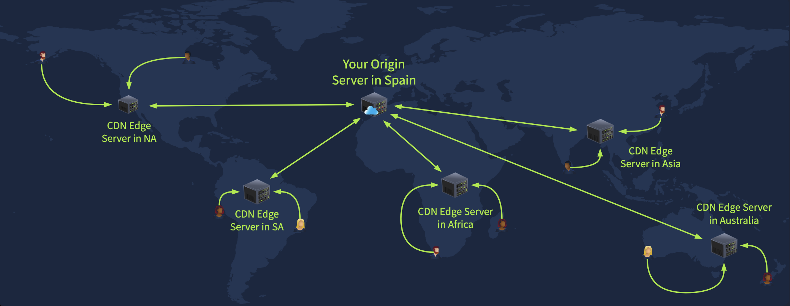
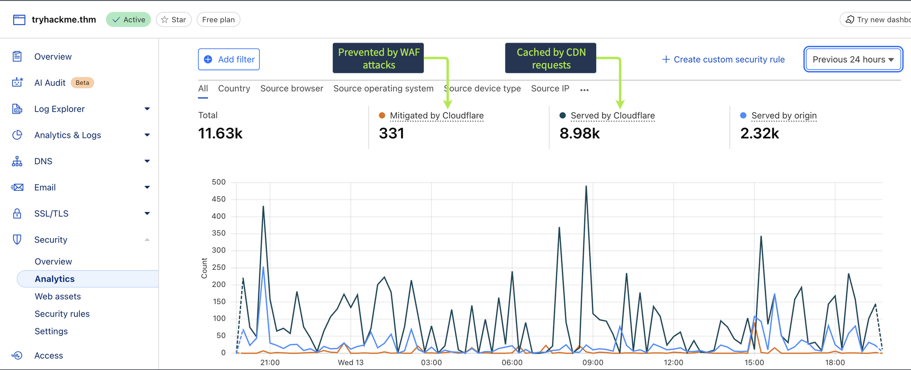
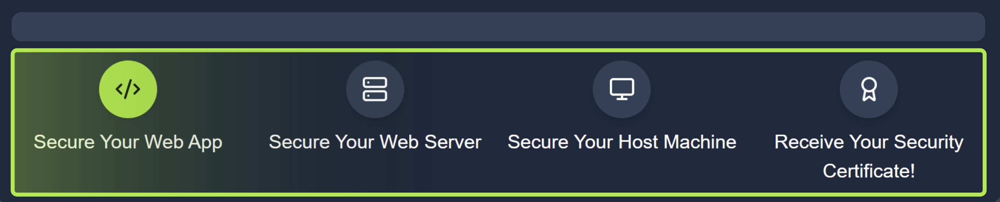
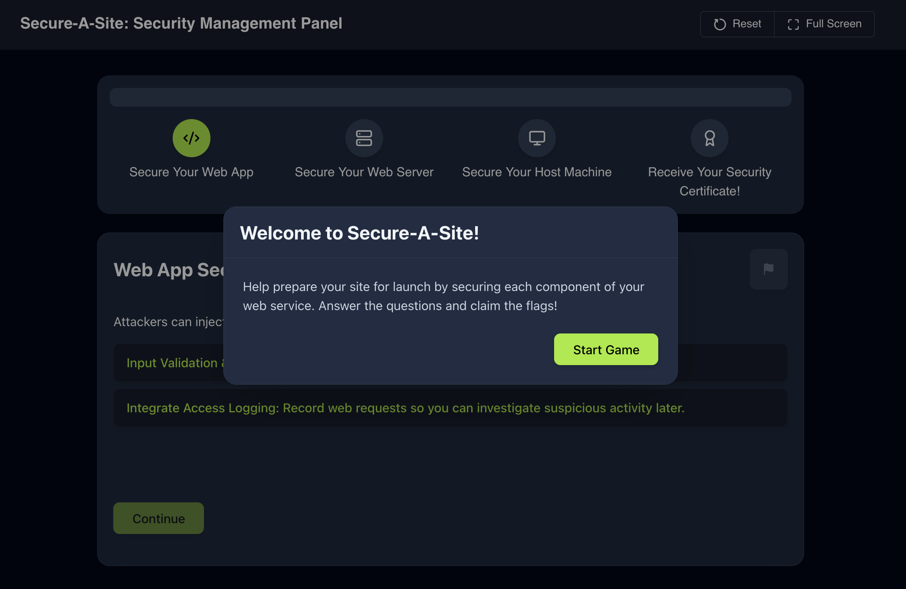
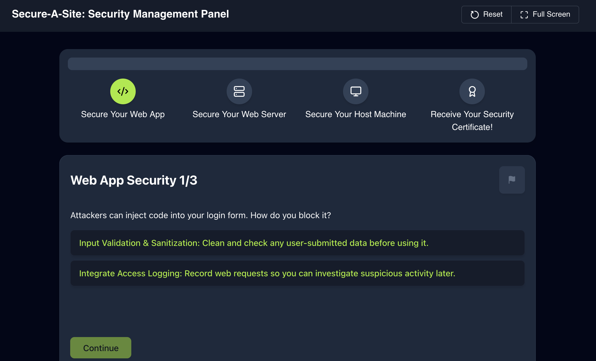
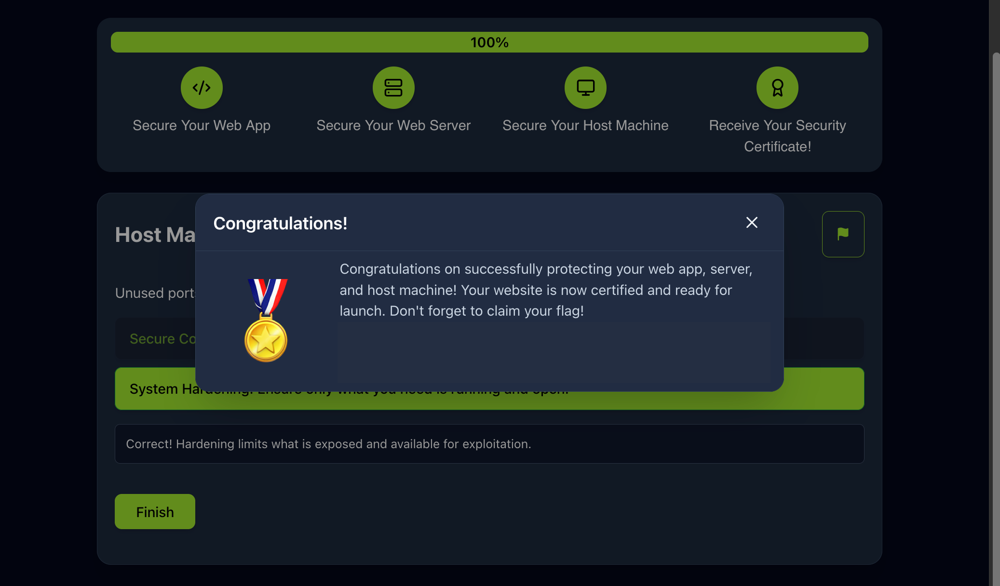

# Web Security Essentials

---

In my years digging into cybersecurity, I've seen how the web's evolution has reshaped everything from daily tasks to enterprise 
operations. The source material I reviewed today underscores the transition away from standalone desktop programs toward browser-based 
systems, a change driven by improvements in speed and connectivity since the 1990s. By the 2000s, dynamic apps for things like email 
and banking became standard, and the 2010s amplified this with cloud services and SaaS models. Now, virtually any activity—shopping, 
gaming, or even virtual machine management—happens in a browser, which I find streamlines workflows but opens up new vulnerabilities 
I need to track.

From a defensive standpoint, this shift boosts accessibility and update efficiency while cutting local resource demands, yet it 
heightens risks. Web apps are perpetually exposed, linking to sensitive backends like databases, making them prime for initial breaches 
in broader campaigns. Owners face constant uptime demands, global access threats, and the burden of patching evolving dangers while 
safeguarding user data. Users, meanwhile, risk data insecurity, account compromises from browser flaws, identity theft, financial hits, 
and lasting privacy erosion. I recall cases like the 2017 Equifax incident, where an Apache flaw let attackers hit internal databases 
affecting 150 million people, or the 2019 Capital One exposure via a faulty WAF that leaked over 100 million records by granting cloud 
access.

Breaking down web setup, a site's request-response loop involves browsers querying servers that process, authenticate, and reply with 
content. Attackers exploit this by flooding systems, evading controls, or injecting commands. Core elements include the app 
itself—handling visuals and logic—the server hosting it, and the underlying OS like Linux or Windows. Common servers I've encountered: 
Apache for basic sites like WordPress blogs, Nginx for demanding apps at places like Netflix, and IIS in Microsoft-heavy setups.

Securing these layers means tailored defenses. For apps, focus on clean code avoiding risky functions, robust error management, input 
checks to block injections, and role-based restrictions. Servers benefit from detailed request logging, WAFs to filter bad traffic, 
and CDNs to offload exposure. Hosts need minimal privileges for services, stripped-down configs closing extras, and AV for malware 
spotting. Across all, enforce solid auth and timely updates. Logging stands out to me—capturing IPs, times, paths, statuses, and agents 
helps reconstruct incidents, like tracing a user's homepage visit, login navigation, credential submission, and account access.

CDNs cache content on edge nodes for faster, safer delivery, masking origin IPs, soaking up DDoS volleys, mandating TLS, and often 
bundling WAFs—think Cloudflare, AWS CloudFront, or Azure Front Door. WAFs act as traffic inspectors, rejecting threats via signatures 
matching tools like sqlmap, heuristics spotting odd queries, anomaly detection on rapid logins, or IP blocks from risky regions. 
Types range from cloud proxies for ease, host-installed software for precision, to network appliances for big ops. AV, while 
endpoint-focused on signature matches, catches uploaded nasties like shells, complementing overall layering.

The practice angle involved hardening a site called Secure-A-Site across app, server, and host before launch, applying these 
principles to grab flags—reminds me how hands-on tweaks reveal gaps I might overlook in theory. Wrapping up, this reinforces web 
apps as attack magnets due to their exposure and data ties, with protections spanning code hygiene to advanced filters.

---

## Extracted Tables

| As a Web App Owner | As a Web App User |
|--------------------|-------------------|
| Your web application is always online and must be secured 24/7 | Your data is stored in a web application, potentially insecurely |
| Anyone around the world can access your app at any time | Once your browser is breached, all of your accounts are at risk |
| It is challenging to stay up to date with so many emerging threats | A breach can result in identity theft or financial loss |
| You have the responsibility of securing your users' data | Your privacy can be permanently compromised |

| WAF Feature | Detection Method | Example |
|-------------|------------------|---------|
| Signature-Based Detection | Matches known attack patterns or payloads | A request with a User-Agent that matches a known tool, sqlmap/1.8.1 |
| Heuristic-Based Detection | Analyzes the context and behavior of requests | A long query string with special characters search?q=%3Cscript%20(1) |
| Anomaly & Behavioral Analysis | Flags deviations from normal traffic behavior | A single IP address makes repeated login attempts in a short period of time |
| Location & IP Reputation Filtering | Uses location and threat intel to block IPs | A request from an IP address that is outside of your normal business area |

---

### Key Takeaways
- Understand the shift from desktop applications to web applications.
- Learn why web applications are common targets for attackers.
- Explore web infrastructure and the tools we use to protect the web.
- Practice applying security measures to harden a new web application.
- Web Application Basics provides an excellent overview of the essentials of web applications.
- Complete HTTP In Detail to brush up on web requests, response codes, and all things HTTP.
- Secure Coding: Avoid insecure functions, ensure proper handling of errors, and remove sensitive information.
- Input Validation & Sanitization: Validate and sanitize user input to prevent injection attacks.
- Access Control: Restrict access based on user roles.
- Logging: Keep a detailed record of all web requests with access logs.
- Web Application Firewall (WAF): Filter and block harmful traffic based on defined rules.
- Content Delivery Network (CDN): Reduce direct exposure to your server and use integrated WAFs.
- Least Privilege: Use low-privilege users for services.
- System Hardening: Disable unnecessary services and close unused ports.
- Antivirus: Add endpoint-level protection that blocks known malware.
- Strong Authentication: Don't just let anyone access your code, admin panels, or host machine.
- Patch Management: Ensure your app dependencies, web server, and host machine are up to date.
- The user, from the client IP <redacted>, visits the website's homepage at /index.html.
- Next, they navigate to the login page at /login.html.
- They then enter their credentials and submit the form, signified by the POST request.
- Finally, they access their account page at /myaccount.html.
- IP Masking: Hides the origin server IP address, which makes it harder for attackers to target.
- DDoS Protection: CDNs can absorb a large amount of traffic, making denial-of-service attacks less effective.
- Enforced HTTPS: Encrypted communication via TLS is enforced by default by most CDNs.
- Integrated WAF: Many CDNs, including Cloudflare CDN, Amazon CloudFront & Azure Front Door, integrate web application firewalls.
- Cloud-based (Reverse Proxy): Sits in front of the web server. These WAFs are easy to deploy and have great scalability.
- Host-based: Software deployed directly on the web server and offers control for each application.
- Network-based: A physical or virtual appliance situated on the network perimeter. More suited for enterprise environments.

---

### Gallery 

  <table>
    <tr>
      <td>
      <td></td>
    </tr>
    <tr>
      <td align="center"><strong>Figure 1a:</strong> Cloud Computing</td>
      <td align="center"><strong>Figure 1b:</strong> Components Of A Web Service</td>
    </tr>
    <tr>
      <td>
      <td></td>
    </tr>
     <tr>
      <td align="center"><strong>Figure 2a:</strong> Web Servers</td>
      <td align="center"><strong>Figure 2b:</strong> Sample Logs</td>
    </tr>
  </table>

  <table>
    <tr>
      <td>
      <td></td>
    </tr>
    <tr>
      <td align="center"><strong>Figure 3a:</strong> Content Delivery Network</td>
      <td align="center"><strong>Figure 3b:</strong> Tryhackme Cloudflare Dashboard</td>
    </tr>
    <tr>
      <td>
      <td></td>
    </tr>
     <tr>
      <td align="center"><strong>Figure 4a:</strong> Practice Scenario</td>
      <td align="center"><strong>Figure 4b:</strong> Secure A Site Activity</td>
    </tr>
  </table>

  <table>
    <tr>
      <td>
      <td></td>
    </tr>
    <tr>
      <td align="center"><strong>Figure 1a:</strong> Secure A Site Activity 1</td>
      <td align="center"><strong>Figure 1b:</strong> Completed Secure A Site Activity</td>
    </tr>
  </table>

---

