# Wireshark 101

---

  

In my ongoing exploration of network analysis tools, I've been delving into Wireshark, which serves as a primary means for generating 
and examining packet capture files, known as PCAPs. This utility stands out for its effectiveness in dissecting network traffic, and 
I've focused on its foundational setup and application for scrutinizing common protocols. The PCAP samples I've worked with originate 
from public repositories like the Wireshark sample captures page and contributions from online communities, crediting their creators 
accordingly. Prior familiarity with fundamental networking concepts proves essential, aligning with preparatory materials such as 
introductory networking modules.

Setting up Wireshark involves a straightforward process, often guided by an installer wizard for graphical interfaces. On systems like 
Kali Linux or dedicated attack environments, it's pre-installed, simplifying access. For Windows or macOS, downloading the installer 
from the Wireshark website and following the prompts suffices, while Linux users can employ package managers like apt install wireshark. 
Additional bundled tools are optional during installation. Further details reside in the Wireshark documentation, which I've referenced 
for clarity.

Upon launching Wireshark, the initial interface presents options for selecting network interfaces and applying initial filters to 
refine captured traffic. Interfaces display activity graphs, aiding in identifying viable ones for monitoring—flat lines suggest 
minimal data flow, rendering them impractical. From here, initiating a live capture or loading an existing PCAP begins the process.

For live captures, managing capture filters via the interface ribbon allows pre-selection to reduce packet volume, though they're not 
mandatory. Detailed filter guidance appears later, but starting a capture involves selecting an interface and halting it when sufficient 
data accumulates. The analysis view then displays packet essentials: numbering, timestamps, sources, destinations, protocols, lengths, 
and summaries. Color-coding highlights potential risks or protocol types, facilitating rapid anomaly detection. Experimenting with menus 
reveals deeper functionalities, which I've noted for future reference.

Gathering PCAPs extends beyond Wireshark's built-in capture, incorporating methods to intercept traffic. Considerations include testing 
setups with samples, ensuring computational resources match network scale, and allocating storage for captures. Techniques encompass 
physical network taps, such as vampire taps that intercept cable signals or inline devices like the throwing star LAN tap that duplicate 
packets between nodes. These are favored in defensive forensics or offensive engagements for passive sniffing.

Active approaches include MAC floods, which overwhelm switch content addressable memory tables, forcing broadcast of packets to all 
ports— a method requiring caution and authorization to avoid network disruption. ARP poisoning redirects traffic to the monitoring host, 
offering a less stressful alternative when physical taps aren't feasible. Integrating these with Wireshark's capture tools enables 
comprehensive live monitoring.

Filtering emerges as crucial for handling voluminous captures, distinguishing between capture filters for initial reduction and display 
filters for post-capture refinement, applied via menus or the top bar. Operators include logical ands, ors, equals, not equals, greater 
thans, and less thans, with advanced ones like contains, matches, and bitwise_and warranting separate study through the Wireshark 
filtering documentation.

Basic filters target IPs with ip.addr equals a specific address, useful for isolating suspicious hosts. Source and destination filters 
combine ip.src and ip.dst with operators for precise traffic segmentation. Protocol filters use tcp.port or udp.port equals a number or 
name, aiding in tracking atypical usage. I've practiced these on samples to refine my approach.

Dissecting packets aligns with the open systems interconnection model, breaking them into layers visible upon expanding a packet. A 
typical HTTP packet reveals frame details at the physical layer, MAC addresses at data link, IP addresses at network, transport protocol 
specifics like ports and errors, application protocol elements, and data payloads. This layered view, drawing from standard models, 
clarifies protocol interactions.

ARP traffic links IPs to MACs via requests (opcode 1) and replies (opcode 2). Enabling name resolution in Wireshark aids in identifying 
devices, like recognizing Cisco origins as potentially benign. Request packets broadcast targets, while replies include sender MACs 
and IPs. Analysis focuses on opcode and origins for anomalies.

ICMP facilitates network diagnostics, seen in pings with type 8 requests and type 0 replies. Packets include timestamps and data 
strings; deviations signal issues. Replies mirror requests but confirm responses, emphasizing type codes for verification.

TCP manages packet delivery, evident in handshakes: SYN, SYN-ACK, ACK sequences. Disruptions like resets indicate scans or errors, 
with color-coding assisting detection. Sequence and acknowledgment numbers are key, viewed relatively or absolutely via preferences. 
Contextual analysis over individual packets reveals patterns.

DNS resolves names to IPs via UDP queries and responses on port 53; TCP usage raises flags. Queries specify origins and targets, 
responses provide answers. Environmental knowledge informs normality assessments.

HTTP transmits web requests like GETs and POSTs, unencrypted for easy inspection of URIs, data, and servers. Features like protocol 
hierarchy statistics, HTTP object exports, and endpoint listings organize data, highlighting discrepancies.

HTTPS secures traffic post-handshake: agreeing on versions, algorithms, optional authentication, and key-based tunneling. Client hello, 
server hello, key exchange, and confirmation packets precede encryption. Decrypting requires importing RSA keys into preferences, 
specifying IP, port, protocol, and keyfile, revealing URIs and agents afterward.

Examining exploit captures, like Zerologon (CVE-2020-1472), involves a domain controller at <DC_IP> and attacker at <ATTACKER_IP>. 
Initial traffic shows DCERPC and EPM from the attacker, suggesting RPC exploitation for password changes. Subsequent SMB2/3 and 
DRSUAPI indicate hash dumping via secretsdump. Identifying indicators through filters and threat knowledge reconstructs the sequence.

For deeper study, the Wireshark documentation offers comprehensive guides and videos. Sample captures provide practice, while challenges
like specific PCAP analyses or hacked scenarios on platforms enhance skills. I found dissecting these protocols sharpened my ability 
to spot irregularities efficiently.

---

| Description | Code/Command |
|-------------|--------------|
| Linux installation command | apt install wireshark |
| IP address filter syntax | ip.addr == <IP Address> |
| Source and destination IP filter syntax | ip.src == <SRC IP Address> and ip.dst == <DST IP Address> |
| TCP port or protocol filter syntax | tcp.port eq <Port #> or <Protocol Name> |
| UDP port or protocol filter syntax | udp.port eq <Port #> or <Protocol Name> |

---

### Key Takeaways
- Network taps: Use hardware like vampire taps for intercepting cable traffic or inline taps such as throwing star LAN taps for duplicating packets between devices.
- MAC floods: Overload switch CAM tables to force packet broadcasting to all ports, but apply with caution and consent.
- ARP poisoning: Redirect host traffic to the monitoring machine as an alternative to physical taps.
- Filtering operators: and (&&), or (||), equals (==), not equal (!=), greater than (>), less than (<).
- Packet layers in dissection: Frame (physical details), source MAC (data link addresses), source IP (network addresses), protocol (transport ports and details), protocol errors (transport continuations), application protocol (specifics like HTTP), application data (payloads).
- HTTPS handshake steps: Client and server agree on protocol version, select cryptographic algorithm, optionally authenticate, create secure tunnel with public key.
- Zerologon exploit artifacts: Multiple RPC connections and DCERPC requests from attacker to change machine account passwords, followed by SMB2/3 and DRSUAPI for hash dumping via secretsdump.

---

### Gallery 

  <table>
    <tr>
      <td>
      <td>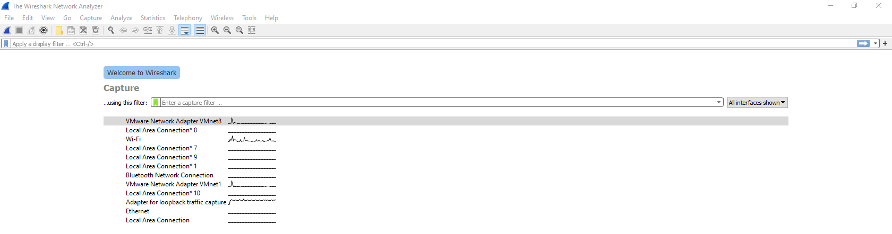</td>
    </tr>
    <tr>
      <td align="center"><strong>Figure 1a:</strong> Wireshark</td>
      <td align="center"><strong>Figure 1b:</strong> Welcome To Wireshark</td>
    </tr>
    <tr>
      <td>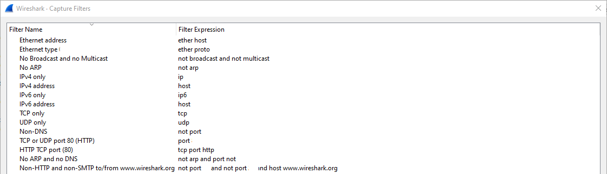
      <td>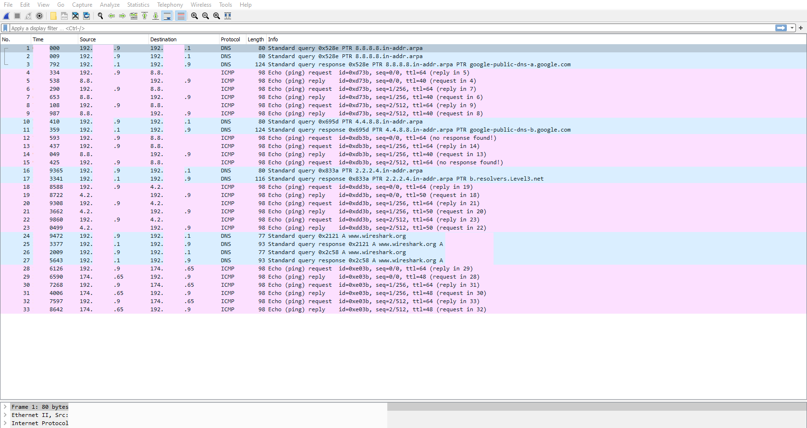</td>
    </tr>
     <tr>
      <td align="center"><strong>Figure 2a:</strong> Live Packet Captures</td>
      <td align="center"><strong>Figure 2b:</strong> Captured Packets</td>
    </tr>
  </table>

  <table>
    <tr>
      <td>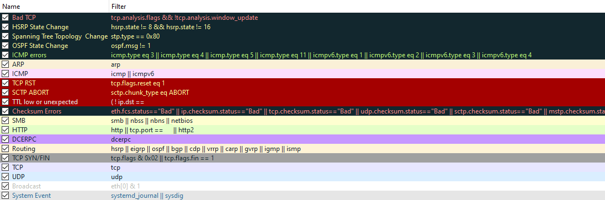
      <td>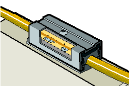</td>
    </tr>
    <tr>
      <td align="center"><strong>Figure 3a:</strong> Color Coded Packets</td>
      <td align="center"><strong>Figure 3b:</strong> Hardware Tap Or Vampire Tap</td>
    </tr>
    <tr>
      <td>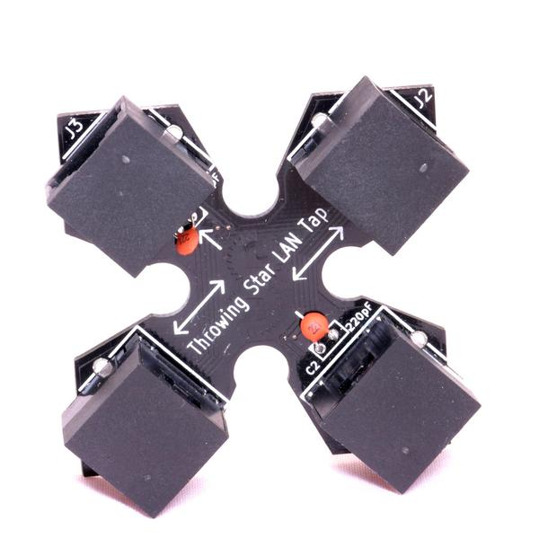
      <td>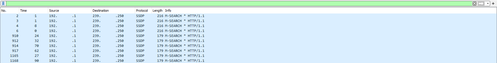</td>
    </tr>
     <tr>
      <td align="center"><strong>Figure 4a:</strong> Throwing Star LAN Tap</td>
      <td align="center"><strong>Figure 4b:</strong> IP Addr Filter</td>
    </tr>
  </table>

  <table>
    <tr>
      <td>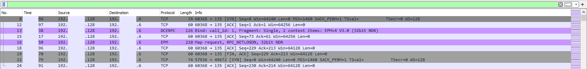
      <td>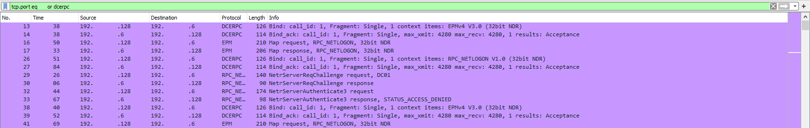</td>
    </tr>
    <tr>
      <td align="center"><strong>Figure 5a:</strong> IP Src And IP Dist Filters</td>
      <td align="center"><strong>Figure 5b:</strong> Port Number And Protocol Name Filters</td>
    </tr>
    <tr>
      <td>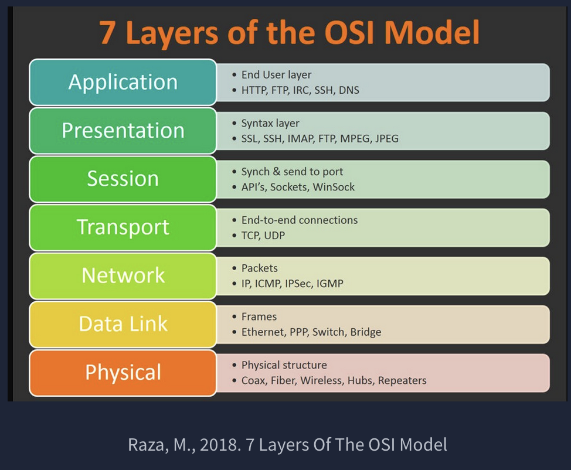
      <td>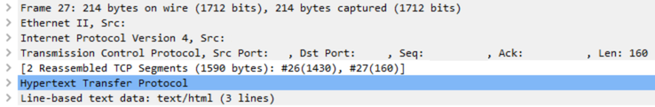</td>
    </tr>
     <tr>
      <td align="center"><strong>Figure 6a:</strong> 7 Layers Of The OSI Model by Raza M. 2018</td>
      <td align="center"><strong>Figure 6b:</strong> Packet Details</td>
    </tr>
  </table>

  <table>
    <tr>
      <td>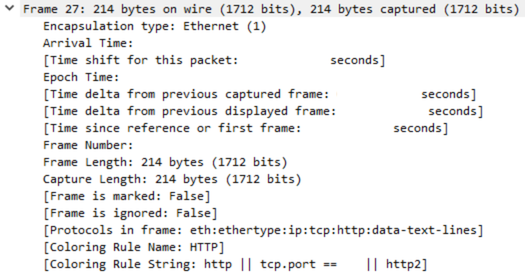
      <td>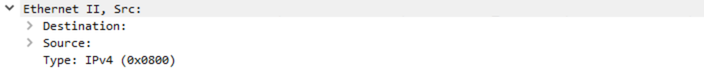</td>
    </tr>
    <tr>
      <td align="center"><strong>Figure 7a:</strong> Packet Details Frame Layer 1</td>
      <td align="center"><strong>Figure 7b:</strong> Packet Details Source MAC Layer 2</td>
    </tr>
    <tr>
      <td>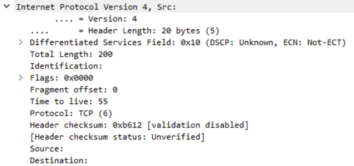
      <td>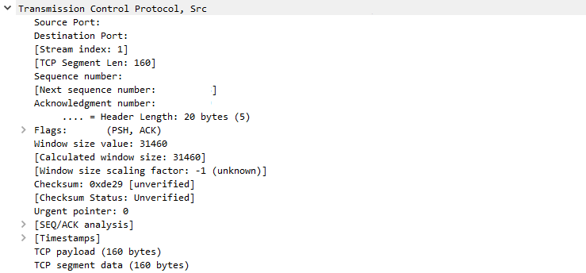</td>
    </tr>
     <tr>
      <td align="center"><strong>Figure 8a:</strong> Packet Details Source IP Layer 3</td>
      <td align="center"><strong>Figure 8b:</strong> Packet Details Source Protocol Layer 4</td>
    </tr>
  </table>

  <table>
    <tr>
      <td>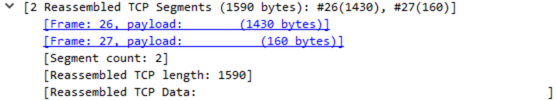
      <td>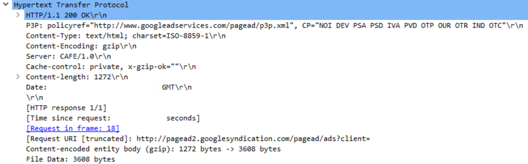</td>
    </tr>
    <tr>
      <td align="center"><strong>Figure 9a:</strong> Protocol Errors Layer 4</td>
      <td align="center"><strong>Figure 9b:</strong> Packet Details Application Protocol Layer 5</td>
    </tr>
    <tr>
      <td>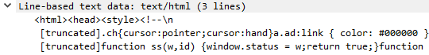
      <td>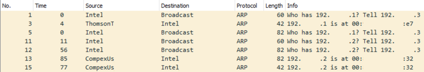</td>
    </tr>
     <tr>
      <td align="center"><strong>Figure 10a:</strong> Application Data Layer 5</td>
      <td align="center"><strong>Figure 10b:</strong> ARP Or Address Resolution Protocol Layer 2</td>
    </tr>
  </table>

  <table>
    <tr>
      <td>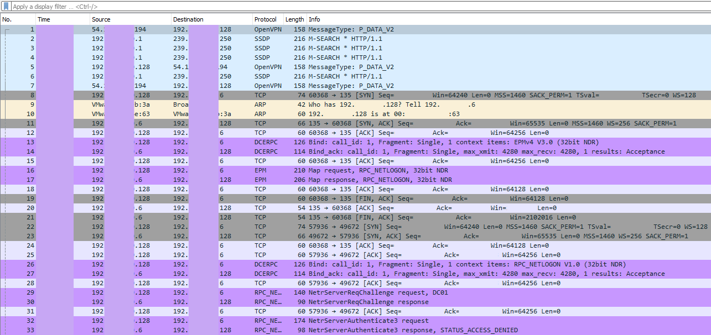
      <td>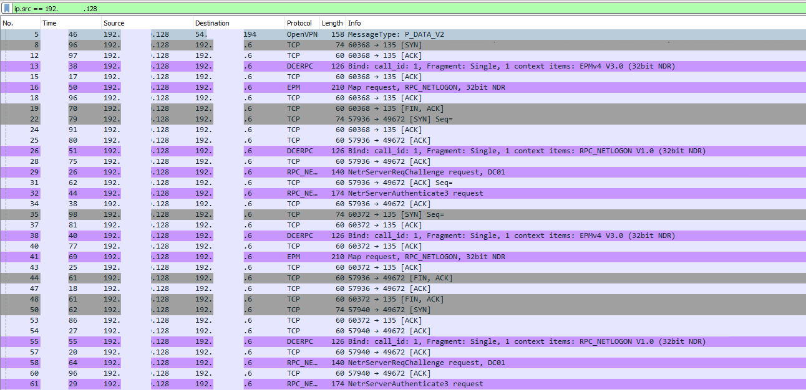</td>
    </tr>
    <tr>
      <td align="center"><strong>Figure 11a:</strong> Zerologon PCAP Overview</td>
      <td align="center"><strong>Figure 11b:</strong> Zerologon POC Connection Analysis</td>
    </tr>
    <tr>
      <td>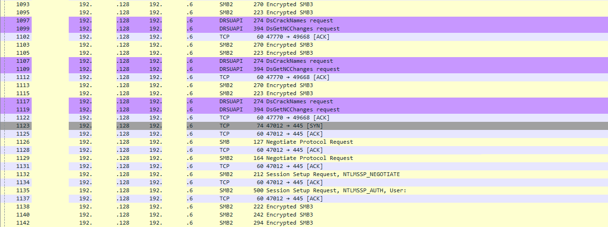
    </tr>
     <tr>
      <td align="center"><strong>Figure 12a:</strong> Secretsdump SMB Analysis</td>
    </tr>
  </table>

---

